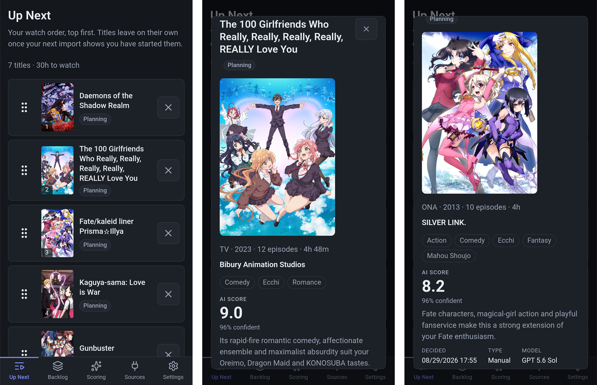

<div align="center">


# AniQueue

**Self-hosted. Ranks your anime backlog with an LLM you choose, against your own past
scores — not global popularity.**

Your library stays on MyAnimeList or AniList. AniQueue decides what you watch next.

[](https://github.com/carlocgc/AniQueue/actions/workflows/pr-build.yml)
[](https://github.com/carlocgc/AniQueue/actions/workflows/dev-image.yml)

[](https://hub.docker.com/r/carlocgc/aniqueue)
[](https://hub.docker.com/r/carlocgc/aniqueue)
[](https://dotnet.microsoft.com/)
[](LICENSE)
[](docs/ROADMAP.md)

</div>

> **⚠️ Trusted networks only.** No security audit, and it serves plain HTTP. The optional
> password protects you from other people on your LAN and from nothing else. Do not put it
> on a public IP, or behind a proxy or tunnel that does not terminate HTTPS.

## What it does

- **Ranks your backlog with an LLM**, against the scores you have already given. No account
  and no API key: paste the request into any chat window, or point AniQueue at a model you
  host yourself.
- **A hand-ordered *Up Next*.** Titles leave it on their own once you start or finish them.
- **Imports a MyAnimeList XML export**, or syncs a public AniList list on a schedule.
  Nothing is written back to either.
- **Shows what each title comes with** — prequels, sequels, side stories — and queues a show
  and its sequels in one click.
- **One container, one SQLite file.** No cloud dependency.

<div align="center">



</div>

## Running it

```bash
docker compose up -d
```

Open `http://localhost:8377`. The first start creates the database, applies every migration
and writes `userconfig.json` beside it. The library starts empty and offers an AniList sync
or a MyAnimeList import. Add `--build` to build from a checkout instead of pulling.

Images: `carlocgc/aniqueue:latest` is what compose pulls, `:vX.Y.Z` pins a release, and
`:dev` is rebuilt from `development` on every merge — a moving edge, not somewhere to keep
data.

### The volume

One volume holds everything that must outlive the container: `aniqueue.db`, the
`userconfig.json` beside it, cached art under `art/`, and the signing keys under `keys/`
that keep open browser pages working across an upgrade. Recreating the container keeps all
of it. Deleting the volume deletes your library, so a backup is a copy of the volume taken
with the container stopped.

Swapping the named volume for a host path needs nothing prepared. AniQueue runs as UID
**1654**, and the container starts as root only long enough to hand `/data` to that user
before dropping to it. Pass an explicit `--user` and it is honoured as given, taking no
ownership — the directory has to match already:

```bash
chown -R 99:100 /mnt/user/appdata/aniqueue
docker run --user 99:100 ...
```

### Settings

Every setting lives in `userconfig.json` in the volume. AniQueue writes it whenever you
change something in the application, and you can edit it by hand when the pages cannot be
reached. Each key carries a line saying what it does. The file is rewritten whole on every
save, so anything else you put in it will not survive.

### The password

Set one at **Settings → Password**; that is the whole of turning the lock on. There is no
username, because there is one account. A sign-in lasts thirty days and renews as you use
it. Changing or removing the password signs out every other device. `/health` is never
behind it, so a container health check still works.

**If you forget it**, put this in `userconfig.json` and restart:

```json
"Auth:Enabled": false
```

That start forgets the password and says so in the log, leaving AniQueue open until you set
a new one. The sign-in page names the file's full path. Turning the switch on by hand with
no password set is not a lockout: every page sends you to the form that sets one.

### Logs

Logs go to stdout and nowhere else, so `docker logs aniqueue` is all of it. The compose file
caps them at three 10 MB files, because Docker's default driver does not rotate.

Startup prints where the data is and what this installation does: the database and settings
paths, whether sync is on and which account it reads, whether scheduled scoring is on and
where it points, and the task cadence. Most "why is it not doing anything" questions are
answered there. For more:

```bash
docker run -e Logging__LogLevel__AniQueue=Debug ...
```

### If you get a blank page

Try it with browser extensions off. Anything that rewrites the page as it loads — a
dark-mode extension, a translator, an accessibility overlay, Brave's Shields — can break the
live connection AniQueue renders through. Dark Reader is handled; the rest cannot be
detected.

## Development

Requires the .NET 10 SDK, and Visual Studio 2026 or the `dotnet` CLI.

```bash
dotnet tool restore
dotnet build
dotnet test
dotnet run --project src/AniQueue.Web
```

The development database is created at `src/AniQueue.Web/data/aniqueue.db` and starts empty.
For a surface that needs rows, the sample profile has its own database and settings under
`src/AniQueue.Web/data/sample/`, so it cannot touch a real library:

```bash
dotnet run --project src/AniQueue.Web --launch-profile "http (sample data)"
```

The *http (lan)* profile reaches the development server from a phone on the same network;
Windows will want an inbound rule for the port. The **Docker** profile in the Visual Studio
dropdown builds and runs this same Dockerfile with the debugger attached, on a volume of its
own.

## Technology

.NET 10 · ASP.NET Core Blazor Web App (Interactive Server) · EF Core 10 · SQLite · xUnit ·
Docker. No React, Angular, Vue, or separate frontend build system.

## Documentation

| Document | Purpose |
|---|---|
| [`docs/ROADMAP.md`](docs/ROADMAP.md) | The plan: domain model, service boundaries, cross-cutting requirements, phases |
| [`docs/DECISIONS.md`](docs/DECISIONS.md) | The reasoning: every architectural decision and deviation, numbered |
| [`docs/RELEASE-NOTES.md`](docs/RELEASE-NOTES.md) | Changes that alter data or behaviour, worth reading before upgrading |
| [`docs/BUILD-PROMPT.md`](docs/BUILD-PROMPT.md) | The original project brief, preserved for reference |
| [`CLAUDE.md`](CLAUDE.md) | Working conventions: the development database, verification, testing, platform gotchas |

## Licence

[GNU Affero General Public License v3.0](LICENSE).
