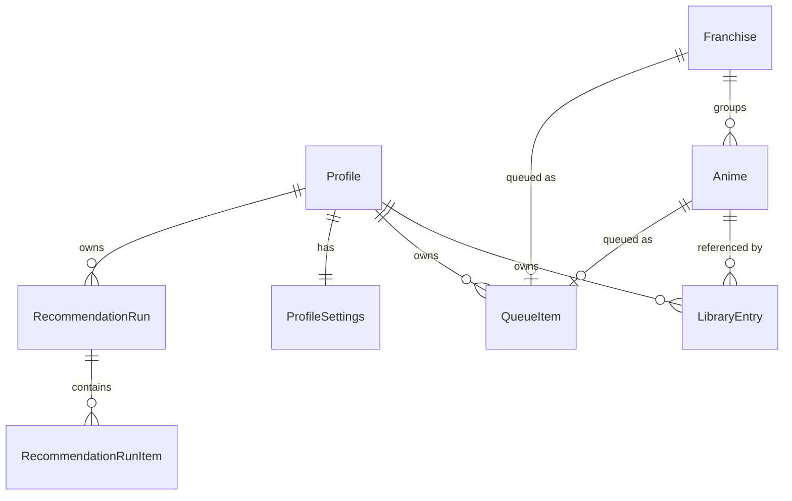

# AniQueue — Roadmap

**Status:** authoritative planning document. Supersedes nothing; amended by PR.

AniQueue is a self-hosted anime watchlist and **backlog decision layer**. It is not a
MyAnimeList/AniList replacement — it assumes your library already exists somewhere and
answers the question those tools answer badly: *what do I actually watch next?*

Problems in scope:

- Plan-to-Watch lists grow large and unordered.
- There is no deliberate, hand-curated "watch this next" queue.
- Franchise seasons, OVAs, films and specials clutter the backlog as separate decisions.
- Prioritisation should follow *your* historical scores, not global popularity.
- It must run on your own hardware with no cloud dependency.

### Source documents

| Document | Role |
|---|---|
| [`BUILD-PROMPT.md`](BUILD-PROMPT.md) | Original brief, preserved verbatim. Historical reference. |
| `ROADMAP.md` (this file) | **Authoritative.** Brief + agreed deviations + phase plan. |

Where this file and the build prompt disagree, this file wins, and §2 records why.

---

## 0. Verified environment

Checked on the development machine, not assumed:

| Component | Version |
|---|---|
| .NET SDK | 10.0.301 (runtime host 10.0.9) |
| Visual Studio | Community 2026 — 18.7.11925.98 |
| Docker Engine / Compose | 29.5.3 / v5.1.4 |
| git / gh | 2.54.0.windows.1 / 2.92.0 |
| EF Core SQLite (latest) | 10.0.11 |

Two findings that contradict reasonable assumptions:

- `dotnet new xunit` on .NET 10 emits **xUnit v2.9.3**, not v3. We use v2 as templated.
- No .NET workloads installed, and none are needed — plain `net10.0` + `Microsoft.NET.Sdk.Web`.

**The repository is public.** No secret, token, API key, or personal export may ever be
committed. Sample/seed data must be obviously fictional.

---

## 1. Technology

Fixed by the brief and agreed:

- .NET 10, C#, ASP.NET Core **Blazor Web App** with Interactive Server rendering
- EF Core 10 + SQLite
- Built-in DI, configuration, logging, options pattern
- xUnit, Docker, Docker Compose

Explicitly excluded: React, Angular, Vue, Node.js, any separate frontend build system,
MediatR/CQRS abstractions, generic repositories, service locator.

One permitted JS dependency: **SortableJS**, via minimal interop, for drag ordering only.
See D5 and §9 for why this is the riskiest line in the document.

`<Nullable>enable</Nullable>` and `<ImplicitUsings>enable</ImplicitUsings>` everywhere.

---

## 2. Architectural decisions and deviations

Numbered so they can be cited in code comments, PRs and future amendments.

### D1 — The queue gets its own table; `LibraryEntry.QueuePosition` is dropped

*Brief §4 vs §5 contradict each other.* §4 puts `QueuePosition` on `LibraryEntry`; §5
requires that an anime **or an entire franchise** can occupy a queue slot. There is no
`LibraryEntry` row for a franchise, so a nullable int on that table structurally cannot
express "Slayers is at position 7".

**Decision:** a dedicated `QueueItem` table holding an exclusive-or reference:

```sql
CHECK ((AnimeId IS NULL) <> (FranchiseId IS NULL))
```

`LibraryEntry.QueuePosition` does not exist. "Is this queued, and where?" is a join.
Reordering rewrites one narrow table instead of touching library rows.

### D2 — No unique index on `(ProfileId, Position)`

SQLite enforces uniqueness **per statement**, not at commit. Any reorder that shifts a
block of positions collides transiently and aborts the transaction. The escapes (shift into
a negative range, then rewrite) are two passes of pure ceremony.

**Decision:** a plain non-unique index. Contiguity and uniqueness are invariants owned by
`QueueService`, applied inside a single transaction. This is a real trade — the database no
longer defends the invariant, so §8's reorder tests are load-bearing, not decorative.

### D3 — `IDbContextFactory`, never scoped `AddDbContext`

Under Interactive Server a scoped service lives as long as the SignalR circuit — the user's
whole session, potentially hours. A scoped `DbContext` there means an unbounded change
tracker, stale reads, and `InvalidOperationException` the first time two components render
concurrently.

**Decision:** `AddDbContextFactory<AniQueueDbContext>`; every service method creates and
disposes a short-lived context. This is the most common Blazor Server + EF defect and is
free to avoid at the start.

### D4 — Recommendation history needs per-run items

*Brief §20 is internally inconsistent.* It says store run metadata and avoid duplicating
request data, then requires comparing the current recommendation set against a previous
one. Metadata alone cannot support that comparison.

**Decision:** `RecommendationRun` (metadata) + `RecommendationRunItem` (per-candidate rank,
predicted score, confidence, reason). Request payloads are **not** persisted — the
candidate set is reconstructable from run items. The `Recommendation*` columns on
`LibraryEntry` are a denormalised cache of the currently-applied run so backlog sorting
stays a single-table query.

### D5 — Button reordering ships before drag-and-drop

The brief requires both (§5) and mandates a non-drag path (§39). The buttons are trivial
and entirely server-side; drag is the risky half.

**Decision:** implement button reordering and its tests first. Drag layers onto an
already-correct reorder service. If the interop proves messy, the feature degrades to
something that already works rather than blocking the phase.

### D6 — Central package management and shared build props

Not in the brief, framework-native, no new dependency: `Directory.Build.props` for shared
compiler settings, `Directory.Packages.props` for versions pinned once across five
projects. Prevents version drift.

### D7 — `ProfileSettings` is a typed entity, not a key/value bag

Settings (§25 of the brief) are a fixed, known set. Typed columns are migratable, bindable
straight from the Settings page, and cannot rot into stringly-typed soup.

### D8 — `AniQueue.slnx`, not `AniQueue.sln`

*Reverses an earlier call in this document.* The brief names `AniQueue.sln`, and the first
attempt used the classic format on the reasoning that `.slnx`'s main benefit — no GUIDs, so
no merge conflicts — does not apply when all five projects are added at once and no more
are planned.

That weighed one factor and missed a second. `dotnet new sln` emits a **hardcoded, already
stale version stamp** (`# Visual Studio Version 17` — VS 2022) that has nothing to do with
the installed toolchain, and the format carries ~100 lines of GUID bookkeeping for what is
really a five-line list of projects. Since VS 2026 is the primary development environment
and supports `.slnx` natively, the modern format is the better fit.

**Decision:** `AniQueue.slnx`, generated via `dotnet sln migrate`. 101 lines → 12, no GUIDs,
and no version header that can go stale. Verified: `dotnet sln list`, `dotnet build`,
`dotnet test` and `dotnet build -c Release` all work unchanged. The `x86`/`x64` platform
entries the migration carried over were removed — this solution only ever builds Any CPU.

Minimum tooling this implies: VS 2026 (or VS 2022 17.14+) and the .NET 10 SDK. Both are
already the baseline in §0, so nothing is lost.

---

## 3. Solution structure

Follows the brief's §36. It is a sensible shape; no argument.

```
AniQueue.slnx
Directory.Build.props / Directory.Packages.props
.editorconfig / .gitattributes / .gitignore / .dockerignore
Dockerfile / docker-compose.yml
README.md
docs/ROADMAP.md, docs/BUILD-PROMPT.md

src/
  AniQueue.Core/            entities, enums, DTOs, interfaces, pure logic. No EF, no Blazor.
  AniQueue.Infrastructure/  EF Core, SQLite, migrations, service implementations
  AniQueue.Web/             Blazor components, DI composition, configuration, hosting

tests/
  AniQueue.Core.Tests/            pure, fast, no database
  AniQueue.Infrastructure.Tests/  SQLite in-memory, real EF
```

**The split that makes the test plan work.** Pure computation lives in Core and is tested
with no database: MAL XML parsing, runtime maths, hybrid ranking, AI-result validation.
Anything touching data lives in Infrastructure. Core has no EF reference not for
architectural purity but so most of the suite runs in milliseconds with no fixtures.

Interfaces are declared in Core, implementations in Infrastructure. Blazor components call
services only — no `DbContext` in `.razor`, no LINQ in markup, no business logic in
components. No HTTP API between the Blazor server and itself.

---

## 4. Domain model



### Anime

`Id, Title, AlternativeTitle?, MediaType, EpisodeCount?, EpisodeDurationMinutes?,
ReleaseYear?, CoverImageUrl?, Description?, Source, SourceAnimeId?, FranchiseId?,
FranchiseOrder?, OptionalWithinFranchise, CreatedAt, UpdatedAt`

- `MediaType`: `Unknown, Tv, Movie, Ova, Ona, Special, Music`
- `Source`: `Manual, MyAnimeList, AniList`
- `OptionalWithinFranchise` (brief §21) belongs here, not on `Franchise` — it describes an
  individual entry's role within its group.
- **Filtered** unique index on `(Source, SourceAnimeId)` `WHERE SourceAnimeId IS NOT NULL`.
  Manual entries have no source id and must not collide with one another.
- Domain entities are never coupled to MAL/AniList DTOs.

### LibraryEntry

`Id, ProfileId, AnimeId, Status, UserScore?, EpisodesWatched, DateStarted?, DateCompleted?,
DateAdded, LastUpdated, PersonalNotes?, ManualPriority, IsHidden, RecommendationScore?,
RecommendationConfidence?, RecommendationReason?, RecommendationUpdatedAt?`

- `Status`: `Planning, Watching, Completed, OnHold, Dropped`
- Unique `(ProfileId, AnimeId)`; indexes on `(ProfileId, Status)`, `(ProfileId, IsHidden)`
- No `QueuePosition` — see D1.

### Franchise

`Id, Name, Description?, ManualSortOrder`. Anime→Franchise is 0..1 for MVP. Internal
ordering is `Anime.FranchiseOrder`. User can create, rename, add/remove titles, reorder and
dissolve. **No automatic franchise detection in v1.**

### QueueItem

`Id, ProfileId, Position, AnimeId?, FranchiseId?, AddedAt`. See D1/D2. Filtered unique
indexes on `(ProfileId, AnimeId)` and `(ProfileId, FranchiseId)` so nothing is queued twice.

### RecommendationRun / RecommendationRunItem

Run: `Id, ProfileId, CreatedAt, ProviderName, ModelIdentifier?, CompletedCount,
CandidateCount, ResultCount, WasApplied`
Item: `Id, RunId, AnimeId?, FranchiseId?, Rank, PredictedScore, Confidence, Reason?`

### Profile / ProfileSettings

Single default local profile; no registration, no OAuth, no auth in MVP. All library data
carries `ProfileId` so multi-user (Phase 5 post-MVP) stays possible. Settings per D7.

---

## 5. Service boundaries

| Service | Project | Responsibility |
|---|---|---|
| `ILibraryService` | Infrastructure | CRUD, status transitions, progress, scoring, filter/page |
| `IQueueService` | Infrastructure | add/remove/reorder, normalise positions, transactional |
| `IFranchiseService` | Infrastructure | membership, ordering, dissolve, next-unwatched |
| `IImportService` | Infrastructure | orchestrates the import pipeline |
| `IRecommendationService` | Infrastructure | build request, validate/apply result, run history |
| `IAnimeListProvider` | Core (impl Infra) | `MalXmlProvider`, `AniQueueJsonProvider` |
| `IAiRecommendationProvider` | Core | `ManualJsonRecommendationProvider` only in MVP |
| `IRankingCalculator` | **Core** | hybrid ranking formula — pure, testable |
| `IRuntimeCalculator` | **Core** | episode×duration maths, franchise sums, formatting |
| `ICoverImageResolver` | Core | URL passthrough now; local caching later |

Import is a pipeline of distinct types, not one `ImportManager`:

```
IImportParser → IImportNormaliser → IImportValidator → IImportMatcher → ImportPreview → IImportCommitter
```

`ImportPreview` is a pure in-memory object. **Nothing touches the database until the user
explicitly confirms.** Imports are idempotent where reasonable.

---

## 6. Cross-cutting requirements

**Security.** Anti-forgery; server-side validation; upload size limits; reject oversized
imports; secure XML (`DtdProcessing.Prohibit`, `XmlResolver = null`); HTML-encode user
content; no user-supplied file paths; no command execution; **never execute or evaluate AI
content** — it is untrusted data; no stack traces in production; secrets only via
environment/configuration. Forwarded headers honoured **only when explicitly configured**.
Never assume requests originate from localhost.

**Logging.** Structured `ILogger`. Events: startup, migration, import started, preview
generated, import committed, recommendation exported, recommendation imported, queue
changed. Never log whole uploaded files, AI payloads, or secrets.

**Performance.** Must handle several thousand anime. Server-side filtering, pagination or
virtualisation, `AsNoTracking` for reads, async EF, real indexes. Never load the whole
library for an ordinary page. AI export may intentionally load the full relevant set.

**Accessibility.** Semantic HTML; real `<button>` elements; keyboard-operable controls;
meaningful labels; sensible focus; a non-drag alternative for every drag action; adequate
contrast in both themes.

**Privacy in AI export.** Export only what ranking needs. Never email addresses, passwords,
API keys, IP addresses, server information, or personal notes unless explicitly opted in.
The UI states plainly what is being sent.

**Data integrity on import.** Match on `Source + SourceAnimeId` first; title matching only
cautiously and never silently merging ambiguous matches. An import must not overwrite
manual queue position, personal notes, franchise grouping, hidden flag, or recommendation
history unless explicitly requested.

---

## 7. Phase plan

Every phase ends **buildable, tested and green**. `dotnet build` + `dotnet test` at each
boundary. Phases are front-loaded so a genuinely useful application exists from Phase 4
onward even if later phases slip.

| # | Phase | Exit criteria |
|---|---|---|
| 0 | Foundation | Solution + 5 projects build; F5 serves the app; repo hygiene in place |
| 1 | Domain + persistence | Migration applies to a fresh DB; indexes exist; dev seeder works |
| 2 | **Vertical slice** | MAL XML → preview → confirm → SQLite → backlog list, end to end |
| 3 | Backlog page | Search, filter, sort, page, bulk actions |
| 4 | Up Next | Reorder correct and persistent; buttons then drag |
| 5 | Franchises | Full manual management; collapsed card with progress + runtime |
| 6 | Watching workflow | Start, +1 episode, complete with optional score, next-in-franchise |
| 7 | Dashboard + decision mode | Summary counts, Suggested Next, "What should I watch?" |
| 8 | JSON interchange | Full library export → wipe → restore round-trip |
| 9 | AI recommendation | Export request, import ranking, apply — manual order provably intact |
| 10 | Settings + polish | Settings, theme, confirmations, a11y and responsive pass |
| 11 | Docker + README | Compose up, health check, container recreated without data loss |

### Phase 0 — Foundation
Repo hygiene (`.gitignore`, `.gitattributes`, `.editorconfig`), solution and five projects,
`Directory.Build.props`, `Directory.Packages.props`, project references wired, placeholder
test in each test project. `.gitattributes` matters: Windows development, Linux container.

### Phase 1 — Domain and persistence
Entities and enums in Core. `AniQueueDbContext` with one `IEntityTypeConfiguration` per
entity. Indexes per §4. Initial migration. `IDbContextFactory` registration (D3). WAL and
`busy_timeout` applied at startup. Migrate-on-boot with explicit, readable failure logging
and graceful startup failure if the database is unreachable. Development-only seeder —
**never** auto-seeds production — covering completed titles with varied scores, planning,
watching, a franchise, a queue and a recommendation result.

### Phase 2 — Vertical slice (the brief's §45 deliverable)
MAL XML import end to end. Secure XML settings, `0000-00-00` → null, status mapping,
size limits, dedup on `Source + SourceAnimeId`, preview summarising new/updated/skipped/
conflicts/invalid and totals per status, then explicit commit. Minimal backlog list to
prove the data landed.

### Phase 3 — Backlog page
Server-side search, filtering, sorting, paging/virtualisation. Filters: status, franchise/
standalone, media type, decade, runtime, score, source, priority. Quick filters (Under 2h,
Under 6h, Movie, OVA, TV, decades, High AI confidence, Not yet ranked) — **each rendered
only when the backing metadata exists**. Bulk selection, bulk queue-add, bulk priority,
bulk hide. Anime cards degrade cleanly instead of printing rows of "N/A".

### Phase 4 — Up Next
`QueueService`: add, remove, move to top/up/down/bottom, transactional reorder with
position normalisation. Franchises queueable from the start (D1). Buttons first, then
SortableJS interop (D5, §9).

### Phase 5 — Franchises
Create, rename, add/remove titles, reorder, dissolve. Collapsed card showing entries
watched, remaining runtime, first entry, AI score, queue position; expanding shows viewing
order. `OptionalWithinFranchise` respected in completion and runtime maths.

### Phase 6 — Watching workflow
Start Watching (status → Watching, set `DateStarted` if absent, dequeue as appropriate).
`+1 episode`. Mark Completed at the known final episode, with an **optional** 1–10 score
prompt — never auto-assign a score. Franchise entries start the next unfinished anime in
franchise order; on completion offer the next entry for the queue.

### Phase 7 — Dashboard and decision mode
Currently Watching with progress bars, Up Next top 5–10 with a prominent Start Watching,
backlog summary counts and estimated runtime, Suggested Next. "What should I watch?":
Anything / Something short / A movie / One evening / Old-school / From my top 20 / Surprise
me. Surprise me uses **weighted randomness**, not the top-ranked title. No conversational UI.

### Phase 8 — JSON interchange
Versioned AniQueue interchange format, import and export, validation, backwards-compatible
design, full-library backup and restore. No secrets in exports.

### Phase 9 — AI recommendation workflow
Request export (download + copy) with an explanatory UI. Generated ready-to-copy prompt.
Import screen accepting upload or paste. Validation: unknown candidate ids, duplicates,
missing candidates, rank collisions, numeric ranges, unexpected candidates. Preview showing
title, rank, predicted score, confidence, reason. Apply writes to `LibraryEntry` and a
`RecommendationRun` (D4). Manual / AI / Hybrid are **three views**, and applying AI never
mutates `QueueItem.Position`. Hybrid ranking is a simple, transparent, explainable formula
— the UI shows why an item ranks where it does. No black box.

### Phase 10 — Settings and polish
General (display name, default queue size, date format, theme System/Light/Dark), Backlog
(show optional franchise entries, default sort/filters), Recommendations (default mode,
export privacy, weighting), Data (export/import backup, clear recommendation results).
Destructive actions require explicit confirmation. Accessibility and responsive passes.

### Phase 11 — Docker and README
Multi-stage Dockerfile (SDK build → `aspnet` runtime, no SDK in the final layer), non-root
user, `/data` persistence, configurable port defaulting to 8080, `/health` endpoint,
compose health check, environment-variable configuration. README per brief §35, explicitly
explaining that v1 AI recommendation works **without giving AniQueue an API key**.

Final gate: Release build, full test run, image build, `docker compose up -d`, health check
verified, **container recreated and the database confirmed intact**.

---

## 8. Test plan

Allocated to whichever project can run each test fastest.

**Core.Tests — no database, milliseconds.** MAL XML parsing; malformed XML; `0000-00-00`;
XXE rejection; status mapping; JSON schema validation; AI result validation (unknown
candidate, duplicate, missing candidate, rank collision, out-of-range predicted score,
out-of-range confidence); runtime calculations including unknown-duration cases; franchise
runtime with optional entries; hybrid ranking; weighted-random selection bounds.

**Infrastructure.Tests — real EF, real SQLite.** Use `Data Source=:memory:` with a
**deliberately held-open connection** (the database dies when the last connection closes).
The EF `InMemory` provider is not used at all — it does not enforce the constraints under
test. Covers: migrations apply cleanly; dedup on `Source + SourceAnimeId`; import
idempotency; import preserves local fields; **queue reorder edge cases and the contiguity
invariant** (load-bearing per D2); franchise ordering; completion transitions; applying AI
recommendations leaves `QueueItem` untouched.

No test may depend on a live external API.

---

## 9. Risks

**SortableJS vs Blazor's DOM ownership — the real one.** Blazor's renderer diffs against
its own virtual tree; SortableJS physically moves nodes behind its back, so the next render
can duplicate or resurrect rows. The working pattern is `@key` on every item plus reverting
the DOM move inside `onEnd`, then calling into .NET with `(oldIndex, newIndex)` and letting
the re-render produce the authoritative order. Budget a spike in Phase 4. Mitigated by D5.

**Non-root container against a bind-mounted `/data`.** A non-root UID cannot create the
database file in a host directory owned by root. Named volumes are fine — Docker seeds
ownership from the image — bind mounts are not. Plan: pin a known UID/GID in the image,
default compose to a **named volume**, and document `chown` for bind-mount users (the
common Unraid case).

**SQLite single-writer.** Adequate for one user, but a concurrent import and queue write
can hit `SQLITE_BUSY`. WAL plus a `busy_timeout` at startup; keep write transactions short.

**Scope.** This is a large MVP — 25 acceptance criteria across 11 phases. Treating them as
one milestone is the main schedule risk; the phase ordering exists to avoid it.

---

## 10. Out of scope

**Not in MVP** (brief §41): MAL/AniList OAuth, live two-way sync, built-in OpenAI calls,
Ollama integration, user registration, social features, comments, public profiles, mobile
native apps, automatic metadata scraping, automatic franchise detection, streaming
integrations. `IAnimeListProvider` and `IAiRecommendationProvider` are the extension
points; nothing speculative gets built behind them. **No fake AniList integration.**

**Post-MVP** (brief §42): Phase 2 AniList GraphQL, metadata enrichment, cover art, genres/
studios, franchise suggestions · Phase 3 optional AI providers, OpenAI-compatible
endpoints, Ollama/LM Studio, scheduled re-ranking · Phase 4 MAL API sync, write-back,
conflict resolution · Phase 5 multi-user, authentication, household profiles.

---

## 11. MVP acceptance criteria → phase

The brief's 25 criteria, mapped so completion is measurable.

| Criteria | Phase |
|---|---|
| 1–2 `docker compose up -d`, open in browser | 11 |
| 3–7 Upload MAL XML, preview, confirm, see statuses and scores | 2 |
| 8–9 Create/edit franchises, collapse sequels into them | 5 |
| 10–12 Add to Up Next, drag to exact order, persist across restart | 4 + 11 |
| 13–14 Track progress, complete with a score | 6 |
| 15 Filter backlog usefully | 3 |
| 16–22 AI request export, prompt, import, preview, apply, manual order intact | 9 |
| 23–24 Export full library as JSON, restore from it | 8 |
| 25 Recreate container without losing the database | 11 |

---

## 12. Working agreements

- Integration branch is `development`. `main` is release-only.
- One feature branch per phase: `feature/phase-N-slug` → PR into `development`.
- Rebase onto `development` and resolve conflicts locally before opening a PR.
- No new third-party dependency without explicit approval. SortableJS is the only one
  pre-approved, and only for Phase 4.
- **LF line endings everywhere**, in the repository and in the working tree on every
  platform, enforced by `.gitattributes` (`* text=auto eol=lf`) with `.editorconfig`
  matching it. `.gitattributes` is the enforcement point rather than `core.autocrlf`
  because it is committed and so applies to every clone; `core.autocrlf` is per-machine
  and never travels. Batch files (`*.bat`, `*.cmd`) are the sole CRLF exception —
  `cmd.exe` can mis-parse LF-only batch files. Verify with
  `git ls-files | while read -r f; do tr -dc '\r' < "$f" | wc -c; done`.
- Amendments to this roadmap go through a PR that updates this file, so the decision record
  and the code move together.
- Comments explain **why**, not syntax. Decisions cite their `D`-number.
