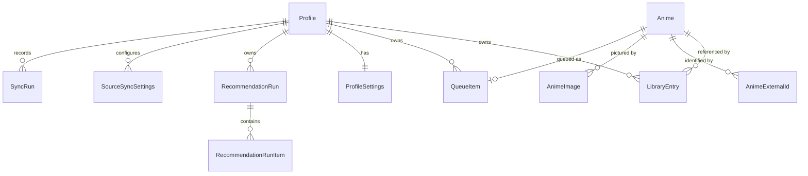

# AniQueue — Roadmap

**Status:** authoritative planning document. Supersedes nothing; amended by PR.

AniQueue is a self-hosted anime watchlist and **backlog decision layer**. It is not a
MyAnimeList/AniList replacement — it assumes your library already exists somewhere and
answers the question those tools answer badly: *what do I actually watch next?*

Put precisely: **AniQueue owns the order of your watch list; the service you already use
owns its membership** (D11). The order is maintained jointly by you and an AI, and it
persists.

Problems in scope:

- Plan-to-Watch lists grow large and unordered.
- There is no deliberate, hand-curated "watch this next" queue.
- Franchise seasons, OVAs, films and specials arrive in the backlog with nothing saying they
  are related. *Amended by D24: the answer is to surface each title's relations on its own
  row rather than to collapse them into one, so this reads as a missing-context problem
  rather than a clutter problem.*
- Prioritisation should follow *your* historical scores, not global popularity.
- It must run on your own hardware with no cloud dependency.

### Source documents

| Document | Role |
|---|---|
| [`BUILD-PROMPT.md`](BUILD-PROMPT.md) | Original brief, preserved verbatim. Historical reference. |
| [`DECISIONS.md`](DECISIONS.md) | Every architectural decision and deviation, numbered `D1`–`D56`. |
| `ROADMAP.md` (this file) | **Authoritative.** Brief + agreed deviations + phase plan. |

Where this file and the build prompt disagree, this file wins, and `DECISIONS.md` records why.

---

## 1. Technology

Fixed by the brief and agreed:

- .NET 10, C#, ASP.NET Core **Blazor Web App** with Interactive Server rendering
- EF Core 10 + SQLite
- Built-in DI, configuration, logging, options pattern
- xUnit, Docker, Docker Compose

Explicitly excluded: React, Angular, Vue, Node.js, any separate frontend build system,
MediatR/CQRS abstractions, generic repositories, service locator.

One permitted JS dependency: **SortableJS**, via minimal interop, for drag ordering only.
See D5 and §9 for why this is the riskiest line in the document.

`<Nullable>enable</Nullable>` and `<ImplicitUsings>enable</ImplicitUsings>` everywhere.

---

## 2. Architectural decisions and deviations

Moved to [`DECISIONS.md`](DECISIONS.md), which is the whole of the record and is cited by
number from pull requests and from the rest of this file. It is a reference to reach for
when a decision is questioned rather than something to read front to back, which is why it
is no longer inline here.

---

## 3. Solution structure

Follows the brief's §36. It is a sensible shape; no argument.

```
AniQueue.slnx
Directory.Build.props / Directory.Packages.props
.editorconfig / .gitattributes / .gitignore / .dockerignore
Dockerfile / docker-compose.yml
README.md
docs/ROADMAP.md, docs/BUILD-PROMPT.md

src/
  AniQueue.Core/            entities, enums, DTOs, interfaces, pure logic. No EF, no Blazor.
  AniQueue.Infrastructure/  EF Core, SQLite, migrations, service implementations
  AniQueue.Web/             Blazor components, DI composition, configuration, hosting

tests/
  AniQueue.Core.Tests/            pure, fast, no database
  AniQueue.Infrastructure.Tests/  SQLite in-memory, real EF
```

**The split that makes the test plan work.** Pure computation lives in Core and is tested
with no database: MAL XML parsing, runtime maths, hybrid ranking, AI-result validation.
Anything touching data lives in Infrastructure. Core has no EF reference not for
architectural purity but so most of the suite runs in milliseconds with no fixtures.

Interfaces are declared in Core, implementations in Infrastructure. Blazor components call
services only — no `DbContext` in `.razor`, no LINQ in markup, no business logic in
components. No HTTP API between the Blazor server and itself.

---

## 4. Domain model



### Anime

`Id, Title, TitleRomaji?, TitleEnglish?, TitleNative?, MediaType, EpisodeCount?, EpisodeDurationMinutes?,
ReleaseYear?, StartDate?, CoverImageColor?, Description?, Source, CreatedAt, UpdatedAt`

- `MediaType`: `Unknown, Tv, Movie, Ova, Ona, Special, Music`
- `Source`: `Manual, MyAnimeList, AniList` — **provenance only** since D17. Identity lives on
  `AnimeExternalId`.
- **Nothing here records grouping**, and nothing will (D23, D24). Relations are stored as edges
  between external identifiers; there is no membership column and no group to be a member of.
- `Title` is the **resolved display title**, and the only one anything else reads — the backlog
  searches, sorts and pages on it in SQL. The three variants beside it each know their own
  language, which is what lets the preference be switched without a sync (D22); they are null for
  manual and MyAnimeList-only rows, which have one name and keep it.
- `EpisodeDurationMinutes` and `ReleaseYear` are first populated in Phase 5b. A MyAnimeList
  export carries neither, so before that phase they are null on every imported row and every
  runtime and decade feature in Phase 3 is inert by design.
- **`CoverImageUrl` is gone** (D47). Where a title's art lives is a fact about an image, and a
  title has more than one, so it is a row on `AnimeImage` rather than a column here.
  `CoverImageColor` stays beside it: six bytes describing the title rather than an address, and
  what renders while no image has been cached yet.
- Domain entities are never coupled to MAL/AniList DTOs.

### AnimeExternalId

`Id, AnimeId, Source, ExternalId`. See D17. Unique on `(Source, ExternalId)` — **unfiltered**,
because a manual entry has no rows rather than a null identifier. A title carries zero or more,
which is what lets an AniList sync bridge onto a MyAnimeList-imported row through `Media.idMal`
instead of conflicting with it.

### AnimeImage

`Id, AnimeId, Kind, Source, Rendition, RemoteUrl, ContentHash?, FetchedUrl?, FileExtension?,
ByteCount?, FetchedAt?, FailedAt?, FailureIsPermanent, AttemptCount`. See D47, D48. Unique on
`(AnimeId, Kind, Source, Rendition)`.

- `Kind`: `Poster, Banner, ClearLogo, Backdrop` — only `Poster` is ever written. The other three
  were for the TVDB and TMDB art D48 declined; they stay because the enum is stored as an integer
  and is append-only, so removing them breaks a data contract to save one arm of a switch.
- `Rendition`: `Thumbnail, Full` — the 100px `medium` cover the list rows use and the 460px
  `extraLarge` the detail dialog needs. A size is not what a picture *shows*, which is why this is
  its own column rather than more `Kind` members (D48).
- `Source` reuses the existing enum. It was to have gained TVDB and TMDB; D48 read their terms and
  neither is reachable from a self-hosted deployment, so `AniList` is the only value that appears.
- **The bytes are not here.** §6 forbids image binaries in the database; the file lives under
  `<data>/art/{directory}/` — `thumbnails` or `posters`, one per rendition (D48) — and this row
  records where it came from, whether it arrived, and what to serve
  it as. `ContentHash` is null until it has, and is what makes the served URL immutable.
- **`RemoteUrl` is the invalidation key.** AniList's URLs carry a content hash, so replaced art
  changes the URL — which clears both failure states and re-fetches, with nothing scheduled and
  no timestamp compared.
- **`FetchedUrl` is what makes that free of a gap.** One column is the picture that should be
  shown and the other is the picture being shown; outstanding work is the two disagreeing, which
  covers "never fetched" and "replaced since" with one comparison, and the old art keeps
  rendering until the new art has actually arrived.

### Genre and AnimeGenre

`Genre: Id, Name`, unique on `Name`. `AnimeGenre: AnimeId, GenreId`, composite key, indexed both
ways. See D49.

- **A table rather than an enum**, because AniList can add a genre and an enum member is a data
  contract that cannot absorb one.
- **Normalised rather than a delimited column**, because §6 requires filtering to be indexed and
  server-side, and `LIKE '%Shonen%'` is neither. Nothing filters on it in 9b or 9c; it is built
  this way now because it is one migration either way and the delimited form would owe a data
  migration the day a filter arrives.
- **An empty incoming set is silence, not "no genres"** (D49). A MyAnimeList export carries none,
  and reading that as fact would strip every genre AniList supplied.

### Studio and AnimeStudio

`Studio: Id, Name, IsAnimationStudio`, unique on `Name`. `AnimeStudio: AnimeId, StudioId, IsMain`,
composite key. See D49.

- **A join entity, not a pure join**, because `IsMain` is a fact about the pairing rather than
  about either side: AniList returns animation studios and the companies that funded them in one
  edge list, and this flag is the only thing separating them.
- All edges are stored rather than filtering to the main one in the query — same query shape, same
  migration, and it leaves §10's studio-affinity idea with its data already present.
- A title with no main studio flagged renders no studio line rather than an arbitrary one.

### LibraryEntry

`Id, ProfileId, AnimeId, Status, UserScore?, EpisodesWatched, DateStarted?, DateCompleted?,
DateAdded, LastUpdated, PersonalNotes?, LastWrittenBySource?, RecommendationScore?,
RecommendationConfidence?, RecommendationReason?, RecommendationUpdatedAt?`

- `Status`: `Planning, Watching, Completed, OnHold, Dropped`
- Unique `(ProfileId, AnimeId)`; index on `(ProfileId, Status)`
- **No `IsHidden`, dropped by Phase 18b**, along with its `(ProfileId, IsHidden)` index. It was a
  local way to say "stop offering me this" beside the one D11 already settled, and only the
  source list survives a sync.
- `UserScore` is 1–10 or null, enforced by `CK_LibraryEntries_UserScoreRange`. Sources that use
  a different scale must normalise *before* reaching here — see Phase 5b on AniList's five
  scoring systems.
- `LastWrittenBySource` records who last wrote the tracking fields, so D18's precedence can
  tell a stale source from an authoritative one. Null on rows written before that decision.
- No `QueuePosition` — see D1. No `ManualPriority` — see D14.

### SourceSyncSettings

`Id, ProfileId, Source, IsEnabled, PrecedenceRank, PollIntervalMinutes, ApplyUnattended,
ConflictPolicy, AbsencePolicy, LastWatermark?`

Keyed `(ProfileId, Source)`, which is why these are not on `ProfileSettings` (D20). Holds
D18's precedence rank, D19's absence policy and D21's application and conflict policies. The
account identifier is **not** here — it is operator configuration (D20).

> **Deleted by Phase 10a.** D36 places every one of these in `userconfig.json`, and D40 depends
> on the move because the task toggles are written there. The precedence rank becomes a single
> key naming the primary source rather than an integer per row.

### JobRun

`Id, TaskKey, UnitKey?, Trigger, StartedAt, FinishedAt, Outcome, ItemsProcessed, ItemsChanged,
FailureReason?`

What every background task has in common, and the only table the tasks page reads (D40). Written
by `BackgroundJobRunner` from the `JobRunOutcome` its job returned, so it cannot disagree with the
typed record the job also wrote. `Outcome` distinguishes success, nothing-to-do, failure and
cancellation — a cancelled run is not a failed one, and conflating them would raise a stalled
banner over a button somebody pressed on purpose.

`UnitKey` is the schedulable unit within a job, e.g. which source a sync read; null where the job
has only one. Due-ness is read from here rather than from `SyncRun`, which is what makes a
cancelled run skip its cycle instead of restarting on the next tick.

Ordered and paged by `Id`. A `DateTimeOffset` can be neither ordered nor compared in SQLite, which
is also why this is one table rather than a union over the typed ones.

Pruned to the last two hundred rows per task on insert. Runs that found nothing to do are kept —
a converged task and a broken one are otherwise indistinguishable — but a tick that was not due is
not a run and is not recorded.

### SyncRun

`Id, ProfileId, Source, StartedAt, FinishedAt?, Outcome, Created, Updated, Skipped,
ConflictsHeld, SlotsReleased, FailureReason?`

The audit trail for writes nobody watched (D21), and the source of "last synced 4 minutes ago"
and the pending-conflict badge. `Outcome` distinguishes success, nothing-to-do and failure —
a stalled sync must never render as "up to date".

A row is written only when a run has reached a terminal state, so `FinishedAt` is never null in
practice; it stays nullable because a run interrupted mid-flight is a state Phase 5c can reach and
this table should be able to describe. `StartedAt` times the work the row records rather than the
whole visit — for a reviewed sync that is the apply, since the gap between fetching and confirming
is a person thinking, not a sync running. Recency is read from the key, not this column: see §8.

### QueueItem

`Id, ProfileId, Position, AnimeId, AddedAt`. See D2, D15 and D23. A slot is always exactly one
title, so the unique index on `(ProfileId, AnimeId)` needs no filter and there is no check
constraint. Queueing a run of seasons appends them individually (D15, D24).

A slot's release depends on its `LibraryEntry` existing, because `AdvanceAsync` treats a missing
entry as unknown rather than watched. Anything that deletes an entry must therefore delete its
slot in the same transaction, or the slot becomes unreleasable (D19).

### RecommendationRun / RecommendationRunItem

Run: `Id, ProfileId, CreatedAt, ProviderName, ModelIdentifier?, CompletedCount,
CandidateCount, ResultCount, WasApplied`
Item: `Id, RunId, AnimeId, Rank, PredictedScore, Confidence, Reason?` — one title per
placement, never a franchise (D16). Check constraints keep `Rank >= 1` and `Confidence`
within 0.0–1.0, because these values arrive from an external model.

### Profile / ProfileSettings

Single default local profile; no registration, no OAuth, no auth in MVP. All library data
carries `ProfileId` so multi-user — post-MVP per §10 — stays possible. Settings per D7 and D20.

`LibraryKey` names this profile's library so a scoring reply can say which one it was built
for (D50). Twelve hex characters, minted by `DatabaseInitializer` when the row is created and
backfilled on the next start for a database that predates the column. Never regenerated: doing so
would invalidate every reply a user is holding.

---

## 5. Service boundaries

| Service | Project | Responsibility |
|---|---|---|
| `ILibraryService` | Infrastructure | CRUD, status transitions, progress, scoring, filter/page |
| `IQueueService` | Infrastructure | add/remove/reorder, normalise positions, transactional |
| `IRelationBackfill` | Infrastructure | fills the relation graph in, and reports how much of it is known |
| `IRelationService` | Infrastructure | the set a title comes with, ordered, and queueing it (D24, D55) |
| `IImportService` | Infrastructure | orchestrates the import pipeline |
| `IRecommendationService` | Infrastructure | Phase 7 — build the export, measure what one would cost (D53), validate a response, apply it, keep run history |
| `IAnimeListParser` | **Core** (incl. impls) | `MyAnimeListXmlParser`, `AniListJsonParser` — pure, no database |
| `IAniListClient` | Infrastructure | HTTP, GraphQL, paging, rate limits. Produces streams the parser reads |
| `ISyncService` | Infrastructure | Orchestrates fetch → preview → apply per source; owns `SyncRun` |
| `IAiRecommendationProvider` | Core | `ManualJsonRecommendationProvider` (Phase 7) and a hosted-endpoint provider (Phase 8). The interface is what keeps the second additive |
| `IRuntimeCalculator` | **Core** | episode×duration maths, sums, formatting |
| `ITaskRegistry` | Web | **Phase 15** — per-unit task state, the trigger channel and the cancellation source. The only thing the tasks page talks to; it never reaches a job (D40) |
| ~~`IIdMappingJob`~~ | — | **Never built.** It was to map a title to TVDB and IMDb ids from D46's dataset; D48 read the art APIs those ids existed to reach and none of them is usable from a self-hosted deployment, so the mapping had nothing left to unlock. Kept as a row because a reader who finds the idea again should find the reason it lost with it |
| `IArtworkService` | Infrastructure | **Phase 9a** — fetches and caches one image per title per kind under `/data`; gated on what is missing and healed by what is on disk (D47) |
| `CoverImageResolver` | **Core** | **Phase 9a**, promoted from post-MVP by D25 and again by D34, and cited as `ICoverImageResolver` before it was built. Turns an image row into what a page should render — a served URL, a colour block, or nothing — which is why it is pure and lives here. Static rather than an interface, for `SourceLinkBuilder`'s reason: one implementation, no seam, nothing to inject. The reason it was drawn at all, that art must be served by AniQueue rather than hotlinked, is measured in §10 |

Import splits at the point where a database is first needed:

```
IAniListClient    (Infrastructure)  HTTP        → response stream(s)
IAnimeListParser  (Core, pure)      bytes       → ParseResult (entries + problems)
IImportService    (Infrastructure)  ParseResult → ImportPreview → commit
```

**The seam is `ParseResult`, and Phase 5a moves it.** `PreviewAsync` currently takes a `Stream`
and parses internally, which a sync cannot use — it has already fetched, possibly across several
responses. So `PreviewAsync(ParseResult, …)` becomes the primitive and the stream overload
composes parse-then-preview on top of it. `ParseResult` merges trivially: concatenate entries,
concatenate problems, and treat the whole fetch as rejected if any part of it was. That is what
makes "the difference is the trigger, not the logic" true rather than aspirational — sync is a
different fetch into the same preview, commit and advancement.

A partial fetch must be rejected outright rather than reported as a partial success: a truncated
list is indistinguishable from mass deletion, which is precisely the hazard D19 guards.

*One thing the merge does beyond concatenating*, added in 5b: an entry claiming an identifier an
earlier part already claimed is dropped. Within one payload a repeated identifier is a real
contradiction and the preview surfaces it as a conflict; across payloads it is an artifact of how
the list was chunked, and asking the user to resolve several hundred of those would be the
pipeline blaming them for its own paging.

**Parsers are resolved by key.** They are registered as one unkeyed singleton today and injected
singly, so adding a second implementation would silently rebind the first and start feeding XML
to the wrong parser.

*The AniList parser is keyed like every other, and only keyed.* It briefly needed a second,
concrete registration so a sync could pass the title-language preference to an overload the
interface could not express; storing each title against its language removed the reason for both
(D22).

**A parsed entry carries a set of identifiers, not one.** `ParsedLibraryEntry` holds a single
`Source` + `SourceAnimeId` today, which is enough for a format that knows only itself. AniList
supplies its own id *and* `idMal` in the same record, and writing both is what makes D17's bridge
work whichever source the user starts with. The MyAnimeList parser emits one identifier and the
AniList parser two; nothing downstream needs to know which produced what.

**D9 — parsing lives in Core, and the parser does not build the preview.** The brief's
`IAnimeListProvider.ImportAsync` returns an `ImportPreview` directly. But deciding whether
an entry is new, an update or a conflict requires reading the existing library, so such a
provider would need database access — which would drag every format parser into
Infrastructure and out of reach of fast, fixture-free tests. Splitting at this seam keeps
all format-specific logic pure, and leaves matching in exactly one place however many
formats exist. Adding AniList later means writing one parser, not a second pipeline.

`ImportPreview` is a pure in-memory object. **Nothing touches the database until the user
explicitly confirms.** Imports are idempotent where reasonable.

---

## 6. Cross-cutting requirements

**Security.** Anti-forgery; server-side validation; upload size limits; reject oversized
imports; secure XML (`DtdProcessing.Prohibit`, `XmlResolver = null`); HTML-encode user
content; no user-supplied file paths; no command execution; **never execute or evaluate AI
content** — it is untrusted data; no stack traces in production; secrets only via
environment/configuration. Forwarded headers honoured **only when explicitly configured**.
Never assume requests originate from localhost.

**Logging.** Structured `ILogger`. Events: startup, migration, import started, preview
generated, import committed, recommendation exported, recommendation imported, queue
changed. Never log whole uploaded files, AI payloads, or secrets.

**To stdout, and nowhere else.** The container runtime captures it and every layer above Docker
reads it from there; a file written inside the container is invisible to all of them, needs a
package the shared framework does not supply, and would grow inside the image's filesystem. What a
user needs without reading a log at all — which task failed, and why, in plain words — is on the
task's own row (D40). Phase 11's README covers `docker logs` and the `max-size` / `max-file`
options an operator should set, because the default `json-file` driver does not rotate.

**Performance.** Must handle several thousand anime. Server-side filtering, pagination or
virtualisation, `AsNoTracking` for reads, async EF, real indexes. Never load the whole
library for an ordinary page. AI export may intentionally load the full relevant set.

**Accessibility.** Semantic HTML; real `<button>` elements; keyboard-operable controls;
meaningful labels; sensible focus; a non-drag alternative for every drag action; adequate
contrast in both themes.

**Privacy in AI export.** Export only what ranking needs. Never email addresses, passwords,
API keys, IP addresses, server information, or personal notes unless explicitly opted in.
The UI states plainly what is being sent.

**Data integrity on import.** Match on external identity first — every identifier the incoming
entry supplies, in source-precedence order (D17) — then title matching only cautiously and never
silently merging ambiguous matches. An import must not overwrite manual queue position, personal
notes or recommendation history unless explicitly requested.
Where a title is known to more than one source, D18 decides which one's tracking data stands.

**Outbound HTTP.** Every **host** AniQueue reaches on its own initiative is a constant, held in
code and never composed from user input, so there is no request-forgery surface. Account names
travel as GraphQL variables rather than in a URL. *This used to say "every endpoint", which was
true until something had to fetch a URL published by somebody else — see the image fetch below.*
**The scoring endpoint is the single
exception** and is settable, because a self-hosted model has no address anybody but the operator
knows; D38 replaces the protection a constant gave with three guards on what may be entered, and
bounds what a failing endpoint is allowed to say back. Cap the response size as import caps
upload size — a hostile or malfunctioning endpoint is
the same problem as a hostile file — and size the cap generously: a measured 753-entry library is
424 KB, so a few thousand entries is a few megabytes and a tight cap would reject a legitimate
large library. Do not persist cookies; the endpoint sets a session cookie that serves no purpose
here.

**Fetching an image is the one place a path comes from data** (D47). A cover URL arrives inside an
AniList response, so it is neither a constant nor user input, and it is not made settable — the
host set stays a constant in code and only the path varies. The fetch follows no redirects,
requires an image content type, caps the response as an upload is capped, and times out; a URL
failing any of those is recorded as a permanent failure rather than retried. Phase 9b was to widen
the host set and change nothing else about this; D48 declined every service that would have been
added to it, so the set is one host and the rule has never had a second case to survive.

---

## 7. Phase plan

Every phase ends **buildable, tested and green**. `dotnet build` + `dotnet test` at each
boundary. Phases are front-loaded so a genuinely useful application exists from Phase 4
onward even if later phases slip.

**The number is identity; the table is not a running order.** Numbers are cited from code
comments, commit messages and PR titles that already exist, so nothing is ever renumbered —
which is why 7 through 11 were shifted once by D31 and left a gap, why background tasks
arrived as Phase 15 rather than in execution order, and why the `Done` column rather than the
row order says what has happened. What happens next is the first row without a tick.

| # | Phase | Done | Exit criteria |
|---|---|---|---|
| 0 | Foundation | ✅ | Solution + 5 projects build; F5 serves the app; repo hygiene in place |
| 1 | Domain + persistence | ✅ | Migration applies to a fresh DB; indexes exist; a fresh install starts empty |
| 2 | **Vertical slice** | ✅ | MAL XML → preview → confirm → SQLite → backlog list, end to end |
| 3 | Backlog page | ✅ | Search, filter, sort, page, bulk actions |
| 4 | Up Next | ✅ | Reorder correct and persistent; queue advances when status changes |
| 5a | Reconciliation groundwork | ✅ | External identity is a set; precedence honoured; MAL import unchanged and green |
| 5b | AniList read sync, on demand | ✅ | Sync Now lands the user's list; runtime and decade filters work for the first time |
| 5c | Unattended sync | ✅ | Queue advances with nobody present; stalled sync is visible |
| 6a | Retire franchises | ✅ | Entity, columns and surfaces deleted; migration applies; suite green |
| 6b | Relations + backfill | ✅ | Edges land from a paced pass that is idle in the steady state |
| 6c | Related titles | ✅ | Every row expands to its relations, tagged; standalone filter returns |
| 6d | Queue what follows | ✅ | One click queues a title and its unwatched sequels, in release order |
| 7a | Scoring contract | ✅ | Request built, response validated, ranking applied — all of it without a page |
| 7b | Scoring surface | ✅ | Export, prompt, paste or upload, preview, apply |
| 8a | Settings store | ✅ | Every setting has one home; the application writes `userconfig.json` and both existing pages read through it |
| 8b | Scoring courier | ✅ | A stubbed endpoint returns a ranking that becomes a preview — client, guards and extraction, with no page involved |
| 8c | Scoring surface | ✅ | Remote and Manual cards; a run started, waited on, cancelled and applied without anything being copied by hand |
| 8d | Scheduled sweep | ✅ | A backlog scores itself in batches with nobody present, and idles when nothing has been rated |
| 9a | Cover art | ✅ | Covers cached under `/data` by a job that idles, served immutably, and rendered on the backlog and Up Next |
| 9b | AniList enrichment | ✅ | Genres, studios, synopsis and a full-size cover landed from one selection-set change, on the next sync, with no backfill job |
| 9c | Show detail dialog | ✅ | A row opens a dialog that argues for the title: poster, synopsis, genres, studio, and the score with its reason |
| 10 | Settings page | ▢ **next** | One page for preferences; operator configuration shown and not editable |
| 10a | Per-source settings to the file | ✅ | `SourceSyncSettings` deleted; every sync setting read from `userconfig.json` |
| 11 | Docker + README | ✅ | Migrations squashed to one baseline; compose up, health check, container recreated without data loss |
| 12 | Optional auth | ▢ | A single-user login can be turned on; off by default, and off is still a supported deployment |
| 13 | CI | ✅ | Build and tests on every push and PR; `dev` published on every merge, a version and `latest` only from a tag on `main` (D56) |
| 14 | Security pass | ▢ | §6's high-risk surfaces reviewed against the finished application; release gate opens |
| 15a | Job contract | ✅ | Jobs take a trigger and return an outcome; the runner drives units and reschedules nothing |
| 15b | Job runs | ✅ | Every executed run is recorded, including one that threw; every task reads its cadence from it |
| 15c | Tasks page + cadence | ✅ | Every task seen, started, cancelled and switched off from one page; one cadence drives them all |
| 15d | Scoring demolition | ✅ | No outbound scoring request has anybody waiting on it |
| 15e | Sources reshape | ✅ | Sources is configuration, one review button and a file import |
| 16 | Scoring without a rank | ✅ | The model returns scores and no ordering; nothing asks for, stores or shows a rank |
| 17 | Improve remote model scoring | ▢ *held, next* | A sweep gets past a batch it cannot score, reports itself as one run, and cannot be defeated by a history that outgrew the context |
| 18 | Mobile first | ✅ | Every page usable at 375px with no sideways scroll and no control under 44px; five thumb-reachable tabs; the lists show a poster, a title, one score and one action |

**✅ done · ◐ part landed · ▢ not started.** *next* is what the running order reaches first;
*held* waits on something outside the repository — for 17, a wider sample of models to
characterise (D45).

Only the phases that have not been built are described below. What a finished phase did is
in the code, in its pull request, and in the decisions it produced.

### Phase 10 — Settings page

> **Smaller than it was, and split.** `Phase 10a` takes the per-source move out of it and runs
> first, ahead of Phase 15 (D36). The single task cadence and the per-task toggles have found a
> home on the tasks page rather than here (D40). What is left is the display preferences still in
> `ProfileSettings` — theme, date format, default queue size, backlog defaults — and showing
> operator configuration read-only.

Creates `/settings` as the one place preferences are changed. Phase 8 was to have created it and
does not (D35) — remote scoring lives on a card beside the route it serves, in the shape Sources
already uses — so this page starts from nothing rather than expanding something. Its contents are
unchanged, and it still has to hold two kinds of setting without letting them look alike (D36):

- **Preferences**, on `ProfileSettings`, edited here: displayed title language — moved from the
  Sources page, where Phase 5b left it sitting under a source it has nothing to do with (D22) —
  theme, date format, default queue size, and the backlog's default sort and filters. The last
  of those has no columns yet and needs a migration; Phase 11 squashes the history immediately
  afterwards, so adding one here costs nothing.
- **The per-source sync settings move to `userconfig.json`** — schedule, absence policy,
  conflict policy and precedence. D36 assigned them to the file and 8a deliberately did not move
  them; the same migration that adds the sort and filter columns drops `SourceSyncSettings`. It
  has to answer what a flat file does with a `(ProfileId, Source)` key, which is the one-profile
  question D36 already accepted for scoring, arriving somewhere it is load-bearing.
- **A register of everything in `userconfig.json`**, and where each value came from: the AniList
  account, the model endpoint, sync frequency, absence policy, the scoring schedule. D36 makes
  these editable, but on the cards that use them — the point of this half is not a second set of
  controls (D30) but the one place that answers "what is actually in effect, and which file do I
  edit when the pages cannot be reached". Naming the file and quoting the effective value is what
  makes a misconfiguration diagnosable without shell access, and it is the answer to the failure
  mode a layered settings system otherwise has: a value set in two places and nothing saying
  which won.

Destructive actions confirm explicitly. The accessibility and responsive passes happen here,
after Phase 9, so they run against the layout that ships rather than one about to gain images.

### Phase 12 — Optional single-user authentication
A login that can be switched on, off by default, and **off remains a supported deployment** —
this is a lock for people who want one, not a requirement discovered late. Single user only;
multi-user accounts, roles and per-profile libraries stay out of scope, and nothing here should
make them harder later.

**It fills the number D31 left vacant**, and lands before Phase 14 rather than after it, because
the security pass reviews §6's high-risk surfaces against the finished application and this is
one of them. Publishing has the same ordering for the same reason (D34): both clocks start on the
first tag.

**Several earlier decisions are conditional on it and say so.** D38's guards on the scoring
endpoint are cheap insurance while there is no trust boundary and become an actual defence once
there is; the capped diagnostic echo is the same. Nothing in Phase 8 assumes this exists, and
nothing in it has to change when it does.

**Enabling it is a setting like any other** (D36), which means the credential is the one value
that cannot follow the rule: a password is not written to a file in plain text and is not shown
back. Storing a hash in the database rather than in `userconfig.json` is the exception D36 has to
carve, and the settings file names the account without holding the secret.

**What it must not break:** the unattended jobs, which run without a session and must keep doing
so; `/health`, which a compose health check reaches before anybody has logged in; and the kill
switches, whose whole purpose is to work when the UI cannot be reached. A lock that locks the
operator out of their own escape hatches is worse than none.

### Phase 14 — Security pass and stabilisation
A deliberate pass over what §6 names as high-risk, against the finished application rather than
against each phase in isolation — which is the point of doing it last, and the reason it cannot
be distributed across the phases that created the surfaces:

- The model endpoint's outbound requests: that the address is operator configuration only, that
  a hostile or wrong endpoint cannot become a request to somewhere else, and that timeouts and
  response size limits hold.
- The import path: upload limits, secure XML settings, and the paste route into Phase 7's
  importer.
- The artwork cache's filesystem writes under `/data`, including what a remote filename is
  allowed to determine about a local path.
- Forwarded headers, error output in production, and the non-root container's permissions.

Plus whatever the bug list has accumulated. It gates Phase 13's first published tag.

### Phase 17 — Improve remote model scoring

**A collection point rather than a plan, and deliberately so.** D45 made the remote route
experimental and opt-in because three models were tried and two could not answer at all. Everything
below was found while establishing that, and none of it is worth building until there is a wider
sample of models to build against — several of these have a right answer that depends on what
"typical" turns out to mean. The phase exists so the findings are not re-derived.

**Ordered by whether the application is currently telling the truth**, which is a different order
from how much each one hurts.

#### 17a — A failed batch is skipped, which it currently is not

`ScoringSweepJob` says *"a failed batch is recorded and skipped rather than ending the sweep — one
odd title must not block everything behind it"*. **Nothing skips.** A failed batch applies nothing,
so its titles keep a null `RecommendationUpdatedAt`, and `ChooseAsync` orders never-scored first
with `AnimeId` as a tiebreak — chosen deliberately *"so two runs over an unscored backlog take the
same titles rather than an arbitrary overlap"*. That stability is right everywhere else and a trap
here: the next batch re-selects **exactly the same titles**, so three consecutive failures are
three attempts at one request.

The consequence is the failure the comment promises cannot happen. One title that breaks a reply
sits at the front of the never-scored ordering permanently, is in every batch of every sweep, and
the backlog behind it is never reached.

**Rotate on failure.** A failed batch advances an offset into the neediest-first ordering, so the
next batch takes the *next* N rather than the same N. No persistent state — the offset lives for
the sweep. It needs no new column and no attempt counter, and it makes the error budget mean
something it does not mean today: three failures become three different questions, which
distinguishes one poisonous title from a model that cannot do this at all. A model that genuinely
cannot still fails three times and stops, exactly as now.

#### 17b — One sweep is one run

A sweep produces one `RecommendationRun` per batch. Pressing *Run now* once and getting ten rows
in *Past rankings* does not match anybody's idea of a run; a measured evening produced 27 rows from
about four sweeps.

**Group the record, and do not buffer the apply.** Deferring every batch's scores to the end of the
sweep was considered and is wrong: batches are independent questions over disjoint candidates, so
there is no consistency between them to protect, and holding them would put an hour of model work
at the mercy of one late failure — which is exactly what the resume-from-where-you-stopped design
and the error budget exist to avoid. What is wrong is the *reporting*, not the writing. A run
should own its batches rather than a sweep minting peers.

#### 17c — A history that outgrew the context is unrecoverable

`TooLarge` halves the batch. The batch is the **candidates**, which are 5.4% of a request; the
history is 94.6%. Halving ten to five saves roughly 720 tokens of 26,500, so a history-driven
overflow cannot be rescued: the batch reaches `MinimumBatchSize`, still does not fit, and every
retry meets the same wall for as long as the setting stands.

Measured, so the arithmetic is not guesswork: **~44.5 tokens per rated title** and ~144 per
candidate. Against a 49,152-token context with 3,248 reserved for output, the wall is near **990
rated titles** — reachable by anybody who keeps raising `Scoring:HistorySize` in step with their
library, which is the natural thing to do and currently reads as a free improvement.

The fix acts on the term with the leverage, and the tension to resolve is that `RunBatchAsync`
deliberately uses the user's own `HistorySize` *"because a sweep predicting against different
evidence from a manual run would give two answers to one question"*. Whatever reduces the history
must do it **between sweeps rather than within one**, or it undoes the snapshot that makes a
sweep's batches comparable with each other.

#### 17d — A cap on the scored set for unattended runs

The idea this phase was collected around: an unattended sweep that fails is worse than one that
scores slightly less well, because nobody is there to notice, and AniQueue cannot know what model
is behind the endpoint. A cap trades accuracy for a failure rate — bounded, reversible, and aimed
at the thing 17c makes unreachable.

Two things to settle with it rather than assume:

**The accuracy cost is measurable.** Score the same candidates at 200 and at 564 and compare the
numbers. Diminishing returns are likely — the most recent 200 rated titles plausibly capture taste
about as well as 564 — and if that holds the trade is far cheaper than it sounds.

**A cap may not be the mechanism at all.** `Scoring:HistorySize` already defaults to 200; the
measured library had been raised to 564 by hand. So what is missing may be that nothing tells
somebody a larger history is a reliability risk rather than a free improvement, which is a smaller
change than a second setting.

**What a cap does not fix**, recorded so it is not expected to: gemma-4-12b failed at a history of
**fifty**. Where a model's failure is that it recites the history before answering, less history
means a shorter recital and not a different outcome.

#### 17e — Notes that need no work yet

**"Answered with an empty message" is true and useless.** A model can return an empty `content`
with a full `reasoning_content` — gemma did, repeatedly — having spent its whole allowance
thinking. That is a distinct and actionable failure ("your model never began the answer") and it
currently reads as though the server misbehaved. The truncated message was fixed for exactly this
reason; this one was not.

**A short reply is usually a choice, not a limit.** Replies of five results out of ten came back
with `finish_reason: "stop"` having used ~550 of 1,712 tokens. The prompt permits stopping early
on purpose, so this is the permission being taken rather than a budget problem, and it is the
largest remaining source of unscored titles on a model that otherwise works. Whether completeness
can be improved without removing an escape hatch that keeps small models usable is open.

**The prompt cache is not AniQueue's to win, and this is the evidence.** Two consecutive requests
were measured byte-identical for 94,758 of ~96,500 bytes — 98.2%, diverging only at `generatedAt`
where the writer puts it. llama.cpp recognises the prefix, routes deliberately to the warm slot at
`f_sim_best` up to 0.999, and reprocesses all ~26,000 tokens anyway. Neither slot count nor
`kv_unified` changed it; single-slot and a smaller context cut prompt processing from 9.3s to 3.3s
by freeing the GPU, not by reusing anything. **Recorded so nobody investigates the payload again**
— if the tokens are still being reprocessed, it is the server.

**Which models work is the open question D45 turns on.** Three is enough to stop promising the
route works and not enough to say which models do. The Experimental badge comes off when a wider
sample says something more useful than "it depends", and D44's citation field wants measuring
against the same sample.

*Exit:* a sweep gets past a batch it cannot score rather than re-asking it; one sweep is one row
in *Past rankings*; and no setting a user can reach makes the sweep fail in a way it cannot
recover from.

---

## 8. Test plan

Allocated to whichever project can run each test fastest.

**Core.Tests — no database, milliseconds.** MAL XML parsing; malformed XML; `0000-00-00`;
XXE rejection; status mapping; JSON schema validation; AI result validation (unknown
candidate, duplicate, missing candidate, rank collision, out-of-range predicted score,
out-of-range confidence); runtime calculations including unknown-duration cases and partial
sums; scoring-response validation against the Phase 7 schema.

AniList parsing is tested the same way, against a committed JSON fixture: every scoring system
normalising into 1–10, a `POINT_100` score below 5 clamping to 1 rather than to null, `REPEATING`
mapping to `Watching`, partial and wholly-null FuzzyDates becoming null, a missing `english` title
falling back rather than writing null, a missing `idMal`, one media id appearing in two lists, and
a GraphQL `errors` array arriving with HTTP 200 being treated as a rejection rather than an empty
list.

**The fixture is structurally faithful and its content is fictional.** §12 forbids committing a
personal export to a public repository, and a captured response *is* one — so the shape is copied
from a real response and the titles, ids, scores and dates are invented. That is not only a
compliance point: a hand-authored fixture can contain the cases a real library does not. The
library used to verify the API held no `PAUSED`, `DROPPED` or `REPEATING` entry, no partial date
and no custom list, so a capture would have tested none of the mappings most likely to be wrong.

**Infrastructure.Tests — real EF, real SQLite.** Use `Data Source=:memory:` with a
**deliberately held-open connection** (the database dies when the last connection closes).
The EF `InMemory` provider is not used at all — it does not enforce the constraints under
test. Covers: migrations apply cleanly; dedup on external identity; import
idempotency; import preserves local fields; **queue reorder edge cases and the contiguity
invariant** (load-bearing per D2); completion transitions; applying AI recommendations leaves
`QueueItem` untouched.

Phase 5 adds, and these are load-bearing rather than decorative:

- **The bridge.** An AniList entry carrying `idMal` matches a MyAnimeList-imported row instead of
  conflicting with it, and writes the AniList identifier so it never conflicts again. This is
  the test that stops D17 regressing into 750 conflicts.
- **Precedence.** A lower-ranked source cannot overwrite status, progress or score written by a
  higher-ranked one, but can still fill catalogue metadata (D18).
- **Absence scoping.** A row with no identifier for the syncing source is untouched by any
  absence policy; a row that carries one and is missing from the fetch is acted on. A partial or
  empty fetch acts on nothing (D19).
- **Deleting an entry deletes its queue slot**, because a slot whose entry is gone can never be
  released (D19).
- **Two writers.** A sync commit and a queue reorder issued concurrently both succeed and leave
  positions contiguous — D2's invariant under the one condition D2 never faced.
- **The client's failure paths**, against a stub handler: a 404 that names the private-account
  case, a 429 that says how long to wait, a socket error that does not repeat the resolved host
  back at the user, and a server claiming `hasNextChunk` forever failing rather than looping.
- **The run record.** A failed fetch and a list that already matched each write a row; a preview
  still awaiting a decision writes none; the kill switch writes none.
- **The unattended subset.** Creates and updates commit; conflicts are held; a source set to ask
  first writes nothing and records `HeldForReview` with a count. Linking by exact title converges
  — the second run has nothing left to conflict about — and an ambiguous match is never linked
  whatever the policy says.
- **Scheduling, without a clock.** Due-ness and backoff are arithmetic over the status the sync
  service reports, so the job is tested against a stub: off never runs, a source that has never
  run is due immediately, each schedule waits its interval, and a failing source is retried at
  double the interval per failure up to sixteen times it. Scheduling that needed real time to
  test would be scheduling nobody could test.

Phase 6 adds:

- **6a proves a subtraction.** Nothing new is asserted; the franchise tests are deleted with
  their subjects rather than ported. What had to stay green was the migration applying to a fresh
  database and to a pre-D15 one — `FranchiseExpansionMigrationTests` upgraded through both the
  expansion and the drop in one run, seeding entirely in SQL because the current model can express
  none of it. *Deleted by Phase 11's squash, which removed both migrations it named and with them
  the upgrade path it existed to prove.*
- **Parsing relations**, in Core against a committed fixture that is structurally faithful and
  fictional per §12: relation types mapped, unknown types dropped rather than stored as `Other`,
  manga nodes filtered out, a missing `startDate`, and **edge direction preserved as fetched**.
- **The backfill's laziness.** A title with no edges is still marked and never refetched; a
  second run writes no duplicates; the kill switch stops it; batching splits at 50; pacing is
  arithmetic over `TimeProvider`, so no test sleeps.
- **Re-reading, and what it is allowed to delete.** An answer a day short of thirty days is still
  trusted and one a day past it is not; an edge the source no longer publishes is removed; an
  edge belonging to a title the response never mentioned is kept; a failed re-read deletes
  nothing at all. The clock is moved by a stub rather than waited on.
- **What the set holds** (rewritten by D55). Every status; owned titles only; ordering is by
  release date with unknowns last; a relation read from the far end is inverted; the same pair
  stated from both ends appears once; two ends that disagree are labelled "Related" rather than
  arbitrated; a title is never in its own set. The set is transitive along the same-work
  edges — a season two edges away is in it — while a spin-off and a remake are neither in it nor
  walked through to reach anything beyond them, and only a direct neighbour carries a label. **A
  spin-off does not reach the work it branches from**, stated from both ends the way AniList
  states it, and the special that costs — one whose only edge is its own `PARENT` — is asserted
  too, so the price is a failing test rather than a surprise if anyone puts `PARENT` back.
- **Queueing a set.** It traverses *through* a Completed middle season without queueing it,
  and through a season the library does not own at all; an unwatched prequel is queued and a
  watched one is refused; it appends in release order rather than the order it found things; a
  recap or compilation in the middle of the chain is passed through rather than queued; a cycle
  terminates; it reports `QueueAddResult` categories correctly, is a no-op when re-run, and
  leaves positions contiguous. The count behind the button reports what the press would actually
  append, and a title with no AniList identifier has no set at all. Tested against the real
  `QueueService` rather than a stub, because the hand-off to `AddAnimeAsync` is the seam the
  design turns on.

Phase 9a adds:

- **The gate, which is most of the job.** A title with no remote URL, one already cached, one
  marked permanently failed and one that has spent its five attempts are all skipped; a title
  whose `RemoteUrl` has changed is picked up again despite either failure state. A pass with
  nothing outstanding makes no request at all, which is D25's "idle when its input is empty"
  stated as an assertion.
- **Disk wins, and the test is that it heals.** A row claiming a cached file whose file has been
  deleted is refetched rather than served; a file with no row is deleted by the same pass.
- **The guards, against a stub handler.** A host off the allowlist is never requested; a redirect
  is not followed; a non-image content type, a body over the cap and a 404 each record a
  *permanent* failure; a timeout, a 5xx and a 429 each record a transient one and count toward
  five. The stub observes its cancellation token — a cancelled pass that appeared to succeed
  would hide the behaviour the test exists to check.
- **A half-written file is never served.** A fetch cancelled or failed mid-write leaves nothing
  under the final name, because the write goes to a temporary file and is renamed.
- **The resolver, in Core and with no database.** An image row with a content hash resolves to a
  served URL; a title with no cached image but a colour resolves to the colour; a title with
  neither resolves to nothing. This is the whole of what the two pages call.

No test may depend on a live external API.

**One SQLite trap worth knowing before Phase 7 meets it, and it is wider than first recorded.**
SQLite cannot `ORDER BY` a `DateTimeOffset` — EF stores it as text with an offset and refuses to
sort it, throwing at query time rather than returning a wrong order. `SyncRun` reads recency from
its key instead, which is the same order for an append-only table. `RecommendationRun` browses
newest-first over `CreatedAt` and will hit exactly this.

**Comparison fails too, which Phase 6b found the hard way.** A `WHERE x < @cutoff` over a
`DateTimeOffset` does not throw at run time — it fails at *translation* time, with "could not be
translated", so it is a bug that survives compilation and every test that does not exercise that
query. The staleness check on `AnimeExternalId.RelationsFetchedAt` needs exactly that comparison,
which is why that one column is a `DateTime` while every other timestamp in the model is a
`DateTimeOffset`. **The rule: a timestamp a `WHERE` must compare is a `DateTime` in UTC; a
timestamp that is only read, displayed or null-checked stays a `DateTimeOffset`.** Filtering in
memory instead was the alternative, and it was declined — §6 requires the filtering to happen in
the database.

---

## 9. Risks

**A DOM-rewriting browser extension breaks Blazor, and one popular one did.** Dark Reader's
dynamic theme rewrites `<head>` as the page loads and then watches for changes. Blazor's renderer
holds live references to the nodes it created, so a node moved or removed underneath it fails the
next render: `TypeError: … insertBefore, n.parentNode is null`, then `No element is currently
associated with component 1`, and the circuit dies on load. Toggling the extension off makes it
unreproducible; toggling it on reproduces it immediately, in both Firefox and Chromium.

**This is a known upstream limitation, not a misconfiguration here.** The same failure is reported
against Edge's translation feature (dotnet/aspnetcore#47111, closed as *not planned*) and against
Chrome 123 (#55085, closed as *External*), alongside a long line of "No element is currently
associated with component" reports (#5592, #10715, #51393, #51825). Anything that mutates the DOM
Blazor owns can break it, and the framework does not defend against it. The comparison that made
this obvious: the same machine and browser runs this author's portfolio site untroubled, and that
site is MVC — it renders HTML once and never binds to it again.

**The fix is `<meta name="darkreader-lock">`, which is the extension's own opt-out** for sites
that already have a dark theme. AniQueue does, behind `prefers-color-scheme`, so the extension was
re-theming a theme. In Dark Reader's source the tag is checked *before* anything runs: with the
lock present it never starts its theme or its watchers, so there is no mutation to lose a race
against. Verified here in Brave and Firefox with the extension installed, against the page that
previously failed on every load.

**Prerendering was turned off and then back on**, which is worth recording because the reasoning
looked sound and was wrong. With no prerendered DOM there is no attach step to corrupt, and it did
fix Firefox — but Chromium still failed, because the extension keeps mutating long after the
attach. A change that costs an empty first paint on every load for every user, and buys immunity
in one browser, is not worth keeping once the real fix exists. An earlier `defer` on the Blazor
script was reverted for the same reason: instrumenting the page showed the component-state comment
being consumed well before the attach in the very runs that failed.

**The technique is the transferable part.** None of the above came from reading code. A
`MutationObserver` installed as the first element in `<head>`, posting every node removal with
timings to a temporary endpoint that appended them to a file, is what named the culprit — the
extension's fingerprints sit between `LOAD` and the attach in the resulting log. The browser
console is no use when the symptom only appears on someone else's machine.

**What is still true and unfixed:** any other extension that rewrites the DOM — a translator, an
accessibility overlay — can break the same way, and there is no lock tag for those. If that ever
reaches a user, the lever is `prerender: false` on the interactive root, which removes the attach
step at the cost of first paint. It is not enough on its own, as above, but it is the only
structural defence available.

**Phase 11's README should mention the class of problem**, because a self-hoster meeting a blank
page has no way to guess that an extension caused it.

**SortableJS vs Blazor's DOM ownership — the real one.** Blazor's renderer diffs against
its own virtual tree; SortableJS physically moves nodes behind its back, so the next render
can duplicate or resurrect rows. The working pattern is `@key` on every item plus reverting
the DOM move inside `onEnd`, then calling into .NET with `(oldIndex, newIndex)` and letting
the re-render produce the authoritative order. Budget a spike in Phase 4. Mitigated by D5.

*Resolved in Phase 4, and the pattern above held exactly as written.* The implementation is
`Components/Pages/UpNext.razor.js`, which is commented as the reference for it. Three things
were learned that the paragraph above does not imply:

- **The drag never edits the list.** It reports two indices and nothing else. Because the
  DOM is reverted before .NET is called, the visible move is always produced by the server's
  re-render — so a reorder the service clamps or rejects cannot leave the page showing an
  order the database does not hold. This is what makes the risk tractable rather than merely
  survivable.
- **Drag must be allowed to fail without taking the page with it.** A failure to initialise
  the interop throws inside `OnAfterRenderAsync`, which tears down the circuit and shows the
  user "An unhandled error has occurred" — a strictly worse outcome than having no drag. It
  is caught and logged, and the page degrades to the move buttons, which is what D5 chose
  them for. Anything layering interop onto a page should do the same.
- **`Assets[...]` returns an application-relative path, which is not a valid ES module
  specifier.** `import()` rejects it outright. Resolve through `new URL(path,
  document.baseURI)` rather than prefixing a slash, so the application still works when
  hosted under a sub-path behind a reverse proxy.

Still open, because it cannot be verified from a desktop browser here: touch. The
configuration disambiguates drag from scroll with `delayOnTouchOnly`, which is the
conventional answer, but it is untested on a real touch device.

**Non-root container against a bind-mounted `/data`.** A non-root UID cannot create the
database file in a host directory owned by root. Named volumes are fine — Docker seeds
ownership from the image — bind mounts are not. Plan: pin a known UID/GID in the image,
default compose to a **named volume**, and document `chown` for bind-mount users (the
common Unraid case).

**Privacy-hardened browsers break Blazor Server's DOM contract.** Narrowed by bisect: the
circuit dies with `Cannot read properties of null (reading 'insertBefore')` followed by
`No element is currently associated with component 1` in **Brave**, while Firefox and Edge
are clean. Edge is also Chromium, so this is Brave's Shields layer, not the engine.

**It is intermittent.** Toggling Shields off and back on for the site stopped it recurring,
which points at cached per-site Shields state or a stale cosmetic-filter list rather than a
deterministic rule. Do not expect to reproduce it on demand — an attempt that comes up clean
does not mean it is gone.

Blazor Server patches the live DOM through direct node references. Shields' cosmetic
filtering hides and sometimes removes nodes, and its fingerprinting protection patches
native DOM APIs — either can invalidate a reference the renderer still holds, after which
the next render batch fails and the circuit tears down.

This matters beyond development. A self-hosted anime backlog manager skews heavily toward
the home-server audience, which skews heavily toward Brave; those users would see only
"An unhandled error has occurred" with no explanation.

Not yet mitigated. Options, in increasing order of cost:

- Document it, and tell users to drop Shields for their AniQueue host.
- Rename any CSS classes that generic cosmetic-filter lists target.
- Disable prerendering on the root components, removing the phase where the client adopts
  server-rendered markup. Only a partial fix — a node removed later still breaks a
  subsequent patch — and it costs a blank first paint.

Reassess once it is known *which* element Shields is acting on.

**SQLite single-writer.** Adequate for one user, but a concurrent import and queue write
can hit `SQLITE_BUSY`. WAL plus a `busy_timeout` at startup; keep write transactions short.

*Phase 5c makes this real.* Until then every write is user-initiated from a circuit, so two
writers required two people. A scheduled sync writes with nobody present, and it contends with
the user over the same narrow table — its `AdvanceAsync` and a drag in Up Next both rewrite
`QueueItem.Position`. The mitigation is the one already chosen rather than a new one: WAL and a
30-second `busy_timeout` against millisecond writes, a commit skipped entirely when nothing would
change, and ticks that cannot overlap. An application-level lock was considered and declined —
it is a single-process guarantee that silently becomes wrong the day anything else opens the
file, which is a worse failure than the one it prevents.

**Scope.** This is a large MVP — 25 acceptance criteria across 11 phases. Treating them as
one milestone is the main schedule risk; the phase ordering exists to avoid it.

---

## 10. Out of scope

**Not in MVP** (brief §41): MAL/AniList OAuth, live two-way sync, built-in OpenAI calls,
Ollama integration, user registration, social features, comments, public profiles, mobile
native apps, automatic metadata scraping, franchise grouping of any kind — curated or
detected, now permanently, see D23 and D24 — streaming
integrations. `IAnimeListProvider` and `IAiRecommendationProvider` are the extension
points; nothing speculative gets built behind them. **No fake AniList integration.**

**Post-MVP** (brief §42, amended by D13 and D25): metadata enrichment beyond what a sync already
hands over, richer artwork keyed to TMDB/TVDB, genres and studios ·
optional AI providers, OpenAI-compatible endpoints, Ollama/LM Studio, scheduled re-ranking ·
MAL API sync · **write-back to AniList or MAL** · multi-user, authentication, household
profiles.

**Four post-MVP phases are stubbed here rather than numbered**, because they are wanted and none
of them is designed. They are recorded so that decisions taken before the MVP ships know what is
coming; each needs its own interview and its own `D`-numbers before it is built.

- **Database management.** A view that deletes what the application accumulates — a backlog, AI
  scores, the art cache, related titles — each independently. The art cache already tolerates
  deletion by design, because D47 made "the file is on disk" half the job's precondition, so that
  one is a button over behaviour that exists. The others are not: deleting scores or relations
  means deciding what a partial library means to every surface that reads it, and "destructive
  actions confirm explicitly" (Phase 10) is the least of it.
- **Mobile display.** Rows must stop cutting elements off on narrow viewports. **This overlaps
  Phase 10, which already owns the responsive and accessibility passes** and schedules them
  deliberately late so they run against the layout that ships. Whether this is a separate phase or
  the discovery that Phase 10's pass was not enough is a question for when Phase 10 is done, not
  before.
- **Row view options.** Condensed with no art, standard as it is today, expanded with larger art
  and more detail, banner view, poster view — a per-surface preference on `ProfileSettings`
  alongside the ones Phase 10 introduces. Two things are already known about it: a banner view has
  no banners to render after D48 declined tier 3, and poster view is questionable on Up Next,
  where the queue is manually ordered and a grid makes position harder to see rather than easier.
- **Dashboard and Up Next consolidation — done in Phase 18a, and not by choosing to.** It was
  parked here because moving the entry point costs a navigation change and a decision about what
  the empty-library state (D27) looks like when it is the first thing seen. A phone-sized bar
  holds five tabs and there were six, so the cost had to be paid anyway; the Dashboard was the
  destination worth the least, being six counters and no work.

**Further art enrichment stays post-MVP and stays unplanned** (D48). Backlog, Up Next and the
detail dialog could all use more than a poster, and after D48 there is no legitimate source for it
yet. Kitsu is the only untried option and its terms have not been read.

**The metadata line moved, and the distinction is deliberate.** *Enrichment* means going out to
fetch data AniQueue was not given — a separate call, a separate concern — and that stays
post-MVP. `duration`, `seasonYear` and `coverImage` arrive in the same response as `episodes`,
which Phase 5b already consumes, so declining them would mean discarding fields already in hand
to honour a boundary drawn before AniList was in the MVP. They are taken — and D25 has since
brought their *rendering* into the MVP as well, as Phase 9. `description` is declined
outright — it is read once and never filtered on, so the source
links already answer it.

*That decline is reversed in 9b* (D49). It was argued against a list row, where a synopsis is a
wall of text in a column with no room for it and a link to AniList costs one click. 9c is a dialog
whose entire job is the pitch, and "the source links already answer it" is a different claim when
the reader is being asked to queue something they have not seen.

**Genres and studios: deferred, with the shape decided so it is not re-litigated.** They are the
only catalogue data here that is many-to-many, so storing them usefully means normalised
`Genre`/`Studio` entities and join tables — a delimited or JSON column makes "has genre Shonen" a
`LIKE` scan, which §6's indexed-server-side-filtering requirement rules out at a few thousand
titles. That is Phase 3-shaped work, and there is no backfill penalty for waiting: because
`MediaListCollection` returns an entire list in one request, refetching to populate them later
costs a single call. Two details worth keeping: genre can be filtered but **not sorted**, being
multi-valued, while studio can be both because AniList's `studios` edges carry `isMain`.

*Deferred no longer — both land in 9b* (D49), in exactly the shape decided above, which is what
that paragraph was written to achieve. What brought them forward was not a change of mind about
their value but the arrival of a consumer: 9c shows a title's genres and studio to argue for it.
The "no backfill penalty" observation is what makes the pull-forward cheap, and it is also what
makes 9b a single phase — genres, studios, synopsis and the full-size cover are four fields on one
selection set, so splitting them across phases would mean refetching the same library twice.

**Genre and studio affinity is a stronger stretch goal than filtering.** "You rate Kyoto
Animation 8.4 and Shonen 6.1" computed from the user's own history is a local, transparent,
explainable ranking signal needing no model at all — which is exactly what Phase 7 says it
wants. It matters more than it looks, and D32 made it matter more still: with the decision
screen withdrawn, the AI score is the only thing that ranks a backlog, and nothing produces one
until the user has carried a scoring run. An affinity score is the only candidate that would
rank a backlog *without the user doing anything*, and it is the best argument for eventually
modelling genres at all.

**Hybrid ranking is a stretch goal, not a gap.** D14 left two meaningful orderings —
`QueueItem.Position`, which the user authors, and `RecommendationScore`, which a model
proposes — and a formula blending them was carried as `IRankingCalculator` until D32 removed
its only consumers. `RecommendationMode` and `ProfileSettings.DefaultRecommendationMode`
remain in the schema against the day somebody wants the blend. Reinstating it is a pure
function in Core and one more `LibrarySort` member, which is why it is safe to leave undone:
nothing has to be built now to keep it cheap later.

AniList *read* access is no longer here — D13 moved it into the MVP as Phase 5, because with
D11 and D12 it is the only remaining manual step in the loop. **Write-back stays post-MVP**
and should be approached carefully: it is the one direction that can damage a list the user
maintains elsewhere, and every safeguard in the import pipeline exists to protect data
flowing the other way.

**The artwork tiers were measured before they were built, and the measurements now live with
the decisions that acted on them** — D25 for what tier 1 buys, D47 for where a picture may be
fetched from, and D48 for why the three APIs tier 3 needed are all unusable from a self-hosted
deployment. Nothing survives here that is not in one of those.

### Stretch goals — self-hosted neighbours

A self-hosted AniQueue very likely sits beside Plex, and often beside Overseerr. Both are
worth linking to, and neither should become an integration: **AniQueue decides what to
watch and hands off the how.** That keeps D11 intact — no data ownership moves.

These are stretch goals for after the MVP is complete, not commitments.

**The cost split matters more than the feature list.** Two very different things get
described with the same words:

| | Needs | Cost |
|---|---|---|
| *Search* link — `/search?query={title}` | A configured base URL | Trivial |
| *Precise* link, or an "on Plex" indicator | A Plex library sync, or an anime-ID → TMDB/TVDB mapping | Substantial |

Search links are worth doing on their own. An availability indicator is the expensive half,
and it is the half with the real product value — *"which of my planned shows can I start
tonight?"* — so it should be judged against the AniList API work rather than bundled with
the cheap links.

Specific things a future implementer will otherwise have to rediscover:

- **Overseerr is TMDB-keyed.** It knows nothing of AniList or MAL identifiers, so a precise
  request link needs an anime-ID → TMDB mapping (the community anime-lists datasets exist
  for this, at the cost of vendoring and refreshing them). A search link avoids the problem
  entirely.
- **Plex anime metadata is inconsistent.** Depending on the agent, items may carry AniList
  or MAL identifiers, only TVDB, or nothing but a title. Where identifiers are absent this
  becomes title matching, which is the same ambiguity that produces import conflicts and
  deserves the same rule: never apply a match the application cannot confidently identify.
- **Plex availability was considered as an LLM input and rejected.** Passing a library for
  the model to recommend from is affordable — a couple of thousand titles is perhaps 10k
  tokens — but it makes AniQueue a membership editor, which D11 rules out, and it discloses
  what media the user holds to an external service. As a *filter* it needs no model at all.
- **Base URLs come from user configuration and end up in an `href`.** Validate the scheme is
  `http` or `https` at the point the link is built. A `javascript:` base URL is stored XSS,
  and this is trivial to guard up front and awkward to retrofit.

The natural shape is one small provider — given an anime, return an optional URL and label —
with per-instance base URLs and an independent toggle each. MyAnimeList, AniList, Plex and
Overseerr all fit it, so the Phase 3 links below are the first implementation of the same
extension point rather than a one-off.

---

## 11. MVP acceptance criteria → phase

Removed. It restated §7's exit criteria against the brief's numbered acceptance criteria,
and the two drifted apart every time a phase moved. §7's table is the one that is
maintained.

---

## 12. Working agreements

- Integration branch is `development`. `main` is release-only.
- One feature branch per phase: `feature/phase-N-slug` → PR into `development`. A split phase
  gets one branch per part — `feature/phase-5a-slug` and so on — because the point of splitting
  it was reviewable PRs.
- Rebase onto `development` and resolve conflicts locally before opening a PR.
- No new third-party dependency without explicit approval. SortableJS is the only one
  pre-approved, and only for Phase 4.
- **Phase 11 takes the second approved dependency**, and it is worth stating what it buys.
  `Microsoft.VisualStudio.Azure.Containers.Tools.Targets` is what makes Visual Studio's `Docker`
  launch profile work against this repository's own Dockerfile. It is build-time only and ships
  nothing into the published output, which was verified rather than assumed: the package name
  appears nowhere in the container's `AniQueue.Web.deps.json`. What it buys that `docker compose
  up` cannot is a breakpoint inside the container, which is where the deployment-only failures
  live — volume permissions, the non-root user, forwarded headers. Version matched to the sibling
  project already using it.
- **Phase 6 needs no new dependency either.** Pacing the relation backfill is tested against
  `TimeProvider`, which is in the box, so nothing was needed to avoid sleeping in tests.
- **Phase 8 needs no new dependency either.** A chat-completions call is an HTTP POST with a JSON
  body, so `HttpClient` and `System.Text.Json` cover the courier as they covered AniList; D37's
  extraction uses `Utf8JsonReader`, which is the same package and is what makes it string-aware
  without hand-rolled brace counting; and the settings writer regenerates a document rather than
  round-tripping one, which is why no comment-preserving JSON library is needed (D36).
- **Phase 5 needs no new dependency**, which is worth recording because two were considered and
  both declined. YamlDotNet was declined by D20 in favour of the in-box JSON configuration
  provider; a GraphQL client library was declined because a GraphQL request is an HTTP POST with
  a JSON body, and `HttpClient` plus `System.Text.Json` are in the box.
- **LF line endings everywhere**, in the repository and in the working tree on every
  platform, enforced by `.gitattributes` (`* text=auto eol=lf`) with `.editorconfig`
  matching it. `.gitattributes` is the enforcement point rather than `core.autocrlf`
  because it is committed and so applies to every clone; `core.autocrlf` is per-machine
  and never travels. Batch files (`*.bat`, `*.cmd`) are the sole CRLF exception —
  `cmd.exe` can mis-parse LF-only batch files. Verify with
  `git ls-files | while read -r f; do tr -dc '\r' < "$f" | wc -c; done`.
- Amendments to this roadmap go through a PR that updates this file, so the decision record
  and the code move together.
- Comments explain **why**, not syntax. Decisions cite their `D`-number.

- **The repository is public.** No secret, token, API key or personal export may ever be
  committed, and sample or seed data must be obviously fictional.
- Amendments to this roadmap go through a PR that updates this file, so the decision record
  and the code move together.
- Comments say what the code is for. Decisions are recorded in `DECISIONS.md`, not in the
  code that implements them.

---

## 13. Local development workflow

- **The inner loop is `F5` on `AniQueue.Web`, not Docker.** Container debugging in
  Blazor Server adds a rebuild cycle per change for no diagnostic benefit. Docker is a
  Phase 11 deliverable and a pre-release gate, not the daily loop.
- **Do not accept Visual Studio's generated Dockerfile**, and that is not the same as declining
  Visual Studio's Docker integration. Container Tools offers to *write* a Dockerfile tuned for
  its own fast-mode volume mount; Phase 11 writes the production one (SDK build → `aspnet`
  runtime, non-root, no SDK in the final layer) and VS is pointed at that instead, through
  `DockerfileFile` and `DockerfileContext` in `AniQueue.Web.csproj` and a `Docker` launch profile.

  **Fast mode targets the first stage in the file**, which is why the production Dockerfile leads
  with `base` — the runtime image — rather than with `build`. Put the SDK stage first and pressing
  F5 on the Docker profile debugs inside a compiler image.

  **The profile deliberately does not set `ASPNETCORE_ENVIRONMENT`.** Development would apply
  `appsettings.Development.json`, whose `Database:Path` is `./data/aniqueue.db` — a path that
  means the repository on this machine and means nothing useful inside a container. Left unset,
  the container reads `/data/aniqueue.db` as a deployment does.

  `DockerfileRunArguments` mounts `aniqueue-vs-data`, a volume of its own, so a debugging session
  cannot write into the one a real deployment is using.

  **Two traps, both found by pressing F5 rather than by reading the documentation.**
  `DockerfileFile` is relative to the project; `DockerfileContext` is relative to the
  *Dockerfile*. Writing `..\..` for both — the obvious thing — pointed the context at `G:\` and
  asked Docker to send an entire drive. The Dockerfile is already at the repository root, so the
  context is `.`. And Container Tools must be at least 1.21: 1.20.1 reads Docker Desktop's
  settings from `settings.json`, which current versions renamed to `settings-store.json`, and it
  throws rather than degrading when the file is missing.
- `AniQueue.Web` is the single startup project; no multi-project startup is needed.
- **EF tooling is a pinned local tool**, not a global install: `.config/dotnet-tools.json`
  fixes `dotnet-ef` at the same version as the EF packages. Run `dotnet tool restore` once
  after cloning. Using the CLI rather than the Package Manager Console means the same
  commands work in CI and in a container build.

  ```bash
  dotnet ef migrations add <Name> -p src/AniQueue.Infrastructure -s src/AniQueue.Web -o Persistence/Migrations
  ```

  `Microsoft.EntityFrameworkCore.Design` is referenced by **both** Infrastructure and Web —
  the tooling builds the model through the startup project's DI — with `PrivateAssets=all`
  so it never reaches the published output.

  **The scaffolder writes CRLF on Windows**, including the model snapshot it rewrites every
  time. `.gitattributes` normalises that on commit, so the repository stays clean, but the
  working tree does not — which contradicts §12's rule that LF applies in both. Strip it after
  scaffolding rather than letting three files drift per migration:

  ```bash
  git ls-files | while read -r f; do tr -dc '\r' < "$f" | wc -c | grep -qv '^0$' && tr -d '\r' < "$f" > "$f.tmp" && mv "$f.tmp" "$f"; done
  ```

- **The development database lands under the Web project, not the repository root.**
  `Database:Path` is `./data/aniqueue.db` in `appsettings.Development.json`, and a relative
  path resolves against the app's *content root*, so the file appears at
  `src/AniQueue.Web/data/aniqueue.db`. Both that directory and `*.db*` by extension are
  git-ignored, deliberately belt-and-braces: an imported library is personal data and must
  never reach the repository.
- Delete that `data` directory to start from an empty database; migrations and the default
  profile are recreated on the next run, and nothing else is — a first run is empty, and the
  way to get data into it is the way a user would (D27).
- **Sample data, when a surface needs rows to be looked at**, and never otherwise. Either the
  *http (sample data)* launch profile — which also points at its own `sample.db`, so it cannot
  land in the database a real account synced into — or:

  ```bash
  dotnet run --project src/AniQueue.Web -- --SeedSampleData=true
  ```

  Development only, refused if the library already holds anything, and it leaves AniList sync
  switched off in what it seeds. It covers the states a manual pass needs and an empty database
  cannot offer: a queue to reorder and empty, a relation graph to expand and walk, a spread of
  scores, and an applied AI ranking. **Do not sync a real account into a
  seeded database** — the sample titles carry identifiers AniList does not issue, so the first
  real list that comes back without them reports them as missing, correctly (D19, D27).
