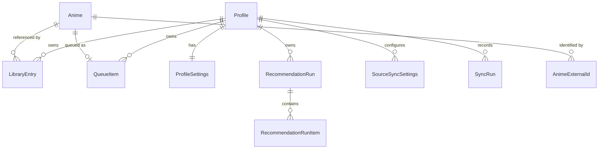

# AniQueue — Roadmap

**Status:** authoritative planning document. Supersedes nothing; amended by PR.

AniQueue is a self-hosted anime watchlist and **backlog decision layer**. It is not a
MyAnimeList/AniList replacement — it assumes your library already exists somewhere and
answers the question those tools answer badly: *what do I actually watch next?*

Put precisely: **AniQueue owns the order of your watch list; the service you already use
owns its membership** (D11). The order is maintained jointly by you and an AI, and it
persists.

Problems in scope:

- Plan-to-Watch lists grow large and unordered.
- There is no deliberate, hand-curated "watch this next" queue.
- Franchise seasons, OVAs, films and specials arrive in the backlog with nothing saying they
  are related. *Amended by D24: the answer is to surface each title's relations on its own
  row rather than to collapse them into one, so this reads as a missing-context problem
  rather than a clutter problem.*
- Prioritisation should follow *your* historical scores, not global popularity.
- It must run on your own hardware with no cloud dependency.

### Source documents

| Document | Role |
|---|---|
| [`BUILD-PROMPT.md`](BUILD-PROMPT.md) | Original brief, preserved verbatim. Historical reference. |
| `ROADMAP.md` (this file) | **Authoritative.** Brief + agreed deviations + phase plan. |

Where this file and the build prompt disagree, this file wins, and §2 records why.

---

## 0. Verified environment

Checked on the development machine, not assumed:

| Component | Version |
|---|---|
| .NET SDK | 10.0.301 (runtime host 10.0.9) |
| Visual Studio | Community 2026 — 18.7.11925.98 |
| Docker Engine / Compose | 29.5.3 / v5.1.4 |
| git / gh | 2.54.0.windows.1 / 2.92.0 |
| EF Core SQLite (latest) | 10.0.11 |

Two findings that contradict reasonable assumptions:

- `dotnet new xunit` on .NET 10 emits **xUnit v2.9.3**, not v3. We use v2 as templated.
- No .NET workloads installed, and none are needed — plain `net10.0` + `Microsoft.NET.Sdk.Web`.

**The repository is public.** No secret, token, API key, or personal export may ever be
committed. Sample/seed data must be obviously fictional.

---

## 1. Technology

Fixed by the brief and agreed:

- .NET 10, C#, ASP.NET Core **Blazor Web App** with Interactive Server rendering
- EF Core 10 + SQLite
- Built-in DI, configuration, logging, options pattern
- xUnit, Docker, Docker Compose

Explicitly excluded: React, Angular, Vue, Node.js, any separate frontend build system,
MediatR/CQRS abstractions, generic repositories, service locator.

One permitted JS dependency: **SortableJS**, via minimal interop, for drag ordering only.
See D5 and §9 for why this is the riskiest line in the document.

`<Nullable>enable</Nullable>` and `<ImplicitUsings>enable</ImplicitUsings>` everywhere.

---

## 2. Architectural decisions and deviations

Numbered so they can be cited in code comments, PRs and future amendments.

### D1 — The queue gets its own table; `LibraryEntry.QueuePosition` is dropped

> **Superseded in part by D15, and finally by D23.** A franchise no longer occupies a queue
> slot, so the exclusive-or below is gone and `QueueItem.AnimeId` is required; D23 then removed
> franchises from the application altogether, so there is no longer any second kind of thing a
> slot could hold. The conclusion — a separate table — still stands, for the different reasons
> D15 gives. The rest of this entry is kept as the record of why the queue was modelled this
> way first.

*Brief §4 vs §5 contradict each other.* §4 puts `QueuePosition` on `LibraryEntry`; §5
requires that an anime **or an entire franchise** can occupy a queue slot. There is no
`LibraryEntry` row for a franchise, so a nullable int on that table structurally cannot
express "Slayers is at position 7".

**Decision:** a dedicated `QueueItem` table holding an exclusive-or reference:

```sql
CHECK ((AnimeId IS NULL) <> (FranchiseId IS NULL))
```

`LibraryEntry.QueuePosition` does not exist. "Is this queued, and where?" is a join.
Reordering rewrites one narrow table instead of touching library rows.

### D2 — No unique index on `(ProfileId, Position)`

SQLite enforces uniqueness **per statement**, not at commit. Any reorder that shifts a
block of positions collides transiently and aborts the transaction. The escapes (shift into
a negative range, then rewrite) are two passes of pure ceremony.

**Decision:** a plain non-unique index. Contiguity and uniqueness are invariants owned by
`QueueService`, applied inside a single transaction. This is a real trade — the database no
longer defends the invariant, so §8's reorder tests are load-bearing, not decorative.

### D3 — `IDbContextFactory`, never scoped `AddDbContext`

Under Interactive Server a scoped service lives as long as the SignalR circuit — the user's
whole session, potentially hours. A scoped `DbContext` there means an unbounded change
tracker, stale reads, and `InvalidOperationException` the first time two components render
concurrently.

**Decision:** `AddDbContextFactory<AniQueueDbContext>`; every service method creates and
disposes a short-lived context. This is the most common Blazor Server + EF defect and is
free to avoid at the start.

### D4 — Recommendation history needs per-run items

> **Superseded in part by D16.** A run item references one anime; the nullable
> `FranchiseId` below is gone. The rest of this entry — run plus per-candidate items, no
> persisted request payloads, `LibraryEntry` as the applied-run cache — stands, and it is
> that cache which forced D16.

*Brief §20 is internally inconsistent.* It says store run metadata and avoid duplicating
request data, then requires comparing the current recommendation set against a previous
one. Metadata alone cannot support that comparison.

**Decision:** `RecommendationRun` (metadata) + `RecommendationRunItem` (per-candidate rank,
predicted score, confidence, reason). Request payloads are **not** persisted — the
candidate set is reconstructable from run items. The `Recommendation*` columns on
`LibraryEntry` are a denormalised cache of the currently-applied run so backlog sorting
stays a single-table query.

### D5 — Button reordering ships before drag-and-drop

The brief requires both (§5) and mandates a non-drag path (§39). The buttons are trivial
and entirely server-side; drag is the risky half.

**Decision:** implement button reordering and its tests first. Drag layers onto an
already-correct reorder service. If the interop proves messy, the feature degrades to
something that already works rather than blocking the phase.

### D6 — Central package management and shared build props

Not in the brief, framework-native, no new dependency: `Directory.Build.props` for shared
compiler settings, `Directory.Packages.props` for versions pinned once across five
projects. Prevents version drift.

### D7 — `ProfileSettings` is a typed entity, not a key/value bag

Settings (§25 of the brief) are a fixed, known set. Typed columns are migratable, bindable
straight from the Settings page, and cannot rot into stringly-typed soup.

**Amended by D20.** Two kinds of setting turned out not to fit this entity: those an operator
must reach from outside a running container, which live in configuration, and those keyed per
external source rather than per profile, which get their own entity. The argument above is
unchanged for everything that remains here.

### D8 — `AniQueue.slnx`, not `AniQueue.sln`

*Reverses an earlier call in this document.* The brief names `AniQueue.sln`, and the first
attempt used the classic format on the reasoning that `.slnx`'s main benefit — no GUIDs, so
no merge conflicts — does not apply when all five projects are added at once and no more
are planned.

That weighed one factor and missed a second. `dotnet new sln` emits a **hardcoded, already
stale version stamp** (`# Visual Studio Version 17` — VS 2022) that has nothing to do with
the installed toolchain, and the format carries ~100 lines of GUID bookkeeping for what is
really a five-line list of projects. Since VS 2026 is the primary development environment
and supports `.slnx` natively, the modern format is the better fit.

**Decision:** `AniQueue.slnx`, generated via `dotnet sln migrate`. 101 lines → 12, no GUIDs,
and no version header that can go stale. Verified: `dotnet sln list`, `dotnet build`,
`dotnet test` and `dotnet build -c Release` all work unchanged. The `x86`/`x64` platform
entries the migration carried over were removed — this solution only ever builds Any CPU.

Minimum tooling this implies: VS 2026 (or VS 2022 17.14+) and the .NET 10 SDK. Both are
already the baseline in §0, so nothing is lost.

### D9 — Parsing lives in Core, and the parser does not build the preview

**Recorded in §5**, beside the import pipeline it describes, rather than repeated here. This
stub exists because the number is cited from code — `IAniListClient` and `AniListClient` both
point at it — and a decision that cannot be found from its own register is a decision nobody
will check before contradicting it.

### D10 — Franchise grouping waits for authoritative relation data

A MyAnimeList export carries no relationship data at all. Its 23 fields per entry are
catalogue basics and the user's own tracking; there is no sequel, prequel, parent or
franchise field. Franchises therefore cannot be derived from an import, only curated.

That is a problem at realistic scale. Measured against a genuine 752-title export, a
title-similarity heuristic proposed **138 candidate franchises covering 447 titles (59%)**.
Curating that by hand is data entry, not curation — but the same run also produced a
confident group named "Re" containing seven entries, which is `Re:Zero` split on its colon.

The brief permits detection "as an optional suggestion" (§4), and that option was considered
and **declined**: a suggestion engine that is confidently wrong leaves the user unpicking
mis-grouped franchises, which is worse than having none yet. Franchise grouping instead
waits for MAL/AniList relation data, which is authoritative rather than inferred.

**Consequence, accepted knowingly:** until that integration lands, users with large libraries
have manual franchise management only, and will realistically group a handful of franchises
rather than all of them. Phase 6 ships manual tools; the relation data D13 promoted into the MVP
is what makes franchises practical at scale.

Do not re-propose title-similarity detection without new evidence that it can be made
accurate — the 59% coverage figure is not the interesting number, the false positives are.

**Amended by D13.** Promoting AniList read access into the MVP supplies exactly the
authoritative relation data this decision was waiting for, so the wait is now until Phase 5
rather than until after the MVP. Phase 6 may propose groupings from real relations — still
confirmed by the user, never applied silently.

**Amended again by the Phase 5 split.** Relation data is now fetched *in Phase 6*, not handed
over by Phase 5. Because relations come from a separate query rather than riding along with the
list (see Phase 6), they have no coupling to list sync, and fetching them one phase before
anything consumed them split one feature across two phases for no benefit. The wait is
unchanged in substance: authoritative relations still precede any grouping proposal.

**Amended finally by D23 and D24, and the change is a reversal rather than a delay.** This
decision said grouping waits for authoritative data. The answer is now that grouping does not
happen at all: AniQueue never groups titles, curated or proposed, because grouping is
authorship and membership is not AniQueue's to author (D11 applied one level down). The
relation data this entry was waiting for is still fetched and is still the foundation of
Phase 6 — it is shown per title rather than resolved into groups. What survives intact is the
warning: **do not re-propose title-similarity detection.** It was wrong when the alternative
was curation and it is wrong now that the alternative is authoritative edges.

### D11 — The AI orders a closed set. It does not choose what is in it.

**What AniQueue is for:** a watch list whose *order* is maintained jointly by the user and
an AI, and which persists. The list's *membership* is maintained elsewhere — principally on
MyAnimeList or AniList — and arrives here by import or, later, sync.

That division is the point. AniQueue owns the order; the external service owns the
membership.

So the model is given the user's scored history and the titles already on their list, and
asked to rank *those*. It is never asked what to add. Entries it ranks lowest become
removal candidates the user may act on at their discretion; removal is therefore a
consequence of ranking rather than a separate instruction, and needs nothing in the schema.

This is a constraint on the model, chosen deliberately over a broader one:

- **It removes hallucination by construction, not by validation.** Every ranked item carries
  a candidate id AniQueue issued, so a fabricated title has nowhere to appear. Asking for
  additions would mean accepting titles the application has never seen, which would then
  need resolving against a real catalogue before they could be trusted — work that depends
  on the API integration, not the model.
- **It keeps the result schema exactly as the brief specifies.** An earlier suggestion to add
  an extensibility hook for future "suggested additions" is withdrawn: a field for a feature
  that is not being built is speculative infrastructure, and `schemaVersion` already provides
  the way to change shape later.
- **It needs no new persistence.** `RecommendationRunItem` referencing an existing anime or
  franchise holds, because every ranked item exists locally. Acting on a removal candidate
  uses what is already modelled — `Dropped` status or `IsHidden` — so nothing has to be
  written back to an external service.

Deferred until the core is done, and deliberately not designed yet: an LLM-written summary
of the user's taste for the dashboard. Pleasant, not load-bearing.

### D12 — AniQueue observes watched status. It never authors it.

D11 said membership is owned elsewhere. This follows it to its conclusion, and
**removes a phase**.

The brief's watching workflow (§22) — mark as watching, add an episode, complete and
score — assumed AniQueue was the primary tracker. It is not. A realistic setup already
has one: media server scrobbles to AniList, scores are entered there, and other services
mirror it. Every one of those actions in AniQueue would create a second source of truth
that drifts from the first within a day.

So watched status, episode progress and scores are **read-only here**. They arrive by
import or sync, they display, and nothing in the application writes them.

That extends to the action that looked most defensible. An explicit "start watching"
button is unnecessary, because starting a show is already observable: the entry moves from
Planning to Watching at the source. **The queue advances as a consequence of sync, not of a
click** — when a queued title stops being Planning, its slot is released and the next item
becomes next in line.

This has a useful property: the rule belongs to the import and sync path, not to a button,
so it works with file import today and needs no API to be correct.

The trade, recorded honestly: the brief's acceptance criteria 13 and 14 ask for progress
tracking and score entry, and this decision declines both. D11 and the brief disagree here;
D11 is the later and more considered position, and the application it describes is the one
being built.

**What remains of the old watching phase:** nothing that warrants a phase. Its one surviving
rule is queue advancement, which belongs with the queue in Phase 4.

### D13 — AniList read access moves into the MVP

Previously post-MVP. Two things move it.

**It is the only manual step in an otherwise automatic chain.** With D11 and D12, membership
and status both arrive from outside — so file export and upload is the single point where the
user does work a machine should. Automating the *ordering* while leaving the *input* manual
optimises the wrong half.

**D12 depends on it to be useful.** Queue advancement works on any import, but advancing on a
schedule rather than when the user remembers to export is what makes the queue trustworthy
without attention.

Scope is deliberately narrow: **read only.** List and status retrieval, and relation data.
No write-back, no OAuth-gated private lists, no scheduled re-ranking. Write-back stays
post-MVP, where it belongs — it is the direction that can damage data the user maintains
elsewhere.

Worth confirming at implementation time rather than assuming: AniList's GraphQL API serves
public list data without authentication, which if true removes OAuth from the MVP entirely.
Design for it, verify before relying on it.

**A consequence for D10:** franchise grouping was deferred for want of authoritative relation
data. Promoting AniList read access supplies it, so grouping can use real relations inside
the MVP rather than waiting. The phase order below puts AniList before relations for exactly
this reason.

*Amended by D23 and D24.* The relation data promoted here is still the point, but nothing
groups with it: relations are shown per title, and the franchise entity is gone.

**Scope, revised once the design was worked through.** Three things changed and are recorded
here rather than left as drift between this entry and the phase plan:

- **The phase is three phases** — 5a, 5b, 5c. Fourteen deliverables across five subsystems is
  not one reviewable change, and §9 already names scope as the main schedule risk.
- **The per-source watermark described below is not a wire optimisation.** `MediaListCollection`
  returns an entire list in one request, so a watermark-driven delta costs *more* requests than
  a full fetch — and worse, a delta is structurally blind to deletions, because a removed entry
  has no `updatedAt` to appear under. That makes it incompatible with D19, which is committed.
  The watermark's real jobs are refusing to re-poll inside the interval floor, skipping a commit
  that would change nothing, and rendering "last synced". That is bookkeeping, not a protocol.
- **Relation data moves to Phase 6**, where it is consumed. See the amendment on D10.

**Verified against the live API on 2026-08-17**, using a real 753-entry public list rather than
assumed. What was checked, and what it means:

| Assumption | Result |
|---|---|
| Public lists readable unauthenticated | **Yes.** HTTP 200 with full data, no `Authorization` header. **OAuth is out of the MVP entirely** |
| `MediaList.score` accepts `format:` | **Yes**, and the conversion is genuinely server-side — the same entry returns 7 / 70 / 4 / 3 across `POINT_10` / `POINT_100` / `POINT_5` / `POINT_3` |
| `MediaListCollection` returns a complete list | **Yes.** Unchunked, `hasNextChunk` is `false`; 753 entries and 753 distinct media ids arrive in **one request** of 424 KB at full fidelity |
| Rate limit | **30/min**, not the documented 90. `X-RateLimit-Limit`/`-Remaining` are returned and CORS-exposed |

That settles the watermark argument above with measurements rather than reasoning: one request
per poll, 424 KB, against a 30/min budget. There is no rate-limit problem for a delta to solve.

Field-level counts from the same response, which several decisions below now rest on:

| | |
|---|---|
| `idMal` null | **6 of 753** (0.8%) — the bridge gap in D17 is real but tiny |
| `title.english` null | **111 of 753** (14.7%) — D22's fallback chain is load-bearing, not defensive |
| `duration` null | **0** — every title carries an episode duration |
| `seasonYear` null | 13 (1.7%) |
| `episodes` null | 1 |
| `coverImage.large` null | 0 |
| `startedAt` entirely null | 208 (27.6%) |

**What the probe could not verify, because this library does not contain it.** Only `COMPLETED`,
`CURRENT` and `PLANNING` appear, so the `PAUSED`, `DROPPED` and `REPEATING` mappings are
reasoned rather than observed. No partial `FuzzyDate` occurred — every date was complete or
entirely null — so partial-date handling is untested against real data even though the schema
makes all three components independently nullable. And the account uses no custom lists, which
leaves one hazard open below.

**Custom lists are an open hazard.** `MediaListCollection.lists` carries `isCustomList`, and
AniList lets a user file one entry into a status list *and* custom lists. Whether that surfaces
the entry more than once in the collection is unverified — 753 entries to 753 distinct media ids
here proves only that it does not happen when no custom list exists. The parser must therefore
de-duplicate by media id rather than trust the collection to be flat.

**Two hardening notes from the response itself.** The endpoint sets a `laravel_session` cookie,
so the client should not persist cookies; and 424 KB for 753 entries means a library of a few
thousand is a few megabytes, which is what §6's response cap should be sized against with
headroom rather than tightly.

### D14 — No manual priority. The queue is the user's ordering.

`LibraryEntry.ManualPriority` is removed: the column, the filter, the sort, the facet and
the bulk action.

**A shared bucket is not an order.** Setting twenty titles to priority 5 says nothing about
which of them comes first, so a bulk priority control could not produce the thing it
appeared to produce. Ordering needs a rank, and two already exist — both real ranks:

| Ordering | Held by |
|---|---|
| The user's | `QueueItem.Position` |
| The AI's | `LibraryEntry.RecommendationScore` |

Those two are exactly what the Manual / AI / Hybrid views need. A third axis overlapping the
first without replacing it only blurred the distinction.

The brief lists manual priority as a hybrid ranking input (§18) — but the same sentence also
lists *"whether title is already in Up Next"*. Queue position was always an intended signal,
and it is the better one: being third in a hand-ordered queue is a far stronger statement of
intent than wearing a shared label.

Removed rather than left unused. Keeping a column against a possibility is the speculative
infrastructure argued against in D11, and if Phase 9 wants a user signal stronger than queue
membership, choosing one deliberately beats inheriting one nobody picked.

Two details worth keeping in mind when removing anything similar:

- **The retired sort's enum value is not reused.** Sort preferences are persisted in settings
  later, and silently changing what a stored number means is how a saved preference becomes a
  wrong one.
- **A tiebreak test quietly stopped testing anything.** It had sorted by priority across
  entries sharing a value; with priority gone it sorted unique titles and would have passed
  without exercising the tiebreak at all. It was re-pointed at a sort that genuinely collides.

### D15 — A franchise groups titles and queues them. It is not a queue item.

> **Superseded in part by D23.** Everything below about what a queue slot is remains in force
> and is the reason the queue survived franchises being deleted without a single change to its
> table. What is withdrawn is the other half — the franchise as a grouping, its curation, its
> collapsed card, `OptionalWithinFranchise`, and expansion taking a franchise id. The one-click
> expansion itself survives, rooted at a title and walking the relation graph forward (D24).

*Reverses the central claim of D1, and declines §262 of the brief — while still meeting the
acceptance criterion that rested on it.*

The brief (§262) allows "an anime **or** an entire franchise" to occupy a queue slot, and D1
built the schema around it: a dedicated `QueueItem` table with an exclusive-or reference,
because a franchise has no `LibraryEntry` row to hang a position on. That is now withdrawn.
`QueueItem` references exactly one anime.

**A franchise is not a thing you watch.** The queue answers one question — what do I press
play on tonight — and its unit has to be an answer to it. A slot holding twelve seasons is a
project, not an evening. Once one exists, position stops meaning anything: item 2 is ninety
minutes and item 3 is ninety hours, and "third in the queue" no longer describes when you
get to it.

**The mechanism that made it work was already deleted.** §262 only functioned because of
§302 — *starting the franchise selects the next unfinished anime in franchise order* — which
turned one slot into a sequence of real decisions. D12 removed the entire watching workflow,
that action with it. What was left was a queue element with no defined way to progress
through it, and implementing D12 exposed the gap immediately: releasing a franchise slot
needed a rule invented for the purpose ("release once nothing in it is still planned")
derivable from nothing. Having to invent that rule was the evidence.

**And it forbade the ordering the application exists to provide.** A franchise as one slot
makes it structurally impossible to put anything between two of its seasons, or to skip a
season, or to space a long series out across months. D11 says AniQueue owns the order of the
watch list. A model that prevents the user expressing an order contradicts the premise.

**Decision:** `QueueItem` is `Id, ProfileId, Position, AnimeId, AddedAt`. The exclusive-or
check constraint and the franchise index go. A franchise keeps everything else it had —
membership, `FranchiseOrder`, `OptionalWithinFranchise`, curation, the collapsed card — and
gains one job in the queue:

- **Queueing a franchise expands it.** Its members that are still Planning, not already
  queued, and (by default) not optional are appended individually in viewing order. One
  click, one decision, but what lands is a run of watchable titles.
- **In the queue a franchise is a badge**, so its seasons read as related while remaining
  independently orderable.
- **`OptionalWithinFranchise` gets a concrete job**: it decides what expansion queues. It
  was previously a flag waiting for completion maths to consume it.

**One membership rule, applied at both ends.** A queue slot holds a title the user
still plans to watch. `AddAnimeAsync` enforces it when a title goes in and
`AdvanceAsync` enforces it as statuses change — the same rule at two moments, rather
than a rule on the way out and nothing on the way in.

Expansion having that filter while the backlog's bulk add did not was a real defect,
found by noticing a Completed title sitting at the top of Up Next. Beyond the
inconsistency, allowing it created a slot with a hidden expiry: a watched title could
be queued and would then be deleted by the next import's advancement, without the
user having watched or removed it. Declining up front and **saying why** is the fix —
`QueueAddResult` separates "already there" from "already started or finished" from
"not in your library", because being told five of eight were added invites the guess
that the application lost the other three.

This does not carve out re-watching, and the way it doesn't matters: set the title
back to Planning at the source and it is queueable again. D12 has AniQueue observe
watch status rather than author it, so a re-watch is expressed where every other
status change is.

**AniList's `REPEATING` is not that gesture, and mapping it here would be a mistake.**
`REPEATING` means actively re-watching now, so it maps to `Watching` and its queue slot is
released — correct, because Up Next answers "what do I start next" and a show playing tonight
is not a decision waiting to be made. The re-watch above is a *planned* re-watch, expressed by
setting a completed title back to `PLANNING`, and that still works unchanged. Mapping
`REPEATING` to `Planning` to make re-watches queueable would put a show being watched into the
not-started bucket and break D12's premise that status is observed faithfully.

Three things fall out rather than being built:

- Advancement becomes per title. Watch season two and only that row leaves; season three
  rises to meet you. The invented franchise rule is gone.
- Re-adding a franchise after a sync brings a new season queues exactly the new season, from
  the same idempotency that already governs adding a title twice.
- Dissolving a franchise no longer empties part of the queue. Under D1 the slot was deleted
  with the franchise, silently taking the user's ordering with it.

**What is given up, plainly.** The queue can no longer show one line reading "Slayers"; a
five-season franchise is five rows, and that is the point — those are five evenings. The
brief's §264 complaint that sequels should not each be *"an independent high-level
choice"* is real, but it is a **backlog** problem, and it is answered where it occurs: by
grouping and collapsing in the backlog, which is the decision surface. The queue is the
ordering surface, and ordering wants the finer grain.

**Acceptance criterion 10 is still met.** It asks to *"add standalone anime or franchises to
Up Next"*, and that still works, from one control. What changed is what the queue holds
afterwards, which the criterion does not specify. Unlike D12's honest decline of criteria 13
and 14, nothing on the brief's completion list is lost here — only §262's account of how it
should be represented.

**Why the queue keeps its own table.** D1's reasoning is gone, so `LibraryEntry.QueuePosition`
would now be expressible. It is still refused. Reordering would write to wide library rows
that imports contend for on a single-writer database; the ordering column would be null on
most rows; and the queue has its own lifecycle. The conclusion survives its original argument.

**Left open deliberately:** `RecommendationRunItem` still carries a nullable `FranchiseId`
(D4), so Phase 9 could rank a franchise against individual titles — the same granularity
mismatch in the recommendation surface. It is not changed here because it is a question about
D11's model rather than the queue's, and it should be argued on its own terms before Phase 9.
**Settled by D16, in the affirmative.**

### D16 — A ranked candidate is a title. It cannot be a franchise.

*Settles the question D15 left open, and supersedes part of D4.* `RecommendationRunItem`
references exactly one anime; the nullable `FranchiseId` and its exclusive-or check
constraint are removed.

D15's granularity argument carries over unchanged — ranking a twelve-season group against a
single film compares a project to an evening. But the decisive reason is narrower and does
not depend on taste at all:

**A franchise ranking had nowhere to be applied.** Applying a run caches its result on
`LibraryEntry.Recommendation*`, which is what makes sorting the backlog by AI score a
single-table query (D4). A franchise has no `LibraryEntry` row. So a franchise placement
could be *stored* and never *applied* — the column permitted a row that the write path
structurally could not consume.

This was not a hypothetical. The one existing implementation of applying a run filtered its
items with `Where(i => i.AnimeId is not null)`, discarding franchise placements as its first
act. A field whose every consumer must skip it is not extensibility; it is an invitation to a
bug in Phase 9, where an imported ranking containing franchises would validate, persist,
report success, and change nothing.

Nothing produced such a row — not the seeder, not any test — so removal loses no behaviour.

**Consequence for Phase 9, stated plainly:** the AI ranks titles. If a user wants a
franchise's seasons ranked, they are ranked individually, which is also the only form in
which the result can be displayed or sorted. This costs nothing real: D11 already builds the
candidate set from the user's library, and every candidate in it is a `LibraryEntry`, so
franchises were never going to appear there in the first place.

**Not changed at the time:** `Anime.FranchiseId`, `FranchiseOrder`, `OptionalWithinFranchise`
and the `Franchise` entity all stood. Franchises remained a grouping, a backlog collapse and a
queueing action (D15) — they were simply not a unit of ranking, exactly as they were not a unit
of watching.

*That sentence is now false in every part: D23 deleted all four.* The reasoning above is
unaffected and, read in hindsight, was the first half of the same argument — a franchise turned
out to be not a unit of ranking, not a unit of watching, and finally not a unit of anything.

### D17 — External identity is a set, not a field

*Retires `Anime.Source` + `Anime.SourceAnimeId` as the identity mechanism. `Source` survives
as provenance.*

Phase 5's charter said reconciliation "reuses the import pipeline — matching on
`Source + SourceAnimeId`". That sentence is only true while both sides speak the same source.
A library imported from MyAnimeList holds `(MyAnimeList, <mal id>)` on every row; an AniList
sync arrives as `(AniList, <anilist id>)`, matches nothing, falls through to the title branch,
and returns a conflict or a duplicate for **every title in the library**. Against the genuine
752-title export measured in D10 that is either 750 hand decisions or 750 duplicate rows — and
unattended sync has nobody present to make decisions.

AniList publishes `Media.idMal`, so the bridge arrives in the same response that creates the
problem. What was missing was anywhere to keep it.

**Decision:** external identity moves to `AnimeExternalId (AnimeId, Source, ExternalId)`,
unique on `(Source, ExternalId)`. A title carries zero or more. Matching tries every
identifier an incoming entry supplies, in source-precedence order, before it considers a title.

Three consequences, one of them a tidy-up:

- **The filtered unique index disappears.** `IX_Anime_Source_SourceAnimeId` carries
  `WHERE SourceAnimeId IS NOT NULL` only because manual entries have no identifier and would
  otherwise collide on null. A manual entry now has no rows at all, so the constraint needs no
  filter.
- **`Source` narrows to provenance** — how this record came to exist — and stays on `Anime`
  because the seeder and conflict linking both reason about it. The backlog's source filter
  changes meaning with it, and improves: `Source == AniList` becomes "this title is on
  AniList" rather than "an AniList import created this row", which is what a user clicking the
  chip means.
- **A row can offer several links.** `SourceLink?` becomes a collection, so a bridged title
  links to both MyAnimeList and AniList.

Typed columns per platform — `MalId`, `AniListId`, later `KitsuId` — were considered and
declined. They are the arity-fixed denormalisation of the same relation, they need one filtered
index each, and reaching the general shape later means rewriting the matching path a second
time. Matching is the one path where a mistake silently duplicates or silently merges a user's
library, so it is worth getting right once; and the generality is free *now*, while the only
consumers are two projections and one filter. This is the argument Phase 11 makes about
squashing migrations — a cheap structural change has a window.

**Not every platform is a peer, and this table must not imply otherwise.** MyAnimeList,
AniList and Kitsu are anime databases with roughly 1:1 title identity that publish
cross-references to one another. Trakt, TMDB and TVDB are general-media databases where a
franchise is frequently one series with absolute episode numbering, the mapping is many-to-one,
and nobody publishes it — §10 already says exactly this about Overseerr. Storing such an
identifier here is harmless; assuming it is 1:1 and self-populating is not.

**The bridge works in both directions, provided a sync writes every identifier it is given.**
An AniList entry carries both `id` and `idMal`, so a sync that stores both leaves a
`(MyAnimeList, <mal id>)` row waiting, and a MyAnimeList export landing later matches it on the
ordinary path instead of conflicting. This extends no new trust: it is the same `idMal` claim,
from the same field, that the other direction already depends on. So a parsed entry carries a
**set** of identifiers rather than one, and a commit writes every one it does not already hold.

Two edges follow, and both must be caught while previewing rather than at the commit:

- **Two incoming entries claiming one identifier.** AniList holds split and duplicate entries
  that point at a single `idMal`. The second write would violate `UNIQUE(Source, ExternalId)`
  and fail the whole transaction, so the collision is detected during matching and reported as
  a problem against the entries that caused it.
- **One entry whose identifiers resolve to different local rows.** Trying identifiers in
  precedence order reads as first-match-wins, which silently discards contradicting evidence —
  and the contradiction usually means those two local rows are duplicates that ought to be
  merged. There is no merge surface, so this is a conflict for the user to resolve, never a
  silent pick.

**One narrow gap remains, and it is a data-quality gap rather than a hole in the model.** An
AniList entry with a null `idMal` asserts that no MyAnimeList counterpart exists; if the export
contains one anyway, the title conflicts on name and the user decides. Nothing in the design can
do better than the cross-reference it is given. Measured against a real 753-entry list, **6
entries had a null `idMal`** — under 1%, so the fallback is genuinely a corner rather than a
common path.

**The two identifiers are not interchangeable, and this is worth stating because assuming
otherwise is a tempting shortcut.** They frequently coincide — *Shingeki no Kyojin* is 16498 on
both — and then diverge without warning: its second season is AniList 20958 and MyAnimeList
25777. Code that treated one id as the other would appear to work across a sample and then
silently mis-map a sequel onto an unrelated title.

### D18 — A primary source owns tracking data. Others may only add.

Consolidating two separately-maintained lists is a use case AniQueue serves: a user with a
MyAnimeList history and an AniList list they now keep current has a real reason to want the
union. D17 makes it possible, and it makes the overlap contested — once a row carries both
identifiers, both sources can write its status, progress and score.

`UpsertLibraryEntryAsync` is unconditional last-writer-wins, which is right with one source and
wrong with two on a timer. The failure is concrete. A show on both lists is finished and scored
on MyAnimeList, the export is imported, and `AdvanceAsync` correctly releases its queue slot.
Thirty minutes later the scheduled AniList sync returns its stale `PLANNING`, unambiguously,
and applies it. The title reverts, becomes queueable again, and reappears in the backlog as a
decision already made. It flaps every interval, and the deliberate act loses every time,
because the scheduled writer is always the last writer.

**Decision:** each configured source carries a precedence rank. On a contested row a
lower-ranked source may create the row and fill catalogue metadata, but may not overwrite
status, episode progress or score written by a higher-ranked one.
`LibraryEntry.LastWrittenBySource` records who last wrote the tracking fields.

- **Precedence guards tracking data only.** Catalogue metadata — episode duration, release
  year, cover image — is filled by whoever has it, because AniList carries fields a
  MyAnimeList export simply does not. This is the line `UpsertLibraryEntryAsync` and
  `ApplyCatalogueFields` already draw between the user's tracking and facts about the title.
- **Ranking is explicit, never inferred.** "Whichever source syncs wins" is the obvious rule
  and it is wrong for the consolidator migrating *away* from AniList while treating
  MyAnimeList as authoritative.
- **With one source configured it never fires**, and behaviour is identical to today's. The
  single-tracker user D13 optimises for pays nothing.

Freshest-wins was rejected on availability: AniList supplies `MediaList.updatedAt`, and the
MyAnimeList export appears to carry no per-entry update time — the parser reads none. A rule
that cannot be evaluated for one side is not a rule. Monotonic merge — never regress status or
progress — was rejected because it breaks D15's re-watch story outright: a re-watch is
expressed by setting a title *back* to Planning, which is precisely the regression such a rule
would refuse.

### D19 — Absence is authoritative, but only where the source once spoke

D11 puts list membership outside AniQueue, which taken seriously means a title deleted from the
user's AniList list should leave here too. The import pipeline has no concept of absence — it
iterates a payload, so a title not in it is never considered — and so today the library only
ever grows.

Two populations must be told apart before any of this is safe, and D17 is what makes the
distinction exact:

- **A row with no identifier for the syncing source** has never been listed there. Out of
  scope, untouched, always. Every MyAnimeList-only and hand-added title is in this bucket.
- **A row carrying that source's identifier which the fetch did not return** was listed and is
  not now. Only this population is ever in scope.

That is what protects the consolidating user, and the protection is worth stating precisely
because it is *structural rather than configured*: their MyAnimeList-only titles are never at
risk whatever the setting says.

**Decision:** absence handling is configured per source — flag for review, remove, or ignore —
defaulting to **flag**. The default is safe for identical-list and consolidated-list users
alike, so correctness never depends on the user finding a setting.

- **Only the `LibraryEntry` and its queue slot are ever removed**, never the `Anime`. The
  catalogue row is shared with relation edges and `RecommendationRunItem` history.
- **Removing an entry must remove its queue slot in the same transaction.** `AdvanceAsync`
  deliberately treats a missing library entry as *unknown, not watched*, and keeps the slot.
  Deleting the entry alone destroys the only evidence that could ever release it, leaving a
  slot nothing can clear.
- **Automatic removal waits for Phase 8.** Phase 8 is what gives the user a full backup and
  restore, and it ships after this phase. A truncated response, a paging bug, a mistyped
  username or a profile turned private all look identical to "the user deleted everything",
  and an emptied library taking the hand-built queue with it is the one failure here with no
  recovery path in the product.
- **When it does land it needs guards:** honour absence only when the fetch is structurally
  complete, never act on an empty or near-empty response, and cap the proportion removable in
  one unattended run before downgrading to flag.

### D20 — Operator configuration and user preference are different stores

*Amends D7 by adding a second home for settings, without reopening its argument.*

Phase 5 is the first phase with settings a self-hoster needs to reach from outside the
application, and the first with something the application must be able to be *told to stop
doing*. A single YAML file in `/data` was proposed for all of it, and declined.

**The stated goal was already met.** `Database:Path` is `/data/aniqueue.db`, so the database
already lives outside the image in the operator's volume, and criterion 25 already proves it
survives container recreation. Settings in the database are settings in `/data`. A second file
there is not more persistent; it is a second thing to back up, and one that Phase 8's
full-library export would not cover.

**Decision:** split by who owns the value, and keep the key sets **disjoint** so there is no
precedence puzzle between them.

| | Store | Holds |
|---|---|---|
| Operator / deployment | `IConfiguration` — `appsettings.json`, environment variables, optional `/data/userconfig.json` | Database path, port, sync kill-switch, poll-interval floor, the AniList account |
| User preference | Database, per profile, per D7 | Primary source, absence policy, unattended application, conflict policy, title language |

Because the sets are disjoint, a value changed in the UI can never be silently reverted by a
file, and the escape hatch that matters when the UI is unreachable — turning sync off — is a
configuration key by design.

`AddJsonFile(path, optional: true, reloadOnChange: true)` is one line and needs no package.
YAML needs YamlDotNet, which §12 requires approving, and a UI writing a hand-editable file
needs atomic replacement, concurrent-write protection, and comment-preserving round-tripping
that YamlDotNet does not provide. §9 also notes that a non-root container cannot write to a
root-owned bind-mounted `/data`, which would turn a first-run failure into a save button that
fails for Unraid users.

**Do not depend on live reload.** The file watcher behind `reloadOnChange` does not reliably
fire on Windows-host or network-share bind mounts, so a restart must apply the file too.

**The file is written on first boot, and everything in it is commented out.** A settings file
nobody knows exists is a poor escape hatch, and "create it yourself, in the right place, with the
right key names" is worse — so startup leaves a template naming every key it accepts. Three
properties make it safe rather than merely helpful, and all three are load-bearing:

- **It configures nothing.** The file is added *last*, so a key it sets beats the same key from
  an environment variable. A template shipping real values would therefore override the
  `Sync__AniList__UserName` an operator set in their compose file, on a machine where nobody had
  opened the file. Commented out, it can only take effect once somebody uncomments a line — an
  act that carries the intent to override.
- **One line per setting, written as a full `Sync:AniList:UserName` path.** The JSON provider
  reads a property name containing colons as the whole key, so this means the same as the nested
  spelling. Uncommenting a line out of a *nested* block leaves its closing braces behind, and a
  file that cannot be parsed is a file whose settings are all silently absent — a poor property
  for the one an operator edits when something is already wrong.
- **It never overwrites and never fails the boot.** An existing file is the operator's work,
  including one they emptied deliberately. §9's non-root container writing to a root-owned bind
  mount cannot create it at all, and refusing to start over an unwritable convenience file would
  turn a hint into an outage, so failure is a logged warning.

**A file it cannot parse must not stop the application.** By default the JSON provider throws
while the host is being built — before logging exists — so one missing comma in the file an
operator edits by hand replaces AniQueue with a stack trace on a console they may not be watching.
That is precisely backwards for an escape hatch: the file exists to be edited when something is
already wrong, and editing it is when it will be mistyped.

So the source is configured with `OnLoadException` set to ignore the load. Everything the file
would have configured is skipped, every other configuration source stands, the application starts,
and it says what happened — a warning at startup for the console, and a red banner on the
dashboard naming the file and quoting the parser's own message, which carries the line and
position. The provider's own load path decides what is acceptable rather than a validation pass of
ours: this file permits comments and trailing commas, and two implementations of that rule could
disagree. The same handler covers a file broken while the application is running, since a reload
failure arrives the same way.

`Database:Path` is deliberately not offered in it: the file is found by looking beside the
database, so a path set there could not be read until it was already in use.

**Per-source settings do not belong on `ProfileSettings`.** They are keyed
`(ProfileId, Source)`, so they get their own entity — which is also where D18's precedence rank
and D19's absence policy live.

### D21 — Unattended sync applies the unambiguous and holds the rest

The remote platform is where the user maintains their list, so the most recent sync is the
better record and AniQueue should accept it without asking. But nobody is present to answer a
question, and §6 forbids silently merging a match the application cannot confidently identify.

**"Unambiguous" is already computed.** `ImportAction.Create` and `ImportAction.Update` are
unambiguous; `ImportAction.Conflict` is by definition not. So the "safe subset" is Phase 2's
preview with conflicts withheld, and no new classification logic exists.

**Decision:** unattended sync commits creates and updates and holds conflicts. Both are
configurable per source — application defaulting to automatic, conflict handling defaulting to
review.

- **Review persists nothing.** A held preview is stale within the hour; the user's visit
  re-fetches and recomputes. Everything an earlier run applied returns as `Unchanged` and
  renders as nothing to do, so the pipeline gives this for free. Only the count is stored, for
  the badge.
- **`SyncRun` is the audit trail.** Unattended writes with nobody watching leave the log as the
  only record of what changed; a row per run carries counts and outcome, and doubles as the
  "last synced" the Sources page shows.
- **A sync that would change nothing writes nothing.** `HasApplicableChanges` gates the commit
  and the advancement, so an idle poll never contends for the single writer.

For AniList the conflict population is exactly **one shape**, which is what makes this
affordable. An AniList entry always carries an identifier, so it matches, bridges through
`idMal`, or is a clean create; the only remaining path is a local row with *no* identifiers
whose title matches exactly — a hand-added entry meeting the real thing. That shape decides
which resolutions may be automated:

- **`LinkToExisting` may be offered**, because it is the only resolution that converges:
  writing the identifier is what stops the entry conflicting on every subsequent sync.
  Choosing it is opting into silent title-based merging, which §6 otherwise forbids, so it is
  an explicit opt-in and is labelled as one. Two things make it defensible — the test is exact
  case-insensitive equality, not the similarity heuristic D10 rejected, and a genuinely
  ambiguous multi-match produces a conflict with no candidate id, which existing code already
  downgrades to skip.
- **`Skip` looks safe and does not converge.** The row stays unidentified and conflicts again
  on every sync, so the pending count never clears. What that choice really wants is skip
  *plus suppression* — a record that this pair was declined — which is the only part of this
  decision needing new persistence, and it is deferred.
- **`ImportAsNew` is never offered unattended.** It duplicates the row, both copies appear in
  the backlog, both are queueable, and no delete-duplicate surface exists. One toggle silently
  multiplying rows across a library is the same class of hazard as automatic removal before
  Phase 8.

**A mandatory interactive first run was considered and dropped.** It was proposed because the
first sync is where a large unattended commit lands; with conflicts held by default the
remaining first-run change is D22's title rewrite, which is visible, reversible and not data
loss. It is recommended, not required.

### D22 — Title language is a preference, and a sync applies it

`Media.title` has four variants; a MyAnimeList export has one, roughly romaji.
`ApplyCatalogueFields` assigns `Title` unconditionally, so a first AniList sync rewrites the
displayed name of most of the library — *Shingeki no Kyojin* becoming *Attack on Titan* across
every row and queue slot — driven by a choice nobody made. Meanwhile
`AlternativeTitle` has existed since Phase 1 with nothing ever written to it.

**Decision:** the preferred language is a user setting — romaji, English or native. Each variant
is stored against its language and the preferred one is resolved into `Title`, so **changing the
preference rewrites the displayed titles immediately**, from what is already stored.

*As originally written this decision said a sync applied the change, on the reasoning below. That
was revisited in Phase 5b and is recorded after it — the reasoning was sound for the storage it
assumed, and the storage was the thing worth fixing.*

Triggering a sync is what makes this cheap. The next fetch rewrites `Title` through the same
`ApplyCatalogueFields` that set it originally, so there is no bulk update, no migration, and
none of the partial states a swap must guard — `Title` is required, and manual and
MyAnimeList-only rows have no alternative to swap with. It also behaves identically whether
the preference is changed before or after the first sync.

- **The resulting preview shows a title change on every AniList-known row.** With review on
  that is a long list. It is also honest: it is a library-wide change, and
  `CompareWithExisting` already renders it.
- **A missing variant falls back rather than writing null.** English is absent far more often
  than "occasionally" — **111 of 753 entries**, nearly one in seven, in the measured library. A
  preference of English without a fallback would push null into a `required` column for every
  one of them. One chain — romaji, English, native — is applied from whichever the preference
  names, over variants that each know which language they are.
- **`userPreferred` is not offered.** It depends on the AniList account's display setting,
  which would make captured test fixtures irreproducible.
- **MyAnimeList-only and manual rows are unaffected**, since there is no alternative to
  prefer. The Sources page should say so, or the setting reads as broken.

**Challenged in Phase 5b, and fixed there rather than deferred: this is display, not data.**
Re-fetching an entire list to change which of two stored strings is shown is a heavy mechanism for
a preference, and a library already up to date had nothing for the next sync to apply — so the
setting could not take effect at all until something else changed. The setting now behaves like
the theme does.

**What made it impossible was the schema, and that is what changed.** `AlternativeTitle` was a
bare string with nothing recording which language it held: the parser filled it with the next
variant that existed and differed, so it carried English for one row and native for the next.
Nothing could switch between them without guessing. Titles are now stored one column per language
— `TitleRomaji`, `TitleEnglish`, `TitleNative` — with `Title` kept as the resolved display value.

- **Typed columns rather than a title-per-row table**, for the reason D7 gives about settings: the
  set is fixed and known. Keeping the denormalised `Title` alongside them is what leaves the
  backlog's search, sort and paging as plain SQL over one column, where a join per query would
  have bought nothing.
- **Changing the preference rewrites `Title` in one statement**, from the variants already stored.
  No fetch, no network, no review list — and it reverses just as cheaply, because the variants
  are untouched by the switch.
- **The parser stopped having an opinion about language.** It used to take the preference, which
  needed an overload `IAnimeListParser` could not express and a second DI registration to reach.
  Both are gone: one parse now serves every preference.
- **The old column is dropped, not renamed.** The migration scaffolder proposed renaming it to
  `TitleRomaji`, which would assert that its contents are romaji — precisely the guess these
  columns exist to prevent. `Title` is untouched, so every library reads exactly as it did, and
  the next sync fills the variants in properly; a row whose variants are not yet known is in the
  same position a MyAnimeList-only title is in permanently.
- **Storing a variant counts as a change** in the preview, so an already-synced library actually
  records them on its next sync rather than resolving to the same displayed title and being
  skipped as unchanged.
- **Search reads every variant**, not only the displayed one: somebody reading English titles
  still knows the show as *Shingeki no Kyojin*.

*What is left for Phase 10* is only where the control lives — beside the theme, rather than on the
Sources page under a source that no longer has anything to do with it.

### D23 — Grouping is observed, never authored. The franchise entity is deleted.

*Generalises D12, withdraws the surviving half of D15, reverses D10, and declines acceptance
criterion 8 outright.*

D12 established that AniQueue observes watched status rather than authoring it. The same
sentence is now true of grouping, and after it **AniQueue authors exactly one thing: order.**
Everything else — what is on the list, whether it has been watched, what belongs with what —
is a fact about the user's library held somewhere that already maintains it.

`Franchise`, `Anime.FranchiseId`, `Anime.FranchiseOrder` and `Anime.OptionalWithinFranchise`
are deleted, along with `ProfileSettings.ShowOptionalFranchiseEntries`, `FranchiseFilter`,
`LibraryFacets.HasFranchises`, `AddFranchiseAsync`, `QueueableFranchise` and both
`FranchiseName` projections. Nothing replaces them under a different name.

**The argument is D11's, one level down.** D11 says the external service owns list membership
and AniQueue owns order. A franchise is membership of a set — the same kind of claim, made
about a different collection, and equally not ours to make. Once that is seen, curation stops
looking like a feature and starts looking like the work D10 already refused to hand the user:
at 752 titles, grouping by hand is data entry.

**It also removes the last thing in the model a user had to maintain.** Every other local
concept is either derived from a source or is the ordering itself. A franchise was neither: it
was a structure the user built, kept up to date as new seasons arrived, and lost if they ever
started again. That is friction inside an application whose entire purpose is answering one
question quickly.

**What replaces it is nothing, and that is the point.** Not automatic grouping either — D24
explains why derived groups were also rejected — but relations shown against the titles they
are facts about.

**Acceptance criterion 8 is declined**, in the same way and for the same kind of reason D12
declined 13 and 14: *"create/edit franchises"* asks for an authoring surface this application
should not have. Criterion 9 is answered differently rather than declined, and D24 states how.
The brief's §810 — *"franchises are central to the application"* — is the strongest claim this
roadmap has contradicted, and it is contradicted knowingly: what is central is the decision,
and franchises were one attempt at serving it.

**One loss, stated plainly.** A MyAnimeList-only library gets nothing from Phase 6 at all.
Relations are an AniList query keyed by AniList ids, and a library imported from a MAL export
carries none. Such a user previously had manual tools; now they have neither. The fix is the
id-mapping job in D25, and until it ships this is a real gap rather than an oversight.

**Also gone: user-created titles.** Nothing in the application ever created one — there is no
such page, and `AnimeSource.Manual` survives only as provenance on rows that arrived carrying
no identifier — so this costs no code. It is recorded because it is the same principle: a
title AniQueue invented would have no external identity, no relations and no membership
anywhere, which makes it exactly the kind of thing this application has decided not to own.

### D24 — Relations are a property of a title, not a grouping of titles

*Settles what replaces the franchise, and declines acceptance criterion 9's stated form.*

Having deleted curated grouping (D23), the obvious next move is to derive groups from AniList
relation edges — connected components over a chosen set of relation types, each collapsed to
one backlog row. **That was designed and then rejected.** There are no groups, derived or
otherwise. Every title keeps its own backlog row, and each row expands to show what it is
related to, every relative tagged with its actual relationship: prequel, sequel, side story,
spin-off, alternative, recap.

**AniList publishes no franchises.** It publishes edges and types. A derived group is therefore
not source parity — it is still AniQueue's inference, and the traversal rule behind it would be
a product decision with nothing behind it, since a wrong group cannot be unpicked once curation
is gone. That is a reason for caution rather than for abandonment. What decides it is next.

**Artwork and collapse are substitutes, and the roadmap had them as complements.** §10 argues
that a backlog of several hundred rows is a wall of text and that recognising a show by its art
is faster than reading its title — then cites that as *supporting* the case for grouping. It
does the opposite. Both solve the same problem, so making the wall scannable with art removes
most of the reason to shorten it by hiding rows. The art is measured and already in hand:
`coverImage.extraLarge` is null for **0 of 753** titles and Phase 5b already fetches it.

**And hiding rows costs discoverability, which is half of what a backlog is for.** A collapsed
group shows one title where the user owns five. The other four stop being visible objects — no
art, no year, no runtime, no AI score — and a later season the user might want to start is
reachable only by expanding something. A backlog is not only a queue of decisions waiting to be
made; it is where interest is provoked. Collapsing optimises the first at the expense of the
second.

**Consequences, all of which make the build smaller:**

- **No components, no lead-row selection, no group key, no group name.** The naming problem
  disappears with the group: no synthesised label to get wrong, and no stored name to fall out
  of step with D22 when the title language changes.
- **Two edge sets, for two jobs.** *Display* — `PREQUEL, SEQUEL, SIDE_STORY, PARENT,
  ALTERNATIVE, SPIN_OFF, SUMMARY, COMPILATION, CONTAINS` — is deliberately wide, because
  nothing is merged and everything is labelled. *Queue expansion* is `SEQUEL` walked forward
  only, skipping `SUMMARY` and `COMPILATION`. `CHARACTER`, `ADAPTATION`, `SOURCE` and `OTHER`
  are in neither: the first links unrelated shows through a shared character, the next two
  point at manga, and the last has no meaning to label it with.
- **Expansion survives D15, rooted at a title.** "Queue this and what follows" walks `SEQUEL`
  forward from the title in front of the user and appends what is still Planning, in release
  order. It is strictly better than franchise expansion was, because it never proposes the
  prequels they have already watched.
- **`OptionalWithinFranchise` is not replaced by another flag.** What it meant is derived: a
  recap or a compilation is skippable because of what the edge says it is, not because somebody
  ticked a box.
- **A standalone filter survives, redefined.** Brief §345 asked for franchise/standalone; the
  useful half is *standalone*, computed as "no `PREQUEL` or `SEQUEL` edge at all" — a real
  decision (*something self-contained tonight*) sitting naturally beside the runtime filter.
  Counted over all edges rather than only owned ones: a series whose later seasons the user
  does not own is still a commitment.
- **An expansion lists owned titles only.** Relations reach thousands of titles the user has
  never expressed interest in, and putting those into the decision surface is what D11 forbids
  — doubly so while there is no write-back, since the only available action would be "go add
  this somewhere else yourself".

**Ordering inside an expansion is release order, and is not claimed to be anything else.**
AniList publishes no viewing sequence. A topological sort along prequel edges produces *story*
order, which is frequently the wrong watch order — AniList marks `Fate/Zero` as a prequel of
`Fate/stay night`, so story order puts it first. Release order is a fact the source supplies;
story order is a curatorial opinion, and D23 has just finished establishing that those are not
ours to author. It needs a date finer than `ReleaseYear`, since split-cour seasons share one.

**Acceptance criterion 9 — *"collapse sequels into them"* — is declined in its stated form.**
What it wanted is met differently: sequels are visibly related, labelled, and one click from
the queue. What is not met is the collapsing, and the roadmap's third problem statement is
amended to match rather than quietly left standing.

**Left open deliberately:** an opt-in *"hide sequels I can't start yet"* filter — the lead-row
selection this decision rejected as a page shape, offered as a toggle instead. Not built.
Recorded so that if a large backlog does prove noisy, the answer is a filter the user chooses
rather than a structure imposed on everyone.

### D25 — Enrichment is a chain of gated jobs, and it is unauthenticated

*Promotes §10's artwork tiers from stretch-goal prose into a planned shape, and fixes what the
relation backfill in Phase 6 is the first instance of.*

AniQueue ends up fetching several kinds of metadata a list sync never hands over: relations
(Phase 6), cross-service identifiers, and artwork. `IBackgroundJob` was written anticipating
exactly this. Four rules, decided once:

- **Each job gates on its own precondition; sequencing is emergent.** The relation job takes
  titles whose relations are not yet known, the id-mapping job takes titles with no mapping,
  the artwork job takes titles with a mapping and no cached image. Nothing orchestrates them,
  order falls out of data readiness, and each is idle when its input is empty — so a job can be
  added, disabled or rerun without touching the others.
- **No authentication, ever, for enrichment.** Catalogue metadata is public, which is what
  keeps OAuth out of the MVP (D13). Authentication would buy private lists and write-back, and
  write-back is the one direction that can damage a list the user maintains elsewhere. If OAuth
  ever arrives it arrives for its own reasons, argued on their own terms, rather than smuggled
  in by a metadata pass.
- **Enrichment degrades silently.** Every use of it is an enhancement, so a failed fetch logs
  and retries rather than raising a banner. Deliberately unlike sync, where D21 makes a stalled
  run visible: a stalled sync means the library is wrong, while a stalled backfill means one
  row is missing a detail.
- **Enrichment may only add.** D18 already governs this — a primary source owns tracking data
  and others may only fill gaps — so an enrichment job never touches status, progress or score.

**Two schema warnings carried forward from §10 so they are not rediscovered late.** TVDB and
TMDB identifiers **do not fit `AnimeExternalId`**: they are many-to-one and meaningless without
the season the mapping dataset supplies alongside them, so storing them as peers of an AniList
id would claim an identity they do not have. And more than one image per title **kills
`Anime.CoverImageUrl`** — poster, banner, logo and backdrop are a set, which is the arity-1
mistake D17 has just finished undoing for identity. Both want their own tables.

**Artwork is promoted out of stretch goals**, because it is a primary decision input rather
than decoration, and because §10's own argument for it is stronger than the section it was
filed under. It splits by cost: `coverImage.color` is six bytes at 92% coverage and rides along
with Phase 6's query change; cached cover rendering becomes its own slice inside the MVP,
before Phase 10, so the accessibility and responsive pass happens on the layout that actually
ships; richer TMDB and TVDB art stays post-MVP with the id-mapping job. The middle tier is the
real work, and its cost is the filesystem cache under `/data` that §9's non-root bind-mount
problem already blocks for the database.

*Unverified, and blocking nothing until it is:* the `Fribb/anime-lists` licence has still not
been read, and vendoring it would be redistribution in a public repository.

### D26 — Actions live on the row they act on, and the backlog has no selection

*Reverses the "bulk selection, bulk queue-add and bulk hide" half of Phase 3, on use rather
than on argument.*

The backlog shipped with a checkbox per row, a select-all in the header, and a bar that
appeared above the table once anything was ticked, carrying **Add to Up Next**, **Hide** and
**Clear selection**. Every row now carries its own **+** and its own hide toggle instead, and
the bar, the checkboxes and the selection state are gone.

**Selection makes a one-title action cost four steps.** Queueing one show meant tick, look up,
find the bar, press, and then clear the selection before touching anything else. That is the
*common* case — a backlog is read one interesting row at a time, and the decision it exists to
support is singular by construction. Bulk was the affordance, and it was priced as though it
were the default.

**The bar appears where the row is not.** It renders above the table, so acting on row forty
means reading row forty, moving to the top of the page, and pressing a button that does not say
which row it is about. That is the specific complaint, and it is not a layout detail: a control
that materialises somewhere else has already broken the connection to the thing it acts on.

**A disabled button beats a message.** With one title per press, the reason an add can be
declined — no longer Planning — is knowable before the click, so the button is disabled and its
tooltip says which. The whole `QueueAddText` apparatus that enumerated skipped counts goes with
the selection that made it necessary, and the page loses its status banner entirely.
`QueueAddResult` keeps its per-reason counts: **6d still adds a run of sequels in one press**,
and that is the case a summary was written for.

**The button is a toggle, not a one-way add**, showing `+` or `−` for the two states a title
can be in. A backlog row is where the mistake is noticed, and undoing it used to mean leaving
for Up Next, finding the row again there, and pressing a different control with a different
glyph — for something the row was already reporting with its own badge. So `IQueueService`
gains `RemoveAnimeAsync`: the same removal addressed by title, because a listing of titles
never sees a slot id and should not have to carry one to undo itself.

*Leaving the queue is allowed whatever the status*, unlike joining it. A title that stopped
being Planning while it sat in a slot is exactly the row somebody would want to clear by hand
rather than wait for the next sync to advance past.

*Plus and minus rather than Up Next's cross*, and the difference is not cosmetic. That page's
subject is an ordered list, and its cross removes a position from one. Here the pair reads as a
single state — in the queue or not — which is all a backlog row has to say about it. Neither
touches the library, and neither is `AdvanceAsync`: advancement releases a slot because a title
stopped being planned, which is an observation (D12), while this is the user changing their
mind about the order, which is the one thing AniQueue authors (D11).

*Re-adding goes to the back.* Position is authored rather than remembered, so restoring a
title's old place would be AniQueue holding an opinion about the order.

**Nothing is re-read after a press.** The row already shows everything the action changed, so
re-running the query would move rows under the cursor, close every open expansion and lose the
reader's place — to report a change they had just made. The page keeps a small overlay of what
it has done since it loaded, and discards it whenever the list is genuinely re-read.

**Hiding stays in place rather than vanishing.** A row that disappeared the instant it was
hidden would read as a delete, so it stays, dimmed, wearing its badge, with the button that did
it offering to undo it. It drops out on the next read, which is when the filter is next
honestly applied.

**Adding leads the row and hiding ends it, with the table between them.** They shipped as
neighbours in one actions cell, which put the action done constantly a few pixels from the one
that takes a title out of the list — two icon buttons of the same size, with nothing but aim
between them. Frequency decides the position: the plus goes where the eye already is, at the
start of the row beside the title being judged, and hiding goes to the far edge where a rare
action belongs. **The relatives inside an expansion lead with theirs too**, so one run of queue
buttons goes down the page whether a title is on a row or inside a panel — the control is the
same control, and it lives in the same place.

Both are the same component for that reason. Two copies of *when may this be pressed, and what
does it say it will do* is how a row's badge and its button start disagreeing.

**Hidden becomes a view in the status picker, and the "Show hidden" chip is deleted.** The chip
put the only route back to a set-aside title in the same row as *Under 2 hours* — findable if
you already knew it was there, and not otherwise, which is a poor place for the undo of an
action that is now one press on every row. It is a view rather than a filter, so it belongs
with the statuses: *what am I looking at* is one question with one control.

Three consequences, none of them incidental:

- **Two states, not three.** `IncludeHidden` mixed hidden entries back in among the visible
  ones, which answers no question anybody asks. `HiddenOnly` replaces it: either the backlog is
  being read, where hidden means hidden, or what was set aside is being looked for, where
  everything else is noise.
- **The hidden view ignores the status filter**, because hiding is orthogonal to status — an
  entry is hidden *and* Planning. Carrying a status into it would answer "what have I set
  aside" with only part of it, and that list exists to find something to put back.
- **Status counts now exclude hidden entries.** They did not, so "Planning (8)" produced seven
  rows. Harmless while hiding was a rare bulk action; not harmless now, and a picker whose
  counts disagree with its own results is worse than one with no counts at all.

Two smaller things follow. The **hidden option survives unhiding the last entry** while it is
the one being looked at, or the selected option would vanish from under the user mid-task. And
an **empty hidden list says "Nothing is hidden"** rather than offering to clear filters: it is
the expected end state of the job that list exists for, not a dead end.

**What is actually lost is hiding many titles at once**, and that is the honest cost. Queueing
many was never a real loss — the queue is an *order*, and a batch appended in title order is
not one, which is why 6d walks sequels in release order rather than offering a bigger
multi-select. Mass hiding is the case with no per-row equivalent, and it is bet against: hiding
is how a user says "not this one", which is a judgement made one title at a time. **If a real
need for it appears** the answer is a filtered bulk action — *hide everything matching these
filters* — rather than the return of the checkbox, because that is the form the need would
actually take.

**The busy dialog goes too.** It was there because SQLite's provider is synchronous and a bulk
write awaited inline freezes the circuit. One row's write is not a bulk write, and a modal
covering the page to announce it would be more disruptive than the wait it describes.

### D27 — A first run starts empty, and the development seeder is deleted

*Withdraws the sample data Phase 1 shipped, on evidence rather than taste.*

The seeder wrote fourteen titles, a queue and an applied recommendation run into any empty
development database. Phase 6c gave five of them AniList identifiers so the relation expansion
could be seen on `F5`, and invented those identifiers so a link out could not land confidently
on somebody else's show.

**That is what broke it, and the failure is structural rather than a detail of which numbers
were chosen.** An identifier the source does not issue is indistinguishable, to D19's absence
policy, from one it has stopped listing — so the first real sync against a real account
correctly reported five titles as *no longer on AniList*. A warning about data the application
had invented for itself, on the first run of a fresh install, phrased in the same words a
genuine deletion would use.

**Real identifiers would not have fixed it.** They would match only if the developer's own list
happened to contain those exact titles, and would report the same warning otherwise — the same
noise from a different cause, with a broken link out as the consolation.

**The sample data is not worth a workaround.** It exists to make an empty install explorable,
and every route into real data — a MyAnimeList export, an AniList sync — is one action away on
a page the empty state already points at. Set against that: sample rows that must be recognised
and cleared before the application can be trusted about the library, and a permanent obligation
on every future feature to reason about titles that do not exist. The empty state is now the
first thing a developer sees, which is also the first thing a *user* sees, and that surface has
never had a reason to be exercised before.

**What is lost is honestly a cost.** The inner loop no longer shows a populated backlog on `F5`
— seeing rows means importing or syncing first, which is one step where it used to be none.

**And that cost was paid immediately, which is why the seeder came back — on request.** In the
same change, the crash that emptying Up Next caused could not be verified at all: reproducing it
needs rows in a queue, and with nothing seeded there was no offline way to get any. A fix
reasoned from a stack trace and shipped unexercised is exactly what sample data is for. So
`SampleDataSeeder` exists again behind **two locks** — the `SeedSampleData` switch, and a
development-environment check that stops production resolving the type — and the automatic
behaviour is what stays deleted. The default is still an empty database, which is still the
first thing both a developer and a user see.

Three things make the returning version safer than the one that was removed:

- **It has to be asked for**, by switch or by the *sample data* launch profile, which also
  points it at its own database file. Nobody meets sample titles on a run they did not ask for.
- **It leaves AniList sync switched off in the database it seeds**, so nothing unattended goes
  looking. The absence report that started all this only happens if somebody presses *Sync now*
  afterwards — which is then a decision to mix sample data with a real account, and the report
  is correct.
- **It seeds a hidden entry**, because the hidden view and its status-picker option only exist
  when something is hidden, and a surface reachable only after hiding a row by hand is one
  nobody checks.

**Sample data and a real account remain alternatives, not complements.** That is stated rather
than engineered around: there is no way to hold invented identifiers in a library that also
syncs a real list without D19 noticing, and D19 noticing is the behaviour that protects real
libraries. Seed a database or sync one.

### D28 — Enrichment wakes on a library change, without anything orchestrating it

*Amends D25's "sequencing is emergent" with the one thing emergence was missing: a reason to
look.*

Every enrichment job gates on its own precondition and runs on a timer. That is sound, and it
left the relation backfill up to fifteen minutes behind a sync — so syncing several hundred new
titles produced a backlog with no relations on it, and a Sources page whose **Refresh related
titles** button looked like the only way to fill them in. An automatic job being operated by
hand is a design that has failed regardless of what its timer says.

**The signal is that the library changed, not that a job should run**, and that distinction is
what keeps D25 intact. `BackgroundJobRunner` waits on its timer *or* on
`ILibraryChangeNotifier`, whichever comes first. Nothing names another job, no job knows what
any other does, and a runner woken with nothing to do finds nothing and goes back to waiting —
which is exactly what makes a broadcast safe. Remove the signal and everything still works,
fifteen minutes later; that is the test of whether it is orchestration.

**The manual sync had to start publishing**, which it never did. Only the unattended job
announced its commits, so a foreground sync left every other open page stale and every
enrichment job asleep. Both entry points now say the same thing.

### D29 — Catalogue metadata fills gaps; precedence settles disagreements

*Splits in two what D18 stated as one thing, on evidence from a real consolidating library.*

D18 says precedence guards tracking data — status, progress, score — and that catalogue
metadata is writable by any source whatever its rank. The reason it gives is that *AniList
carries fields a MyAnimeList export simply does not*, and refusing those would lose data for no
reason. That is an argument about **gaps**. The implementation was **last-write-wins**, which is
a different rule, and the difference is invisible until two sources both have a value and
disagree.

A user synced AniList as primary and then imported a MyAnimeList export. Three hundred and
thirty-one titles came back as updates: `Type: Ova → Special`, and `Title: 'SPY×FAMILY' → 'Spy x
Family'`. Nothing was being filled in. Two catalogues disagree about categorisation and about
punctuation, and the tie was going to whichever import ran last — so the media type of a title,
and the Type filter over the whole library, depended on import order.

**The same argument the roadmap already accepted elsewhere.** Phase 6b's backfill deliberately
does not write `ReleaseYear` from `startDate`, because "writing one from the other would fight
the next sync for the column, and the decade filter would flip between runs." Identical shape;
it had simply not been applied here.

**The rule, and it is asked per title rather than globally.** A source writes catalogue fields
freely when it outranks every other source that also identifies *that row*. Otherwise it may
only fill in what is missing. Rank means nothing where one source is the only one describing a
title, so a single-tracker library and a re-import of a corrected export behave exactly as they
always did — which is what stops this becoming a first-writer-wins lock.

**A source nobody has configured ranks below one somebody has.** The alternative is a tie, and a
tie means last-write-wins, which is the behaviour being removed. It also matches what the
setting means to read: someone who went to the Sources page and named a primary said something,
and a source they have never opened has not.

**Absence never erases.** A source that does not carry a field leaves it alone whatever its
rank. A MyAnimeList export knows no episode duration, and reading that silence as "there isn't
one" would discard the answer AniList already gave.

**The title half was a plain bug, not a policy question.** The display title was resolved from
the *incoming entry's* variants and assigned unconditionally — alone among the fields, every
other one being guarded. A MyAnimeList export has no variants, so it fell through to that
export's single unlabelled name, while the next three lines merged the variants and kept
AniList's. Rows were left holding a `Title` that disagreed with their own `TitleRomaji`, and the
change did not even persist: `RewriteDisplayTitlesAsync` resolves from the *row's* variants, so
changing the title language and back undid it. That is exactly the arity-1 ambiguity D22 removed,
reappearing one level up. Resolving from the merged row makes the import and the language
setting agree by construction rather than by a comment claiming they are tested together.

**Not yet settled, and it limits this.** `PrecedenceRank` is per-source and independently
settable, so two sources can both be rank 0 — and two primaries tie, which is last-write-wins
again. The Sources page also only offers the setting for AniList, so MyAnimeList's rank is
whatever the default says. Making *primary* exclusive, and giving every source a place to be
configured, is the other half of this and is tracked separately.

---

## 3. Solution structure

Follows the brief's §36. It is a sensible shape; no argument.

```
AniQueue.slnx
Directory.Build.props / Directory.Packages.props
.editorconfig / .gitattributes / .gitignore / .dockerignore
Dockerfile / docker-compose.yml
README.md
docs/ROADMAP.md, docs/BUILD-PROMPT.md

src/
  AniQueue.Core/            entities, enums, DTOs, interfaces, pure logic. No EF, no Blazor.
  AniQueue.Infrastructure/  EF Core, SQLite, migrations, service implementations
  AniQueue.Web/             Blazor components, DI composition, configuration, hosting

tests/
  AniQueue.Core.Tests/            pure, fast, no database
  AniQueue.Infrastructure.Tests/  SQLite in-memory, real EF
```

**The split that makes the test plan work.** Pure computation lives in Core and is tested
with no database: MAL XML parsing, runtime maths, hybrid ranking, AI-result validation.
Anything touching data lives in Infrastructure. Core has no EF reference not for
architectural purity but so most of the suite runs in milliseconds with no fixtures.

Interfaces are declared in Core, implementations in Infrastructure. Blazor components call
services only — no `DbContext` in `.razor`, no LINQ in markup, no business logic in
components. No HTTP API between the Blazor server and itself.

---

## 4. Domain model



### Anime

`Id, Title, TitleRomaji?, TitleEnglish?, TitleNative?, MediaType, EpisodeCount?, EpisodeDurationMinutes?,
ReleaseYear?, CoverImageUrl?, Description?, Source, CreatedAt, UpdatedAt`

- `MediaType`: `Unknown, Tv, Movie, Ova, Ona, Special, Music`
- `Source`: `Manual, MyAnimeList, AniList` — **provenance only** since D17. Identity lives on
  `AnimeExternalId`.
- **Nothing here records grouping**, and nothing will (D23, D24). Relations are stored as edges
  between external identifiers; there is no membership column and no group to be a member of.
- `Title` is the **resolved display title**, and the only one anything else reads — the backlog
  searches, sorts and pages on it in SQL. The three variants beside it each know their own
  language, which is what lets the preference be switched without a sync (D22); they are null for
  manual and MyAnimeList-only rows, which have one name and keep it.
- `EpisodeDurationMinutes` and `ReleaseYear` are first populated in Phase 5b. A MyAnimeList
  export carries neither, so before that phase they are null on every imported row and every
  runtime and decade feature in Phase 3 is inert by design.
- Domain entities are never coupled to MAL/AniList DTOs.

### AnimeExternalId

`Id, AnimeId, Source, ExternalId`. See D17. Unique on `(Source, ExternalId)` — **unfiltered**,
because a manual entry has no rows rather than a null identifier. A title carries zero or more,
which is what lets an AniList sync bridge onto a MyAnimeList-imported row through `Media.idMal`
instead of conflicting with it.

### LibraryEntry

`Id, ProfileId, AnimeId, Status, UserScore?, EpisodesWatched, DateStarted?, DateCompleted?,
DateAdded, LastUpdated, PersonalNotes?, IsHidden, LastWrittenBySource?, RecommendationScore?,
RecommendationConfidence?, RecommendationReason?, RecommendationUpdatedAt?`

- `Status`: `Planning, Watching, Completed, OnHold, Dropped`
- Unique `(ProfileId, AnimeId)`; indexes on `(ProfileId, Status)`, `(ProfileId, IsHidden)`
- `UserScore` is 1–10 or null, enforced by `CK_LibraryEntries_UserScoreRange`. Sources that use
  a different scale must normalise *before* reaching here — see Phase 5b on AniList's five
  scoring systems.
- `LastWrittenBySource` records who last wrote the tracking fields, so D18's precedence can
  tell a stale source from an authoritative one. Null on rows written before that decision.
- No `QueuePosition` — see D1. No `ManualPriority` — see D14.

### SourceSyncSettings

`Id, ProfileId, Source, IsEnabled, PrecedenceRank, PollIntervalMinutes, ApplyUnattended,
ConflictPolicy, AbsencePolicy, LastWatermark?`

Keyed `(ProfileId, Source)`, which is why these are not on `ProfileSettings` (D20). Holds
D18's precedence rank, D19's absence policy and D21's application and conflict policies. The
account identifier is **not** here — it is operator configuration (D20).

### SyncRun

`Id, ProfileId, Source, StartedAt, FinishedAt?, Outcome, Created, Updated, Skipped,
ConflictsHeld, SlotsReleased, FailureReason?`

The audit trail for writes nobody watched (D21), and the source of "last synced 4 minutes ago"
and the pending-conflict badge. `Outcome` distinguishes success, nothing-to-do and failure —
a stalled sync must never render as "up to date".

A row is written only when a run has reached a terminal state, so `FinishedAt` is never null in
practice; it stays nullable because a run interrupted mid-flight is a state Phase 5c can reach and
this table should be able to describe. `StartedAt` times the work the row records rather than the
whole visit — for a reviewed sync that is the apply, since the gap between fetching and confirming
is a person thinking, not a sync running. Recency is read from the key, not this column: see §8.

### QueueItem

`Id, ProfileId, Position, AnimeId, AddedAt`. See D2, D15 and D23. A slot is always exactly one
title, so the unique index on `(ProfileId, AnimeId)` needs no filter and there is no check
constraint. Queueing a run of seasons appends them individually (D15, D24).

A slot's release depends on its `LibraryEntry` existing, because `AdvanceAsync` treats a missing
entry as unknown rather than watched. Anything that deletes an entry must therefore delete its
slot in the same transaction, or the slot becomes unreleasable (D19).

### RecommendationRun / RecommendationRunItem

Run: `Id, ProfileId, CreatedAt, ProviderName, ModelIdentifier?, CompletedCount,
CandidateCount, ResultCount, WasApplied`
Item: `Id, RunId, AnimeId, Rank, PredictedScore, Confidence, Reason?` — one title per
placement, never a franchise (D16). Check constraints keep `Rank >= 1` and `Confidence`
within 0.0–1.0, because these values arrive from an external model.

### Profile / ProfileSettings

Single default local profile; no registration, no OAuth, no auth in MVP. All library data
carries `ProfileId` so multi-user — post-MVP per §10 — stays possible. Settings per D7 and D20.

---

## 5. Service boundaries

| Service | Project | Responsibility |
|---|---|---|
| `ILibraryService` | Infrastructure | CRUD, status transitions, progress, scoring, filter/page |
| `IQueueService` | Infrastructure | add/remove/reorder, normalise positions, transactional |
| `IRelationBackfill` | Infrastructure | fills the relation graph in, and reports how much of it is known |
| `IRelationService` | Infrastructure | a title's relations, tagged and ordered; the sequel walk (D24) |
| `IImportService` | Infrastructure | orchestrates the import pipeline |
| `IRecommendationService` | Infrastructure | build request, validate/apply result, run history |
| `IAnimeListParser` | **Core** (incl. impls) | `MyAnimeListXmlParser`, `AniListJsonParser`, `AniQueueJsonParser` — pure, no database |
| `IAniListClient` | Infrastructure | HTTP, GraphQL, paging, rate limits. Produces streams the parser reads |
| `ISyncService` | Infrastructure | Orchestrates fetch → preview → apply per source; owns `SyncRun` |
| `IAiRecommendationProvider` | Core | `ManualJsonRecommendationProvider` only in MVP |
| `IRankingCalculator` | **Core** | hybrid ranking formula — pure, testable |
| `IRuntimeCalculator` | **Core** | episode×duration maths, sums, formatting |
| `ICoverImageResolver` | Core | **Phase 9.5**, promoted from post-MVP by D25. The reason it was drawn — art must be served by AniQueue rather than hotlinked — is measured in §10 |

Import splits at the point where a database is first needed:

```
IAniListClient    (Infrastructure)  HTTP        → response stream(s)
IAnimeListParser  (Core, pure)      bytes       → ParseResult (entries + problems)
IImportService    (Infrastructure)  ParseResult → ImportPreview → commit
```

**The seam is `ParseResult`, and Phase 5a moves it.** `PreviewAsync` currently takes a `Stream`
and parses internally, which a sync cannot use — it has already fetched, possibly across several
responses. So `PreviewAsync(ParseResult, …)` becomes the primitive and the stream overload
composes parse-then-preview on top of it. `ParseResult` merges trivially: concatenate entries,
concatenate problems, and treat the whole fetch as rejected if any part of it was. That is what
makes "the difference is the trigger, not the logic" true rather than aspirational — sync is a
different fetch into the same preview, commit and advancement.

A partial fetch must be rejected outright rather than reported as a partial success: a truncated
list is indistinguishable from mass deletion, which is precisely the hazard D19 guards.

*One thing the merge does beyond concatenating*, added in 5b: an entry claiming an identifier an
earlier part already claimed is dropped. Within one payload a repeated identifier is a real
contradiction and the preview surfaces it as a conflict; across payloads it is an artifact of how
the list was chunked, and asking the user to resolve several hundred of those would be the
pipeline blaming them for its own paging.

**Parsers are resolved by key.** They are registered as one unkeyed singleton today and injected
singly, so adding a second implementation would silently rebind the first and start feeding XML
to the wrong parser.

*The AniList parser is keyed like every other, and only keyed.* It briefly needed a second,
concrete registration so a sync could pass the title-language preference to an overload the
interface could not express; storing each title against its language removed the reason for both
(D22).

**A parsed entry carries a set of identifiers, not one.** `ParsedLibraryEntry` holds a single
`Source` + `SourceAnimeId` today, which is enough for a format that knows only itself. AniList
supplies its own id *and* `idMal` in the same record, and writing both is what makes D17's bridge
work whichever source the user starts with. The MyAnimeList parser emits one identifier and the
AniList parser two; nothing downstream needs to know which produced what.

**D9 — parsing lives in Core, and the parser does not build the preview.** The brief's
`IAnimeListProvider.ImportAsync` returns an `ImportPreview` directly. But deciding whether
an entry is new, an update or a conflict requires reading the existing library, so such a
provider would need database access — which would drag every format parser into
Infrastructure and out of reach of fast, fixture-free tests. Splitting at this seam keeps
all format-specific logic pure, and leaves matching in exactly one place however many
formats exist. Adding AniList later means writing one parser, not a second pipeline.

`ImportPreview` is a pure in-memory object. **Nothing touches the database until the user
explicitly confirms.** Imports are idempotent where reasonable.

---

## 6. Cross-cutting requirements

**Security.** Anti-forgery; server-side validation; upload size limits; reject oversized
imports; secure XML (`DtdProcessing.Prohibit`, `XmlResolver = null`); HTML-encode user
content; no user-supplied file paths; no command execution; **never execute or evaluate AI
content** — it is untrusted data; no stack traces in production; secrets only via
environment/configuration. Forwarded headers honoured **only when explicitly configured**.
Never assume requests originate from localhost.

**Logging.** Structured `ILogger`. Events: startup, migration, import started, preview
generated, import committed, recommendation exported, recommendation imported, queue
changed. Never log whole uploaded files, AI payloads, or secrets.

**Performance.** Must handle several thousand anime. Server-side filtering, pagination or
virtualisation, `AsNoTracking` for reads, async EF, real indexes. Never load the whole
library for an ordinary page. AI export may intentionally load the full relevant set.

**Accessibility.** Semantic HTML; real `<button>` elements; keyboard-operable controls;
meaningful labels; sensible focus; a non-drag alternative for every drag action; adequate
contrast in both themes.

**Privacy in AI export.** Export only what ranking needs. Never email addresses, passwords,
API keys, IP addresses, server information, or personal notes unless explicitly opted in.
The UI states plainly what is being sent.

**Data integrity on import.** Match on external identity first — every identifier the incoming
entry supplies, in source-precedence order (D17) — then title matching only cautiously and never
silently merging ambiguous matches. An import must not overwrite manual queue position, personal
notes, hidden flag, or recommendation history unless explicitly requested.
Where a title is known to more than one source, D18 decides which one's tracking data stands.

**Outbound HTTP.** One fixed endpoint, held as a constant, never composed from user input, so
there is no request-forgery surface. Account names travel as GraphQL variables rather than in a
URL. Cap the response size as import caps upload size — a hostile or malfunctioning endpoint is
the same problem as a hostile file — and size the cap generously: a measured 753-entry library is
424 KB, so a few thousand entries is a few megabytes and a tight cap would reject a legitimate
large library. Do not persist cookies; the endpoint sets a session cookie that serves no purpose
here.

---

## 7. Phase plan

Every phase ends **buildable, tested and green**. `dotnet build` + `dotnet test` at each
boundary. Phases are front-loaded so a genuinely useful application exists from Phase 4
onward even if later phases slip.

| # | Phase | Exit criteria |
|---|---|---|
| 0 | Foundation | Solution + 5 projects build; F5 serves the app; repo hygiene in place |
| 1 | Domain + persistence | Migration applies to a fresh DB; indexes exist; a fresh install starts empty |
| 2 | **Vertical slice** | MAL XML → preview → confirm → SQLite → backlog list, end to end |
| 3 | Backlog page | Search, filter, sort, page, bulk actions |
| 4 | Up Next | Reorder correct and persistent; queue advances when status changes |
| 5a | Reconciliation groundwork | External identity is a set; precedence honoured; MAL import unchanged and green |
| 5b | AniList read sync, on demand | Sync Now lands the user's list; runtime and decade filters work for the first time |
| 5c | Unattended sync | Queue advances with nobody present; stalled sync is visible |
| 6a | Retire franchises | Entity, columns and surfaces deleted; migration applies; suite green |
| 6b | Relations + backfill | Edges land from a paced pass that is idle in the steady state |
| 6c | Related titles | Every row expands to its relations, tagged; standalone filter returns |
| 6d | Queue what follows | One click queues a title and its unwatched sequels, in release order |
| 7 | Dashboard + decision mode | Summary counts, Suggested Next, "What should I watch?" |
| 8 | JSON interchange | Full library export → wipe → restore round-trip |
| 9 | AI recommendation | Export request, import ranking, apply — manual order provably intact |
| 9.5 | Artwork | Covers cached under `/data` and rendered; no hotlinking (D25) |
| 10 | Settings + polish | Settings, theme, confirmations, a11y and responsive pass |
| 11 | Docker + README | Migrations squashed to one baseline; compose up, health check, container recreated without data loss |

### Phase 0 — Foundation
Repo hygiene (`.gitignore`, `.gitattributes`, `.editorconfig`), solution and five projects,
`Directory.Build.props`, `Directory.Packages.props`, project references wired, placeholder
test in each test project. `.gitattributes` matters: Windows development, Linux container.

### Phase 1 — Domain and persistence
Entities and enums in Core. `AniQueueDbContext` with one `IEntityTypeConfiguration` per
entity. Indexes per §4. Initial migration. `IDbContextFactory` registration (D3). WAL and
`busy_timeout` applied at startup. Migrate-on-boot with explicit, readable failure logging
and graceful startup failure if the database is unreachable. A development-only seeder shipped
here covering completed titles with varied scores, planning, watching, several seasons of one
series, a queue and a recommendation result. *Deleted by D27 — a first run now starts empty.*

### Phase 2 — Vertical slice (the brief's §45 deliverable)
MAL XML import end to end. Secure XML settings, `0000-00-00` → null, status mapping,
size limits, dedup on `Source + SourceAnimeId`, preview summarising new/updated/skipped/
conflicts/invalid and totals per status, then explicit commit. Minimal backlog list to
prove the data landed.

*Described as delivered.* Phase 5a moves dedup onto `AnimeExternalId` (D17); everything else
here — the preview-then-commit split, the field-preservation rules, the conflict handling — is
what Phase 5 reuses rather than replaces.

### Phase 3 — Backlog page
Server-side search, filtering, sorting, paging/virtualisation. Filters: status, media type,
decade, runtime, score, source. Quick filters (Under 2h,
Under 6h, Movie, OVA, TV, decades, High AI confidence, Not yet ranked) — **each rendered
only when the backing metadata exists**. Bulk selection, bulk queue-add and bulk hide.
Anime cards degrade cleanly instead of printing rows of "N/A".

*Amended by D26: the selection is gone.* Every row carries its own add-to-queue and hide
control, because a backlog is read one interesting row at a time and selection priced the
common case as though it were the rare one. Mass hiding is the one capability withdrawn, and
D26 records what would bring it back. The "show hidden" quick filter goes with it: hidden is a
view in the status picker now, listing only what was set aside, which is the list somebody
actually wants when they go looking for something to restore.

No priority filter, sort or bulk action: manual priority does not exist (D14).

Defaults to **Planning**, with the status filter able to widen it. The brief defines the
backlog as what the user intends to watch, and Watching has its own page (§26); listing
every status by default buries the couple of hundred titles that are actually a decision
behind several hundred that are not.

Also adds a **source link per row** — "View on MyAnimeList", and AniList once that source
exists. This costs nothing: external identifiers are already stored by the importer, so the URL
is pure formatting with no lookup, no configuration and no new dependency. It is
worth having early because a backlog of several hundred titles constantly raises "what *is*
this one?", and answering it should not mean leaving the page to search manually.

From Phase 5a a row can carry several identifiers, so it offers a link per source rather than
one (D17) — a title bridged from MyAnimeList onto AniList links to both.

It is also the first implementation of the link provider described in §10, so Plex and
Overseerr later become configuration rather than new machinery.

Bulk actions run through `BusyScope` and off the circuit thread from the start, for the
reason recorded against the import: SQLite's provider is synchronous, so a bulk write
awaited inline freezes the entire circuit rather than just the page. *Withdrawn from this page
by D26 along with the bulk actions themselves — one row's write is not a bulk write. The rule
still holds everywhere it still applies: import, sync, and 6d's sequel walk.*

### Phase 4 — Up Next
`QueueService`: add, remove, move to top/up/down/bottom, transactional reorder with
position normalisation. Buttons first, then SortableJS interop (D5, §9).

**One crash found in use, and it is the interop's shape rather than SortableJS's.** Emptying the
queue removes the last row, the tbody stops rendering, and the teardown runs — twice, because
the guard was a null check followed by an `await` and `OnAfterRenderAsync` renders again while
the interop call is in flight. Sortable's `destroy` nulls its own element reference and then
writes to it, so the second call threw, and an exception escaping `OnAfterRenderAsync` ends the
circuit. **The field is claimed before the first await now**, teardown failures are logged
rather than propagated — it is cleanup, and losing it costs listeners on a circuit that is
ending anyway — and the JS guards on the element as well. Worth recording because the same
shape appears wherever a render callback disposes something asynchronously, and because no test
in the suite could have caught it (§8).

A run of seasons is queued by **expansion** (D15) — appended individually rather than as one
slot. Every slot is one title, which is what lets the user put something between two seasons.
*Amended by D23 and D24:* what expansion takes is a title rather than a franchise id, and what
it walks is the relation graph. Phase 4 shipped the franchise form; Phase 6d replaces it.

Also **queue advancement** (D12): when an import or sync reports that a queued title is no
longer Planning, its slot is released and positions are normalised, so the next item becomes
next in line without anyone pressing anything. This lives here rather than in the import
because it is a queue invariant, and it works with file import immediately — Phase 5c only
changes how often it runs.

### Phase 5 — AniList read sync

Read only (D13): no write-back, no scheduled re-ranking. Reconciliation reuses the import
pipeline rather than duplicating it — preserving every locally curated field and advancing the
queue via the Phase 4 rule. The difference is the trigger, not the logic.

Split into three because it was not one reviewable change. The seams are chosen so that all of
the AniList-specific risk is retired in 5b, while a human is still confirming every commit; 5c
then adds unattendedness to a path already proven by hand. That is the argument D5 made for
shipping buttons before drag.

#### Phase 5a — Reconciliation groundwork

No network, no new user-facing feature. `AnimeExternalId` and its migration, backfilling every
existing row from `Source` + `SourceAnimeId` (D17). Multiple `SourceLink`s per row. The backlog's
source filter and facet re-pointed at "is on this source" rather than "was created by it".
`PreviewAsync(ParseResult, …)` extracted as the primitive; parsers resolved by key.
`SourceSyncSettings`, precedence, and `LastWrittenBySource` (D18).

Everything here is provable against the existing MyAnimeList import, so the exit criterion is
that Phase 2 and Phase 4's suites pass unchanged with identity restructured underneath them.

**This phase ships no visible value**, which cuts against the front-loading principle above. It
is accepted deliberately: it is small, it is low-risk, and it is what makes 5b and 5c reviewable
instead of one enormous change.

#### Phase 5b — AniList read sync, on demand

**First task is a single request** answering the three assumptions D13 flags — unauthenticated
public list access, `score(format:)`, and whether `MediaListCollection` pages. Everything below
is designed for the answers being yes, yes, and no; verify before relying on it.

`AniListClient` in Infrastructure; `AniListJsonParser` in Core, tested against a captured
response committed as a fixture, so no test touches the network (§8). A **Sources** page: account
status, last sync, Sync Now, and the D18–D22 settings. Conflicts default to held for review, and
the existing import preview *is* the review surface (D21).

The mapping, which is where the fiddly parts are:

| AniList | AniQueue |
|---|---|
| `CURRENT` / `REPEATING` | `Watching` — see D15 on why `REPEATING` is not a planned re-watch |
| `PLANNING` / `COMPLETED` / `DROPPED` | `Planning` / `Completed` / `Dropped` |
| `PAUSED` | `OnHold` |
| `format` `TV` / `TV_SHORT` | `Tv`. The query pins `type: ANIME`, so manga formats never arrive |
| `score(format: POINT_100)` | `score > 0 ? max(1, round(score / 10.0, AwayFromZero)) : null` |
| `startedAt` / `completedAt` FuzzyDate | `DateOnly?`; a partial date is null, as `0000-00-00` already is |
| `duration`, `seasonYear`, `coverImage.extraLarge` | `EpisodeDurationMinutes`, `ReleaseYear`, `CoverImageUrl` |

Scores need the most care, and the probe changed the answer here. AniList users pick one of five
scoring systems and a raw `score` returns *their* scale, so an unconverted read gives 87 for a
100-point user and violates `CK_LibraryEntries_UserScoreRange` mid-transaction. Asking the API to
convert is right; **asking it for `POINT_10` is not.**

`score(format: POINT_10)` returns an integer, because AniList rounds during conversion — measured
half-up, since a 10-point 5 becomes a 5-point 3. So a 100-point user's score of 4 converts to 0.4
and comes back as **0**, which is indistinguishable from unscored. The scale that is supposed to
protect low scores is the one that destroys them.

Requesting `POINT_100` instead — the finest-grained integer scale, which every native format maps
onto without loss — keeps 0 meaning exactly one thing, and leaves the 1–10 mapping ours to do:
divide by ten, round away from zero, and clamp up to 1 so a 4/100 becomes a 1 rather than
vanishing. Rounding happens *after* excluding zero. Away-from-zero is specified deliberately
because .NET's default `Math.Round` is banker's rounding, which would send 8.5 down to 8.

A 1 is useful signal — it separates a disliked show from an unrated one, which is exactly what
Phase 9 ranks on. In the measured library 188 of 753 entries are unscored, so the zero branch is a
quarter of the data rather than an edge case.

Coarse native formats stay coarse: a 3-smiley user's history compresses to three distinct values
whatever we request, so Phase 9's ranking should not claim confidence it does not have.

**Runtime and decade features start working here**, and this is the phase's most visible effect
besides the sync itself. `EpisodeDurationMinutes` and `ReleaseYear` have never been populated
outside the development seeder, so Phase 3's runtime filter, runtime sort and *Under 2h* /
*Under 6h* / decade chips have been inert in every real installation, and Phase 7's *Something
short* and *One evening* modes were blocked on data nothing supplied.

The measured coverage is better than expected: **not one of 753 entries had a null `duration`**,
and only 13 lacked `seasonYear`. So for AniList-known titles these features are effectively
complete rather than partial. They remain empty for MyAnimeList-only and manual rows, so the
surfaces must still say what they are filtering over — `RuntimeCalculator.Sum` already reports
`IsPartial` for exactly this reason.

**Amendments made while building it.** Recorded here rather than left as drift between this
section and the code:

- **`SyncRun` moved here from 5c.** This phase has to render "last synced", and nothing else can
  say it. An on-demand run also deserves the same record an unattended one gets, so 5c adds the
  loop rather than the table. A row is written when a run reaches a *terminal* state — a failure,
  or a list that already matched — and a preview waiting on a person is not terminal. Recording
  one would let the page report the library as up to date while the changes sat unconfirmed on
  screen. The kill switch writes nothing at all: nothing was attempted, and a log of runs that
  never ran buries the failures that did.
- **Catalogue fields follow one rule: a value replaces, a null leaves alone.** Otherwise the
  consolidating user's next MyAnimeList import blanks the duration, year and art an AniList sync
  had just supplied, for every title the two lists share — turning Phase 3's filters back off.
  D18's precedence guards tracking data; nullness guards catalogue data.
- **A cover URL that merely moved is not a change.** It is nearly always the same picture behind
  a rotated CDN path, and reporting it would turn an idle sync into a library-wide review list —
  the churn D21 assumes away when it says a sync that changes nothing writes nothing. Gaining art
  where there was none is reported.
- **The parser has no opinion about title language.** It briefly took the preference through an
  overload `IAnimeListParser` could not express, which needed a second DI registration to reach.
  Storing each title against its language removed the reason for both: the parser carries every
  variant the source published, and the import resolves which to display (D22).
- **Chunk following belongs to the client, with a hard ceiling of 20 requests.** `hasNextChunk`
  is the other end's word, so an unbounded loop is a request loop with no exit. Hitting the
  ceiling **fails the fetch** rather than keeping what arrived, and `ParseResult.Merge` enforces
  the same rule when parts are joined — half a list is precisely what D19's absence handling
  would read as a mass deletion.
- **No `AddHttpClient`.** It would mean a package reference to manage a single long-lived client
  to a single host, which §12 requires approval for. The two things the factory would supply are
  done explicitly: a pooled connection lifetime so a long-running container notices DNS changes,
  and one shared instance rather than a socket per call. Cookies are off, because the endpoint
  sets a `laravel_session` nothing here wants.
- **Settings that do not act yet are shown, grouped and labelled.** Unattended application,
  conflict policy and absence policy only mean something once 5c runs on a timer. They sit under
  a heading saying AniQueue does not sync on a schedule yet, because a control that silently does
  nothing reads as broken — and omitting it reads worse to someone who has just read what
  unattended sync will do.

#### Phase 5c — Unattended sync

A `BackgroundService` on a `PeriodicTimer`, a scope per tick, and **ticks that never overlap** —
a slow response must skip the next tick, not queue it, or one timeout turns a five-minute interval
into concurrent syncs racing each other. Unattended application and the absence policy (D19, D21).
Staleness notification, failure surfacing and backoff.

*`SyncRun` and the configuration kill-switch landed in 5b* — the Sources page needed both — so
this phase writes rows to an existing table rather than creating one. The poll-interval floor is
still operator configuration and still arrives here, since nothing polls before it.

**Write it as a job runner that happens to have one job.** AniQueue ends up with several timed
background tasks — metadata and artwork enrichment, and eventually scheduled re-ranking — and the
loop each of them needs is identical: tick, open a scope, refuse to overlap, catch, record, back
off. Expressing that as "run this job" rather than "run the sync" costs about twenty lines either
way and makes the second job additive instead of a refactor. Nothing more than the loop is
generalised.

**Specifically, do not generalise the run record.** `SyncRun`'s columns — created, updated,
conflicts held, slots released — mean something for a sync and nothing for an artwork fetch.
Folding future jobs into one table forces either a JSON blob or a wide row of nullable columns
each belonging to one job type, which is the stringly-typed bag D7 rejected. A second job gets a
second typed table.

**And no background task page yet.** What such a page offers is observability and manual control,
and both already exist per job: the Sources page shows last success, last failure and Sync Now.
A combined view earns its place when per-job surfaces become worse than one shared surface, which
is around three jobs. Today there is one, and two of the three candidates cannot exist in the MVP
— metadata and artwork have no MVP consumer, and scheduled re-ranking has nothing to call, since
D11's recommendation workflow is a manual export and paste. The trigger for building it is a
second real job, not a date.

**This is the app's first background writer**, and §9's `SQLITE_BUSY` risk stops being
hypothetical when it runs on a timer. WAL and `busy_timeout` are already configured and are the
right tool — a 30-second budget against millisecond writes, failing as a retry rather than
corruption — so no application-level lock is added. What is required is non-overlapping ticks
and a commit that is skipped entirely when nothing would change.

**Pages must not change under the user**, which is already the default: Blazor Server re-renders
only when something calls `StateHasChanged`, and a background write in its own scope cannot
reach an open circuit. So the work is the opposite — telling an open page it went stale, via a
singleton event pages subscribe to and *reliably unsubscribe from*, marshalled onto the render
thread as `BusyScope` already does. The page then offers a refresh button rather than moving
under the cursor. Sync Now is exempt: the user asked, so it refreshes.

Staleness here is safe rather than merely tolerable, and Phase 4 made it so on purpose. Every
queue mutation resolves against the database inside its transaction rather than against the
rendered page, and `MoveAsync`/`RemoveAsync` key on `QueueItemId`, so acting on a stale Up Next
either does the right thing or returns false and logs.

Failure must be legible and must never look like success. A GraphQL `errors` array arrives with
HTTP 200 and is a failure, not an empty list; a private or mistyped account resolves to nothing
and is a configuration error, not a successful sync of zero entries — under an absence policy of
remove, that distinction is the difference between a warning and an emptied library. The Sources
page shows last success and last failure separately, because "last synced 3 hours ago, last
attempt failed: profile is private" is actionable where "sync failed" is not, and sustained
failure escalates to a banner on Up Next, whose correctness silently depends on sync running.

**What 5c decided that this section did not.** Four things had to be settled while building it,
and each is load-bearing enough to record rather than leave in the code.

- **The schedule is a fixed set, not a number of minutes** — off, hourly, six-hourly, daily,
  weekly — stored per source as `SourceSyncSettings.Schedule`. A free-form interval invites
  "every two minutes" from a user with no way to know the measured rate limit is 30 requests a
  minute, and every value here is a promise about load on somebody else's service. *This
  retires the poll-interval floor* that D20 listed as operator configuration: the floor existed
  to bound an arbitrary number, and the shortest value offered is now an hour. Adding an inert
  configuration key ahead of the behaviour that needs it is what D11 argues against, so it was
  not added. A cron-style schedule is out of the MVP; the floor comes back with it.
- **It ships switched off.** An installation upgrading with an account already configured does
  not start fetching on its own — turning it on is the act that carries the intent. That is why
  the phase's exit criterion is provable rather than automatic: the queue advances with nobody
  present *once a schedule is set*.
- **Absence is recorded on `AnimeExternalId`**, as a nullable `MissingFromSourceAt`. Absence is
  a fact about a title on one service, which is exactly what that row already is — a title
  dropped from AniList while still on MyAnimeList is absent from one and present on the other,
  and a flag on the library entry could not say that. It is written during the fetch rather than
  the commit, because the case absence exists for is a list that is otherwise identical, and
  such a fetch has nothing to apply. It is cleared the moment the source lists the title again,
  so it always describes the latest fetch rather than accumulating history — which also makes it
  the exact population Phase 8's `Remove` will act on.
- **`SyncOutcome` gains a fourth value, `HeldForReview`, and `SyncRun` a `ChangesHeld` count.**
  With unattended application switched off, a run that finds twelve changes and applies none had
  no honest row to write: `NothingToDo` would tell the user their library matches their list,
  and `Failed` would put a red banner on a setting working exactly as configured. Only the count
  is stored, per D21 — the changes themselves are recomputed by the visit that reviews them.

**One bug fell out of building it**, in the import path rather than the sync. D21 asserts that a
genuinely ambiguous match "produces a conflict with no candidate id, which existing code already
downgrades to skip". That was true of the no-identifier path and *not* of the hand-added-twin
path, which took the first same-titled row by query order and offered it as the candidate. Under
`LinkToExisting` an unattended run would have merged into an arbitrary one of two identical rows.
Two or more unidentified twins now produce a conflict carrying no candidate, which is both the
honest preview for a person and the thing that keeps the automated resolution unreachable.

**A settings reset belongs to Phase 10, and is recorded here because 5c is where the need
appeared.** D20's split means a clean slate takes two actions: renaming `userconfig.json` clears
the operator's half, and the user's half lives in the database. Moving preferences into the file
would fix that at the cost of a config writer D20 declined — atomic replacement, concurrent-write
protection and comment-preserving round-tripping — and would put settings outside the backup
Phase 8 gives the database. The cheaper answer is a **"reset settings to defaults"** action that
deletes the profile's `SourceSyncSettings` and `ProfileSettings` rows and leaves the library
alone: no writer, no precedence puzzle, and it resets preferences a *user* set, which renaming an
operator file never would. Three things make waiting safe — every user-preference default is the
safe one (absence `Flag`, conflicts `HoldForReview`, schedule `Off`), so "no row" and "clean
slate" are the same state; and the recovery case that actually matters is already covered
completely by the kill switch.

### Phase 6 — Relations

*Formerly "Franchises". D23 deleted the entity and D24 settled what replaces it, so this phase
now builds the thing franchises were an attempt at: a title's relatives, shown against the
title, with no grouping anywhere.*

Split into four parts, because they fail for different reasons — deletion is mechanical, the
backfill is the only part that can be defeated by something outside the repository, and the two
surfaces on top of it are ordinary UI work.

**6a — Retire franchises.** `Franchise`, the three `Anime` columns, `ShowOptionalFranchiseEntries`,
`FranchiseFilter`, `LibraryFacets.HasFranchises`, `AddFranchiseAsync`, `QueueableFranchise` and
both `FranchiseName` projections, with the migration that drops them. The queue is untouched by
design: since D15 a slot has referenced a title directly, which is why this is a straight drop
rather than the data migration `FranchisesAreNotQueueItems` had to be. D23, D24 and D25 land in
the same PR, per §12.

**6b — Relations and the backfill.** `AnimeRelation` stores edges as **external ids** —
`(Source, ExternalId, RelationType, RelatedExternalId)` — rather than as `AnimeId` pairs, unique
on all four, with a second index on `(Source, RelatedExternalId)` because both ends are queried.
Relations routinely point at titles the user does not own, and resolving at write time would
discard those. Edges are stored **exactly as fetched** and inverted on read: AniList states an
edge from the perspective of the media queried, so normalising at write time would lose which
end spoke.

The fetch is a separate query rather than a field on the list query, and *should* be: relations
are near-static while a list changes constantly, so inlining them would refetch an immutable
graph on every poll. A batched pass — `media(id_in: [...])`, 50 per request — costs roughly
fifteen requests for a 750-title library once, and zero in the steady state. It also carries
`startDate` (release ordering needs a date finer than `ReleaseYear`, since split-cour seasons
share a year) and `coverImage.color` (six bytes, 92% coverage, and the query is already being
edited — D25).

**Pace it.** The measured rate limit is 30 requests a minute, not the documented 90, so a
fifteen-request backfill is half a minute's budget in one burst. Honour `X-RateLimit-Remaining`
and `Retry-After` and spread it, rather than discovering the limit through 429s. Tested against
`TimeProvider` rather than by sleeping, the same way 5c tests scheduling.

It runs as a second `IBackgroundJob`, which is what that interface was written for. Work is
"any `AnimeExternalId` with a null `RelationsFetchedAt`" — a marker meaning **we asked**, not
*we got edges*, or a title with no relations is refetched forever. It **respects the
`Sync:Enabled` kill switch**, being unattended outbound traffic, and it **degrades silently**
(D25): a count on the Sources page, no `SyncRun` rows, no banner.

**A new season needs no re-fetch**, and that is worth stating because it is the case everyone
assumes is the problem: a new season arrives as a *new* title with no marker, gets fetched, and
its own edges point back at the older seasons — which the reverse index already finds.

**What does need re-reading is both ends already owned:** a relation added or corrected between
two titles the library already holds. Editors reclassify a side story as a spin-off, add a recap
film's link, or fix an edge that was wrong. So an answer **expires after thirty days** and the
title re-enters the same lazy pass, oldest-unanswered first.

Thirty days, and **fixed rather than configurable**. The graph changes on the timescale of
production announcements, and "how often should relation metadata be re-read" is a question
nobody has an opinion about or evidence for — a setting would be a control nobody touches and a
migration to carry it. A **Refresh related titles** button on the Sources page covers impatience,
and is the only user-triggered path into any of this.

**Re-reading forces reconciliation, and that is not optional.** The first pass could only ever
add, so a refresh that also only added would *confirm* a withdrawn edge rather than remove it —
achieving less than half of what re-reading is for. Edges the source no longer publishes are
deleted, scoped exactly as D19 scopes absence: **only for titles the response actually spoke
about.** A title a batch did not mention keeps everything it had, because a gap is not a
statement.

Deliberately **not** narrowed to titles still airing, which would cut the population by most of
it: the interesting case is a finished show from 2005 gaining a sequel announced in 2026, and
status-based targeting misses exactly that.

**Scope is every owned title carrying an AniList id**, whatever its status: a Completed prequel
has to be displayable as a relative. A MyAnimeList-only library reaches none of this until
D25's id-mapping job ships — stated in D23 as a real gap.

**Measured against the live API on 2026-08-19**, with a real 754-title library rather than
assumed:

| Assumption | Result |
|---|---|
| Fifty ids in one request | **Yes.** 49 of 50 media returned in 34 KB; the missing one does not exist, which is the case the marker has to survive |
| The rate limit is 30, not the documented 90 | **Confirmed again.** `X-RateLimit-Limit: 30`, and `X-RateLimit-Remaining` is present on every response |
| The declined relation types are not rare | **They are most of the noise.** Of 438 edges in one batch, 79 were `CHARACTER` or `OTHER` and 46 were `ADAPTATION` |
| The node-type filter is load-bearing | **Yes.** 81 of 438 nodes were `MANGA`, which no other guard would have caught |
| A whole library converges in one visit | **Yes.** 754 titles asked about, **1,275 edges stored**, and every later tick did nothing at all |

**6c — Related titles in the backlog.** Every title keeps its own row; each row expands to its
relatives, owned only, tagged with the relation type. One edge out from the title, never
transitive — season 5 is not the sequel of season 1, and a walk that kept going would pull a
whole franchise into a panel opened to answer a much smaller question. Ordered by release date,
unknown dates last. Hidden entries are excluded; every other status is included, because an
expansion is context rather than results.

The page gains **one** query: a grouped count of displayable relatives for the fifty visible
rows, so a row with no relatives shows **no chevron at all**. A control that sometimes does
nothing teaches people to stop pressing it, which would kill the discoverability the phase
exists for. Detail loads on expand.

The **standalone filter** returns here in D24's redefined form — no `PREQUEL` or `SEQUEL` edge,
counted over all edges rather than only owned ones — as an indexed `EXISTS`, the same shape as
the filters already in `LibraryService`. It is offered only once the graph holds a prequel or
sequel edge: before the backfill has run, and forever for a MyAnimeList-only library, it would
match every row, and a filter that changes nothing reads as *everything I own is standalone*.

**"Related" was written here as the label for a transitive connection, and it cannot be that.**
Nothing is transitive, by the sentence immediately after it, so that label could never appear.
What actually earns it is narrower and real: **the two ends disagree.** AniList publishes
`PARENT` as the counterpart of both `SIDE_STORY` and `SPIN_OFF`, so one pair routinely arrives
as a spin-off read from one side and a side story read from the other. Naming a winner would
state a relationship the source did not, and naming the first one seen would make the label
depend on row order — so a disagreement is labelled "Related" and nothing else is.

**The development seeder was given a graph here**, so the expansion could be looked at without
syncing a real account first, with invented AniList identifiers deliberately outside the range
AniList issues. *That is what D27 later deleted, and this is the paragraph that caused it:*
invented identifiers are indistinguishable from real ones that a source has stopped listing, so
the first sync against a real account reported five sample titles as missing from it.

**One Razor trap, found the way they all are.** A `@* … *@` comment placed *between attributes*
inside an element's opening tag compiles without complaint and then fails at render, as
`setAttribute` rejecting the comment text as an attribute name — a runtime failure that takes
the circuit down, from markup the compiler accepted. Comments go above the element. Nothing in
the suite could have caught it: there are no component tests, which is the actual gap.

**6d — Queue what follows.** `AddWithSequelsAsync(profileId, animeId)` walks `SEQUEL` forward
from one title and appends what is still Planning, in release order, skipping `SUMMARY` and
`COMPILATION`. It traverses **through** titles it will not queue — a Completed season four
between three and five must not stop the walk — and it writes nothing itself, handing the
ordered set to `AddAnimeAsync` so the contiguity invariant keeps one home. Individual adds from
an expansion are the other half, and the two together replace what `AddFranchiseAsync` did.

**The individual half shipped first, and took the checkboxes with it (D26).** Every backlog row
and every relative in an expansion carries a **+** that queues that one title, disabled where it
could not work and saying why. The walk is the other half, and it is the only part of 6d a
per-row button cannot express — and the only part that still needs `QueueAddResult`'s per-reason
counts, since a run of six can decline several of them for different reasons.

**The walk lives in the expansion panel, not on the row.** A control that queues six things at
once belongs beside the list of what they are, and the row already carries two buttons that D26
had to move apart. It is the only worded button on the page, because "queue six titles" is not
something a glyph should be trusted to say, and it carries the count so the size of the
commitment is stated before it is made rather than after.

It is offered only when it would do more than the row's own button already does — at one title
it *is* that button with a longer name — so a run already queued shows nothing, and the number
is recomputed after every press on the page, in either direction.

**Two things about the walk that the sentence above got wrong, and one it left ambiguous.**

- **`CountSequelsToQueueAsync` had to exist**, which nothing planned for. A button that says
  what it will do has to ask first, and it has to ask the same question the press answers, or
  the count and the action disagree the moment anything else is queued.
- **The walk goes through titles the library does not own**, not merely through titles it will
  not queue. It runs in external identifiers and resolves to library rows only at the end,
  because an unowned middle season has edges and no `Anime` row — and stopping there would end
  the chain at exactly the gap the feature exists to bridge.
- ***"Skipping `SUMMARY` and `COMPILATION`" is about nodes, not edges,*** which is the only
  reading that is not vacuous: the walk follows `SEQUEL` alone, so it never traverses either
  type. What it means is that a title *identified as* a recap or a compilation is passed through
  rather than queued — and that case is routine rather than theoretical, because AniList threads
  a recap film as the sequel of one season and the prequel of the next, putting it in the middle
  of the chain rather than off to one side.

  **One direction of that cannot be read**, and it is left wrong on purpose. `COMPILATION` has
  an inverse in AniList's vocabulary and `SUMMARY` does not — `RelationTypes.Invert` maps it to
  itself — so only an edge stating "X has summary Y" identifies Y as the recap. A recap whose
  own fetch stated the edge from its side is indistinguishable from the series it recaps.
  Excluding both ends would drop the season instead, and queueing a recap the user removes in
  one press is much the smaller error.

**A cycle terminates**, because relation data is maintained by people and a graph saying two
titles follow each other is a mistake to survive rather than spin on. The visited set does that;
a step limit bounds length as well, since an unbounded transitive walk over data an external
editor reshapes is a page that hangs rather than a page that is wrong.

### Phase 7 — Dashboard and decision mode
Currently Watching with progress bars, Up Next top 5–10, backlog summary counts and
estimated runtime, Suggested Next. "What should I watch?": Anything / Something short /
A movie / One evening / Old-school / From my top 20 / Surprise me. Surprise me uses
**weighted randomness**, not the top-ranked title. No conversational UI.

**No Start Watching button**, here or anywhere. An earlier version of this phase promised one
prominently; D12 removed the action and this description was not updated with it. Recorded
explicitly so it is not reinstated by someone reading the brief's §22 in isolation: starting
a show is observed, not declared, and the queue advances on the next sync.

**Open question, deliberately not answered yet.** That leaves the decision moment with no
interaction in it — the user reads the top of Up Next and leaves the application. Whether
that is finished or merely unfinished is a real product question, and the cheapest candidate
answer already exists as a stretch goal: the per-provider search links in §10, so the top
item can offer "watch on Plex" or "request on Overseerr". That is a link, not an
integration, and it keeps D11 and D12 intact — AniQueue decides what to watch and hands off
the how. It is **not** committed here; it is written down so the gap is visible rather than
discovered late.

### Phase 8 — JSON interchange
Versioned AniQueue interchange format, import and export, validation, backwards-compatible
design, full-library backup and restore. No secrets in exports.

### Phase 9 — AI recommendation workflow
Request export (download + copy) with an explanatory UI. Generated ready-to-copy prompt.
Import screen accepting upload or paste. Validation: unknown candidate ids, duplicates,
missing candidates, rank collisions, numeric ranges, unexpected candidates. Preview showing
title, rank, predicted score, confidence, reason. Apply writes to `LibraryEntry` and a
`RecommendationRun` (D4). Manual / AI / Hybrid are **three views**, and applying AI never
mutates `QueueItem.Position`. Hybrid ranking is a simple, transparent, explainable formula
— the UI shows why an item ranks where it does. No black box.

### Phase 9.5 — Artwork
*Promoted out of §10's stretch goals by D25, and numbered between rather than appended because
where it sits is the argument: it must land before Phase 10, or the accessibility and responsive
passes are done against a text layout that is then replaced.*

Covers rendered on the backlog and Up Next, served from a filesystem cache under `/data` rather
than hotlinked — §10's Tier 2, whose four reasons for not hotlinking are measured there.

**The cache is the whole cost**, and it lands on a problem already known: §9's non-root
bind-mount permissions under `/data`, which the database has too. Solve it once.

`coverImage.color` arrives earlier, in 6b, and earns its place here too: a themed card with no
image loading at all is the degradation this phase needs anyway, for a cover that is missing,
unfetched or still downloading.

### Phase 10 — Settings and polish
General (display name, default queue size, date format, theme System/Light/Dark), Backlog
(default sort/filters), Recommendations (default mode,
export privacy, weighting), Data (export/import backup, clear recommendation results).
Destructive actions require explicit confirmation. Accessibility and responsive passes.

**Title language moves here from the Sources page**, where Phase 5b left it. The behaviour is
already right — each title is stored against its language and changing the preference rewrites the
displayed one immediately, with no sync (D22) — so what is left is only that the control sits
under a source it no longer has anything to do with. It belongs beside the theme.

### Phase 11 — Docker and README
Multi-stage Dockerfile (SDK build → `aspnet` runtime, no SDK in the final layer), non-root
user, `/data` persistence, configurable port defaulting to 8080, `/health` endpoint,
compose health check, environment-variable configuration. README per brief §35, explicitly
explaining that v1 AI recommendation works **without giving AniQueue an API key**.

**Squash the migrations into a single baseline — and this is the last moment it is possible.**

By this point development will have accumulated several migrations, including at least one
that creates a column a later one drops. Collapsing them into one `InitialCreate` that
describes the shipping schema is standard practice before a first release, and it leaves
the operator of a self-hosted application with a migration folder that reads as a schema
rather than as a diary.

It is free **only while no database but ours exists**. After anyone else runs AniQueue their
`__EFMigrationsHistory` names migrations that would no longer exist, and startup would try
to apply a baseline over a populated schema and fail. There is no way back from that except
asking users to delete their data, so the window closes the moment an image is published or
a release is tagged.

The procedure, and the reason it is low-risk:

1. Delete `Persistence/Migrations/` and the development database.
2. `dotnet ef migrations add InitialCreate`.
3. Run the tests. `SqliteTestDatabase` applies migrations rather than calling
   `EnsureCreated`, so a broken baseline fails the whole Infrastructure suite immediately
   rather than at someone's first run.
4. Start a container against an empty volume and confirm the schema is created.

Skipping it costs almost nothing — a slightly longer history and one redundant column
create-and-drop. It is a tidiness measure, not a correctness one. But it can only be done
here, so it is listed as a gate rather than left to judgement.

Final gate: Release build, full test run, image build, `docker compose up -d`, health check
verified, **container recreated and the database confirmed intact**.

---

## 8. Test plan

Allocated to whichever project can run each test fastest.

**Core.Tests — no database, milliseconds.** MAL XML parsing; malformed XML; `0000-00-00`;
XXE rejection; status mapping; JSON schema validation; AI result validation (unknown
candidate, duplicate, missing candidate, rank collision, out-of-range predicted score,
out-of-range confidence); runtime calculations including unknown-duration cases and partial
sums; hybrid ranking; weighted-random selection bounds.

AniList parsing is tested the same way, against a committed JSON fixture: every scoring system
normalising into 1–10, a `POINT_100` score below 5 clamping to 1 rather than to null, `REPEATING`
mapping to `Watching`, partial and wholly-null FuzzyDates becoming null, a missing `english` title
falling back rather than writing null, a missing `idMal`, one media id appearing in two lists, and
a GraphQL `errors` array arriving with HTTP 200 being treated as a rejection rather than an empty
list.

**The fixture is structurally faithful and its content is fictional.** §0 forbids committing a
personal export to a public repository, and a captured response *is* one — so the shape is copied
from a real response and the titles, ids, scores and dates are invented. That is not only a
compliance point: a hand-authored fixture can contain the cases a real library does not. The
library used to verify the API held no `PAUSED`, `DROPPED` or `REPEATING` entry, no partial date
and no custom list, so a capture would have tested none of the mappings most likely to be wrong.

**Infrastructure.Tests — real EF, real SQLite.** Use `Data Source=:memory:` with a
**deliberately held-open connection** (the database dies when the last connection closes).
The EF `InMemory` provider is not used at all — it does not enforce the constraints under
test. Covers: migrations apply cleanly; dedup on external identity; import
idempotency; import preserves local fields; **queue reorder edge cases and the contiguity
invariant** (load-bearing per D2); completion transitions; applying AI recommendations leaves
`QueueItem` untouched.

Phase 5 adds, and these are load-bearing rather than decorative:

- **The bridge.** An AniList entry carrying `idMal` matches a MyAnimeList-imported row instead of
  conflicting with it, and writes the AniList identifier so it never conflicts again. This is
  the test that stops D17 regressing into 750 conflicts.
- **Precedence.** A lower-ranked source cannot overwrite status, progress or score written by a
  higher-ranked one, but can still fill catalogue metadata (D18).
- **Absence scoping.** A row with no identifier for the syncing source is untouched by any
  absence policy; a row that carries one and is missing from the fetch is acted on. A partial or
  empty fetch acts on nothing (D19).
- **Deleting an entry deletes its queue slot**, because a slot whose entry is gone can never be
  released (D19).
- **Two writers.** A sync commit and a queue reorder issued concurrently both succeed and leave
  positions contiguous — D2's invariant under the one condition D2 never faced.
- **The client's failure paths**, against a stub handler: a 404 that names the private-account
  case, a 429 that says how long to wait, a socket error that does not repeat the resolved host
  back at the user, and a server claiming `hasNextChunk` forever failing rather than looping.
- **The run record.** A failed fetch and a list that already matched each write a row; a preview
  still awaiting a decision writes none; the kill switch writes none.
- **The unattended subset.** Creates and updates commit; conflicts are held; a source set to ask
  first writes nothing and records `HeldForReview` with a count. Linking by exact title converges
  — the second run has nothing left to conflict about — and an ambiguous match is never linked
  whatever the policy says.
- **Scheduling, without a clock.** Due-ness and backoff are arithmetic over the status the sync
  service reports, so the job is tested against a stub: off never runs, a source that has never
  run is due immediately, each schedule waits its interval, and a failing source is retried at
  double the interval per failure up to sixteen times it. Scheduling that needed real time to
  test would be scheduling nobody could test.

Phase 6 adds:

- **6a proves a subtraction.** Nothing new is asserted; the franchise tests are deleted with
  their subjects rather than ported. What must stay green is the migration applying to a fresh
  database and to a pre-D15 one — `FranchiseExpansionMigrationTests` now upgrades through both
  the expansion and the drop in one run, seeding entirely in SQL because the current model can
  express none of it.
- **Parsing relations**, in Core against a committed fixture that is structurally faithful and
  fictional per §0: relation types mapped, unknown types dropped rather than stored as `Other`,
  manga nodes filtered out, a missing `startDate`, and **edge direction preserved as fetched**.
- **The backfill's laziness.** A title with no edges is still marked and never refetched; a
  second run writes no duplicates; the kill switch stops it; batching splits at 50; pacing is
  arithmetic over `TimeProvider`, so no test sleeps.
- **Re-reading, and what it is allowed to delete.** An answer a day short of thirty days is still
  trusted and one a day past it is not; an edge the source no longer publishes is removed; an
  edge belonging to a title the response never mentioned is kept; a failed re-read deletes
  nothing at all. The clock is moved by a stub rather than waited on.
- **What an expansion shows.** Counts exclude hidden entries and include every other status;
  only owned relatives are counted, so the badge never promises more than it opens; ordering is
  by release date with unknowns last; a relation read from the far end is inverted; the same
  pair stated from both ends counts once; two ends that disagree are labelled "Related" rather
  than arbitrated; nothing is ever transitive beyond one edge.
- **The sequel walk.** It traverses *through* a Completed middle season without queueing it,
  and through a season the library does not own at all; it never goes backwards; it appends in
  release order rather than the order it found things; a recap or compilation in the middle of
  the chain is passed through rather than queued; a hidden season carries the chain without
  being queued; a cycle terminates; it reports `QueueAddResult` categories correctly, is a no-op
  when re-run, and leaves positions contiguous. The count behind the button reports what the
  press would actually append, and a title with no AniList identifier has no chain at all.
  Tested against the real `QueueService` rather than a stub, because the hand-off to
  `AddAnimeAsync` is the seam the design turns on.

No test may depend on a live external API.

**One SQLite trap worth knowing before Phase 9 meets it, and it is wider than first recorded.**
SQLite cannot `ORDER BY` a `DateTimeOffset` — EF stores it as text with an offset and refuses to
sort it, throwing at query time rather than returning a wrong order. `SyncRun` reads recency from
its key instead, which is the same order for an append-only table. `RecommendationRun` browses
newest-first over `CreatedAt` and will hit exactly this.

**Comparison fails too, which Phase 6b found the hard way.** A `WHERE x < @cutoff` over a
`DateTimeOffset` does not throw at run time — it fails at *translation* time, with "could not be
translated", so it is a bug that survives compilation and every test that does not exercise that
query. The staleness check on `AnimeExternalId.RelationsFetchedAt` needs exactly that comparison,
which is why that one column is a `DateTime` while every other timestamp in the model is a
`DateTimeOffset`. **The rule: a timestamp a `WHERE` must compare is a `DateTime` in UTC; a
timestamp that is only read, displayed or null-checked stays a `DateTimeOffset`.** Filtering in
memory instead was the alternative, and it was declined — §6 requires the filtering to happen in
the database.

---

## 9. Risks

**A DOM-rewriting browser extension breaks Blazor, and one popular one did.** Dark Reader's
dynamic theme rewrites `<head>` as the page loads and then watches for changes. Blazor's renderer
holds live references to the nodes it created, so a node moved or removed underneath it fails the
next render: `TypeError: … insertBefore, n.parentNode is null`, then `No element is currently
associated with component 1`, and the circuit dies on load. Toggling the extension off makes it
unreproducible; toggling it on reproduces it immediately, in both Firefox and Chromium.

**This is a known upstream limitation, not a misconfiguration here.** The same failure is reported
against Edge's translation feature (dotnet/aspnetcore#47111, closed as *not planned*) and against
Chrome 123 (#55085, closed as *External*), alongside a long line of "No element is currently
associated with component" reports (#5592, #10715, #51393, #51825). Anything that mutates the DOM
Blazor owns can break it, and the framework does not defend against it. The comparison that made
this obvious: the same machine and browser runs this author's portfolio site untroubled, and that
site is MVC — it renders HTML once and never binds to it again.

**The fix is `<meta name="darkreader-lock">`, which is the extension's own opt-out** for sites
that already have a dark theme. AniQueue does, behind `prefers-color-scheme`, so the extension was
re-theming a theme. In Dark Reader's source the tag is checked *before* anything runs: with the
lock present it never starts its theme or its watchers, so there is no mutation to lose a race
against. Verified here in Brave and Firefox with the extension installed, against the page that
previously failed on every load.

**Prerendering was turned off and then back on**, which is worth recording because the reasoning
looked sound and was wrong. With no prerendered DOM there is no attach step to corrupt, and it did
fix Firefox — but Chromium still failed, because the extension keeps mutating long after the
attach. A change that costs an empty first paint on every load for every user, and buys immunity
in one browser, is not worth keeping once the real fix exists. An earlier `defer` on the Blazor
script was reverted for the same reason: instrumenting the page showed the component-state comment
being consumed well before the attach in the very runs that failed.

**The technique is the transferable part.** None of the above came from reading code. A
`MutationObserver` installed as the first element in `<head>`, posting every node removal with
timings to a temporary endpoint that appended them to a file, is what named the culprit — the
extension's fingerprints sit between `LOAD` and the attach in the resulting log. The browser
console is no use when the symptom only appears on someone else's machine.

**What is still true and unfixed:** any other extension that rewrites the DOM — a translator, an
accessibility overlay — can break the same way, and there is no lock tag for those. If that ever
reaches a user, the lever is `prerender: false` on the interactive root, which removes the attach
step at the cost of first paint. It is not enough on its own, as above, but it is the only
structural defence available.

**Phase 11's README should mention the class of problem**, because a self-hoster meeting a blank
page has no way to guess that an extension caused it.

**SortableJS vs Blazor's DOM ownership — the real one.** Blazor's renderer diffs against
its own virtual tree; SortableJS physically moves nodes behind its back, so the next render
can duplicate or resurrect rows. The working pattern is `@key` on every item plus reverting
the DOM move inside `onEnd`, then calling into .NET with `(oldIndex, newIndex)` and letting
the re-render produce the authoritative order. Budget a spike in Phase 4. Mitigated by D5.

*Resolved in Phase 4, and the pattern above held exactly as written.* The implementation is
`Components/Pages/UpNext.razor.js`, which is commented as the reference for it. Three things
were learned that the paragraph above does not imply:

- **The drag never edits the list.** It reports two indices and nothing else. Because the
  DOM is reverted before .NET is called, the visible move is always produced by the server's
  re-render — so a reorder the service clamps or rejects cannot leave the page showing an
  order the database does not hold. This is what makes the risk tractable rather than merely
  survivable.
- **Drag must be allowed to fail without taking the page with it.** A failure to initialise
  the interop throws inside `OnAfterRenderAsync`, which tears down the circuit and shows the
  user "An unhandled error has occurred" — a strictly worse outcome than having no drag. It
  is caught and logged, and the page degrades to the move buttons, which is what D5 chose
  them for. Anything layering interop onto a page should do the same.
- **`Assets[...]` returns an application-relative path, which is not a valid ES module
  specifier.** `import()` rejects it outright. Resolve through `new URL(path,
  document.baseURI)` rather than prefixing a slash, so the application still works when
  hosted under a sub-path behind a reverse proxy.

Still open, because it cannot be verified from a desktop browser here: touch. The
configuration disambiguates drag from scroll with `delayOnTouchOnly`, which is the
conventional answer, but it is untested on a real touch device.

**Non-root container against a bind-mounted `/data`.** A non-root UID cannot create the
database file in a host directory owned by root. Named volumes are fine — Docker seeds
ownership from the image — bind mounts are not. Plan: pin a known UID/GID in the image,
default compose to a **named volume**, and document `chown` for bind-mount users (the
common Unraid case).

**Privacy-hardened browsers break Blazor Server's DOM contract.** Narrowed by bisect: the
circuit dies with `Cannot read properties of null (reading 'insertBefore')` followed by
`No element is currently associated with component 1` in **Brave**, while Firefox and Edge
are clean. Edge is also Chromium, so this is Brave's Shields layer, not the engine.

**It is intermittent.** Toggling Shields off and back on for the site stopped it recurring,
which points at cached per-site Shields state or a stale cosmetic-filter list rather than a
deterministic rule. Do not expect to reproduce it on demand — an attempt that comes up clean
does not mean it is gone.

Blazor Server patches the live DOM through direct node references. Shields' cosmetic
filtering hides and sometimes removes nodes, and its fingerprinting protection patches
native DOM APIs — either can invalidate a reference the renderer still holds, after which
the next render batch fails and the circuit tears down.

This matters beyond development. A self-hosted anime backlog manager skews heavily toward
the home-server audience, which skews heavily toward Brave; those users would see only
"An unhandled error has occurred" with no explanation.

Not yet mitigated. Options, in increasing order of cost:

- Document it, and tell users to drop Shields for their AniQueue host.
- Rename any CSS classes that generic cosmetic-filter lists target.
- Disable prerendering on the root components, removing the phase where the client adopts
  server-rendered markup. Only a partial fix — a node removed later still breaks a
  subsequent patch — and it costs a blank first paint.

Reassess once it is known *which* element Shields is acting on.

**SQLite single-writer.** Adequate for one user, but a concurrent import and queue write
can hit `SQLITE_BUSY`. WAL plus a `busy_timeout` at startup; keep write transactions short.

*Phase 5c makes this real.* Until then every write is user-initiated from a circuit, so two
writers required two people. A scheduled sync writes with nobody present, and it contends with
the user over the same narrow table — its `AdvanceAsync` and a drag in Up Next both rewrite
`QueueItem.Position`. The mitigation is the one already chosen rather than a new one: WAL and a
30-second `busy_timeout` against millisecond writes, a commit skipped entirely when nothing would
change, and ticks that cannot overlap. An application-level lock was considered and declined —
it is a single-process guarantee that silently becomes wrong the day anything else opens the
file, which is a worse failure than the one it prevents.

**Scope.** This is a large MVP — 25 acceptance criteria across 11 phases. Treating them as
one milestone is the main schedule risk; the phase ordering exists to avoid it.

---

## 10. Out of scope

**Not in MVP** (brief §41): MAL/AniList OAuth, live two-way sync, built-in OpenAI calls,
Ollama integration, user registration, social features, comments, public profiles, mobile
native apps, automatic metadata scraping, franchise grouping of any kind — curated or
detected, now permanently, see D23 and D24 — streaming
integrations. `IAnimeListProvider` and `IAiRecommendationProvider` are the extension
points; nothing speculative gets built behind them. **No fake AniList integration.**

**Post-MVP** (brief §42, amended by D13 and D25): metadata enrichment beyond what a sync already
hands over, richer artwork keyed to TMDB/TVDB, genres and studios ·
optional AI providers, OpenAI-compatible endpoints, Ollama/LM Studio, scheduled re-ranking ·
MAL API sync · **write-back to AniList or MAL** · multi-user, authentication, household
profiles.

**The metadata line moved, and the distinction is deliberate.** *Enrichment* means going out to
fetch data AniQueue was not given — a separate call, a separate concern — and that stays
post-MVP. `duration`, `seasonYear` and `coverImage` arrive in the same response as `episodes`,
which Phase 5b already consumes, so declining them would mean discarding fields already in hand
to honour a boundary drawn before AniList was in the MVP. They are taken — and D25 has since
brought their *rendering* into the MVP as well, as Phase 9.5. `description` is declined
outright — it is read once and never filtered on, so the source
links already answer it.

**Genres and studios: deferred, with the shape decided so it is not re-litigated.** They are the
only catalogue data here that is many-to-many, so storing them usefully means normalised
`Genre`/`Studio` entities and join tables — a delimited or JSON column makes "has genre Shonen" a
`LIKE` scan, which §6's indexed-server-side-filtering requirement rules out at a few thousand
titles. That is Phase 3-shaped work, and there is no backfill penalty for waiting: because
`MediaListCollection` returns an entire list in one request, refetching to populate them later
costs a single call. Two details worth keeping: genre can be filtered but **not sorted**, being
multi-valued, while studio can be both because AniList's `studios` edges carry `isMain`.

**Genre and studio affinity is a stronger stretch goal than filtering.** "You rate Kyoto
Animation 8.4 and Shonen 6.1" computed from the user's own history is a local, transparent,
explainable ranking signal needing no model at all — which is exactly what Phase 9 says it wants.
It matters more than it looks: in the MVP the AI half of ranking is a manual copy-paste
workflow, so an affinity score is the only thing that could rank a backlog *without the user
doing anything*. Recorded as a candidate input to `IRankingCalculator`, and the best argument for
eventually modelling genres at all.

AniList *read* access is no longer here — D13 moved it into the MVP as Phase 5, because with
D11 and D12 it is the only remaining manual step in the loop. **Write-back stays post-MVP**
and should be approached carefully: it is the one direction that can damage a list the user
maintains elsewhere, and every safeguard in the import pipeline exists to protect data
flowing the other way.

### Artwork — measured here, built in Phase 9.5

> **No longer a stretch goal** — see D25 for where each tier landed. Kept intact because
> everything below is measured, and the measurements are what those phases are costed against.

**The premise is accepted as real rather than decorative.** A backlog of several hundred rows is
a wall of text, and recognising a show by its art is faster than reading its title — which makes
artwork a decision aid on the surface where decisions are made, not styling.

*This section used to add: "that is the same argument §7 makes for grouping franchises in the
backlog." D24 found that exactly backwards.* Art and collapsing solve the same problem, so they
are substitutes rather than allies — and making the wall scannable is the better of the two,
because it does not hide anything to do it. That reversal is the argument that ended grouping.

**Tier 1 — AniList already supplies more than we ask for, at no extra cost.** Measured against a
real 753-entry list:

| Field | Null | Note |
|---|---|---|
| `coverImage.extraLarge` | **0 of 753** | Same request cost as `large`; downscaling is possible, upscaling is not |
| `coverImage.color` | 59 (7.8%) | A dominant accent colour per title — themed cards with **no image loading at all** |
| `bannerImage` | 185 (24.6%) | But 95% of `TV` and 92% of `MOVIE` have one. The gap is almost entirely `OVA` (99) and `SPECIAL` (45) |

That last distribution is the design constraint: a banner-led layout works for exactly the
formats that dominate a watch decision, and needs a poster fallback for side content. Do not
build a layout that assumes a banner.

`coverImage.color` deserves particular attention — it is six bytes, present for 92% of titles,
and enables per-show theming without solving the image-serving problem below at all. It is the
highest value per byte on offer.

**Only `extraLarge` is taken in Phase 5b, and the rest waits deliberately.** Nothing renders any
of it yet, and the whole library refetches in one request, so storing fields no phase reads would
be the speculative infrastructure D11 argues against, for no saving.

**Tier 2 — serving it is the real work, and it is why `ICoverImageResolver` exists.** Rendering
AniList's URLs directly is hotlinking, and it fails in four separate ways:

- It is **someone else's bandwidth**, on a CDN that owes a third-party application nothing.
- **The URLs rot.** They carry a content hash — `bx16498-buvcRTBx4NSm.jpg` — so replacing a
  title's art changes its URL and every stored copy becomes a broken image.
- **One third-party request per card**, disclosing to AniList's CDN what the user is browsing.
  §9 already notes this audience skews toward Brave, whose Shields will block some of them —
  producing a page of broken images with no explanation.
- **Availability.** AniList down means no art anywhere.

Caching through AniQueue answers all four, and lands on a constraint that is already written
down: §6 forbids image binaries in the database, so the cache is the filesystem under `/data` —
which is exactly where §9's non-root bind-mount problem lives. Solve that once for the database
and it is solved for art too.

**Tier 3 — richer artwork needs an id mapping, and that mapping is now measured rather than
assumed.** Clearlogos, backdrops, character art and language-specific posters come from
fanart.tv, TMDB and TVDB, and **all three are TMDB/TVDB-keyed**. The cross-reference does not
have to be built: open datasets already publish it. `Fribb/anime-lists` merges AniList,
MyAnimeList, AniDB, Kitsu, TVDB and TMDB identifiers into one file, and `Anime-Lists/anime-lists`
is the long-standing AniDB↔TVDB source that carries episode offsets. The question is not
availability. It is coverage.

Measured against the same 753-entry library using Fribb's merged dataset — 7.5 MB, 42,867
records, 20,687 of them carrying an AniList id:

| Format | Titles | In dataset | → TVDB | → TMDB |
|---|---|---|---|---|
| TV | 253 | 248 | **248 (98%)** | **248 (98%)** |
| MOVIE | 163 | 163 | 78 (48%) | 143 (88%) |
| OVA | 219 | 186 | 136 (62%) | 148 (68%) |
| SPECIAL | 73 | 72 | **11 (15%)** | **12 (16%)** |
| ONA | 31 | 31 | 18 (58%) | 18 (58%) |
| TV_SHORT | 13 | 13 | 8 (62%) | 8 (62%) |
| **All** | **753** | 714 (95%) | 500 (66%) | **578 (77%)** |

**Coverage tracks format, and that changes the cost of everything built on it.** The dataset
knows 95% of the library but keys only 77% to TMDB, and the shortfall is concentrated almost
entirely in `SPECIAL` and `OVA`. A mainstream TV-only library would sit near 98%; a library that
is 29% OVA and 10% special sits at 77%. Any estimate of this work has to be made against the
shape of the library, not a headline number.

Three consequences:

- **Tier 3 art is additive, not a replacement.** AniList covers 100% of covers and TMDB would
  cover 77%, so richer art layers over a base that is always present. Graceful degradation falls
  out of the data rather than needing to be designed, which lowers the risk of the whole tier.
- **Overseerr is in better shape than 77% suggests.** Requests concentrate on series and films —
  98% and 88% — because specials and OVAs are rarely individually requestable. The cheap half of
  §10's cost table lands on the well-mapped half of the library.
- **Both identifier types are needed, keyed by media kind.** Films are 88% TMDB but 48% TVDB;
  series are 98% on both. The data is typed accordingly — `"themoviedb_id": {"tv": 26209}` versus
  a `movie` variant — so a design assuming one external key is wrong.

**These identifiers do not fit `AnimeExternalId`, and that is D17's warning arriving in
practice.** The table assumes 1:1 identity; a TVDB or TMDB id is many-to-one and only meaningful
alongside the season it refers to, which the dataset supplies as `"season": {"tvdb": 1,
"tmdb": 1}`. Storing them as if they were peers of an AniList id would silently claim an identity
they do not have. They need the season carried with them.

**The fetch is the same shape as Phase 6's relation pass**, and should reuse its pattern rather
than invent one: a lazy batched pass over titles whose mapping is not yet resolved, rare, and
doing nothing in the steady state. **Cache the dataset under `/data` rather than vendoring it** —
7.5 MB re-committed on every refresh is permanent history in a public repository, it goes stale
for exactly the new titles a user is most likely to be planning, and `/data` is already where the
artwork cache lives. Every use is an enhancement, so a failed fetch must degrade silently.

*Confidence, stated plainly:* the AniList and coverage figures above are measured. **The
dataset's licence has not been read, and vendoring would be redistribution** — that must be
checked before either path is chosen. The fanart.tv, TMDB, TVDB and Kitsu characterisations are
from general knowledge; their current API terms, key requirements and rate limits need verifying
before any of them is committed to. Kitsu remains the exception worth remembering: an anime
database with 1:1 identity that publishes its own art, reachable through D17's table with no
TMDB mapping at all.

**One schema note, because it is the same shape as a decision already made.** More than one image
per title means `Anime.CoverImageUrl` stops being sufficient — poster, banner and later logo and
backdrop are a set, not a field. That is precisely the arity-1 denormalisation D17 has just
finished replacing for identity, and the answer is the same: an `AnimeImage` table keyed by kind
and source, not a column per image. Worth doing in one step if it is done at all.

### Stretch goals — self-hosted neighbours

A self-hosted AniQueue very likely sits beside Plex, and often beside Overseerr. Both are
worth linking to, and neither should become an integration: **AniQueue decides what to
watch and hands off the how.** That keeps D11 intact — no data ownership moves.

These are stretch goals for after the MVP is complete, not commitments.

**The cost split matters more than the feature list.** Two very different things get
described with the same words:

| | Needs | Cost |
|---|---|---|
| *Search* link — `/search?query={title}` | A configured base URL | Trivial |
| *Precise* link, or an "on Plex" indicator | A Plex library sync, or an anime-ID → TMDB/TVDB mapping | Substantial |

Search links are worth doing on their own. An availability indicator is the expensive half,
and it is the half with the real product value — *"which of my planned shows can I start
tonight?"* — so it should be judged against the AniList API work rather than bundled with
the cheap links.

Specific things a future implementer will otherwise have to rediscover:

- **Overseerr is TMDB-keyed.** It knows nothing of AniList or MAL identifiers, so a precise
  request link needs an anime-ID → TMDB mapping (the community anime-lists datasets exist
  for this, at the cost of vendoring and refreshing them). A search link avoids the problem
  entirely.
- **Plex anime metadata is inconsistent.** Depending on the agent, items may carry AniList
  or MAL identifiers, only TVDB, or nothing but a title. Where identifiers are absent this
  becomes title matching, which is the same ambiguity that produces import conflicts and
  deserves the same rule: never apply a match the application cannot confidently identify.
- **Plex availability was considered as an LLM input and rejected.** Passing a library for
  the model to recommend from is affordable — a couple of thousand titles is perhaps 10k
  tokens — but it makes AniQueue a membership editor, which D11 rules out, and it discloses
  what media the user holds to an external service. As a *filter* it needs no model at all.
- **Base URLs come from user configuration and end up in an `href`.** Validate the scheme is
  `http` or `https` at the point the link is built. A `javascript:` base URL is stored XSS,
  and this is trivial to guard up front and awkward to retrofit.

The natural shape is one small provider — given an anime, return an optional URL and label —
with per-instance base URLs and an independent toggle each. MyAnimeList, AniList, Plex and
Overseerr all fit it, so the Phase 3 links below are the first implementation of the same
extension point rather than a one-off.

---

## 11. MVP acceptance criteria → phase

The brief's 25 criteria, mapped so completion is measurable.

| Criteria | Phase |
|---|---|
| 1–2 `docker compose up -d`, open in browser | 11 |
| 3–7 Upload MAL XML, preview, confirm, see statuses and scores | 2 |
| 8 Create/edit franchises | **declined — see D23** |
| 9 Collapse sequels into them | **declined in its stated form — see D24**; sequels are shown related and tagged on each row, and are one click from the queue |
| 10–12 Add to Up Next, drag to exact order, persist across restart | 4 + 11 — one click also queues a title and its unwatched sequels (D15, D24) |
| 13–14 Track progress, complete with a score | **declined — see D12** |
| 15 Filter backlog usefully | 3 |
| 16–22 AI request export, prompt, import, preview, apply, manual order intact | 9 |
| 23–24 Export full library as JSON, restore from it | 8 |
| 25 Recreate container without losing the database | 11 |

**Criteria 13–14 are deliberately not met.** They ask AniQueue to record watch progress and
accept a score, which D12 declines: those belong to the service that already tracks them, and
a second copy here would drift within a day. Progress and scores are still *shown* — the
importer writes them — so criteria 6 and 7, seeing statuses and historical scores, are met.

**Criteria 8 and 9 join them, for a related reason.** D23 declines 8 outright: *"create/edit
franchises"* asks for an authoring surface, and AniQueue authors order and nothing else. D24
declines 9's stated form and answers what it wanted differently — sequels are visibly related,
labelled with what they are, and one click from the queue, but they are not collapsed into one
row. The roadmap's third problem statement is amended to match rather than left standing.

These are the places the brief and the built application deliberately part company, so they are
stated here rather than quietly reported as done. Between them, 13, 14 and 8 all decline the
same kind of thing: a surface on which the user maintains data some other service already
maintains, or that nobody should have to maintain at all.

---

## 12. Working agreements

- Integration branch is `development`. `main` is release-only.
- One feature branch per phase: `feature/phase-N-slug` → PR into `development`. A split phase
  gets one branch per part — `feature/phase-5a-slug` and so on — because the point of splitting
  it was reviewable PRs.
- Rebase onto `development` and resolve conflicts locally before opening a PR.
- No new third-party dependency without explicit approval. SortableJS is the only one
  pre-approved, and only for Phase 4.
- **Phase 6 needs no new dependency either.** Pacing the relation backfill is tested against
  `TimeProvider`, which is in the box, so nothing was needed to avoid sleeping in tests.
- **Phase 5 needs no new dependency**, which is worth recording because two were considered and
  both declined. YamlDotNet was declined by D20 in favour of the in-box JSON configuration
  provider; a GraphQL client library was declined because a GraphQL request is an HTTP POST with
  a JSON body, and `HttpClient` plus `System.Text.Json` are in the box.
- **LF line endings everywhere**, in the repository and in the working tree on every
  platform, enforced by `.gitattributes` (`* text=auto eol=lf`) with `.editorconfig`
  matching it. `.gitattributes` is the enforcement point rather than `core.autocrlf`
  because it is committed and so applies to every clone; `core.autocrlf` is per-machine
  and never travels. Batch files (`*.bat`, `*.cmd`) are the sole CRLF exception —
  `cmd.exe` can mis-parse LF-only batch files. Verify with
  `git ls-files | while read -r f; do tr -dc '\r' < "$f" | wc -c; done`.
- Amendments to this roadmap go through a PR that updates this file, so the decision record
  and the code move together.
- Comments explain **why**, not syntax. Decisions cite their `D`-number.

---

## 13. Local development workflow

- **The inner loop is `F5` on `AniQueue.Web`, not Docker.** Container debugging in
  Blazor Server adds a rebuild cycle per change for no diagnostic benefit. Docker is a
  Phase 11 deliverable and a pre-release gate, not the daily loop.
- **Do not accept Visual Studio's generated Dockerfile.** Container Tools writes a
  debug-oriented file tuned for its fast-mode volume mount. Phase 11 writes a production
  multi-stage one (SDK build → `aspnet` runtime, non-root, no SDK in the final layer).
- `AniQueue.Web` is the single startup project; no multi-project startup is needed.
- **EF tooling is a pinned local tool**, not a global install: `.config/dotnet-tools.json`
  fixes `dotnet-ef` at the same version as the EF packages. Run `dotnet tool restore` once
  after cloning. Using the CLI rather than the Package Manager Console means the same
  commands work in CI and in a container build.

  ```bash
  dotnet ef migrations add <Name> -p src/AniQueue.Infrastructure -s src/AniQueue.Web -o Persistence/Migrations
  ```

  `Microsoft.EntityFrameworkCore.Design` is referenced by **both** Infrastructure and Web —
  the tooling builds the model through the startup project's DI — with `PrivateAssets=all`
  so it never reaches the published output.

  **The scaffolder writes CRLF on Windows**, including the model snapshot it rewrites every
  time. `.gitattributes` normalises that on commit, so the repository stays clean, but the
  working tree does not — which contradicts §12's rule that LF applies in both. Strip it after
  scaffolding rather than letting three files drift per migration:

  ```bash
  git ls-files | while read -r f; do tr -dc '\r' < "$f" | wc -c | grep -qv '^0$' && tr -d '\r' < "$f" > "$f.tmp" && mv "$f.tmp" "$f"; done
  ```

- **The development database lands under the Web project, not the repository root.**
  `Database:Path` is `./data/aniqueue.db` in `appsettings.Development.json`, and a relative
  path resolves against the app's *content root*, so the file appears at
  `src/AniQueue.Web/data/aniqueue.db`. Both that directory and `*.db*` by extension are
  git-ignored, deliberately belt-and-braces: an imported library is personal data and must
  never reach the repository.
- Delete that `data` directory to start from an empty database; migrations and the default
  profile are recreated on the next run, and nothing else is — a first run is empty, and the
  way to get data into it is the way a user would (D27).
- **Sample data, when a surface needs rows to be looked at**, and never otherwise. Either the
  *http (sample data)* launch profile — which also points at its own `sample.db`, so it cannot
  land in the database a real account synced into — or:

  ```bash
  dotnet run --project src/AniQueue.Web -- --SeedSampleData=true
  ```

  Development only, refused if the library already holds anything, and it leaves AniList sync
  switched off in what it seeds. It covers the states a manual pass needs and an empty database
  cannot offer: a queue to reorder and empty, a relation graph to expand and walk, a hidden
  entry, a spread of scores, and an applied AI ranking. **Do not sync a real account into a
  seeded database** — the sample titles carry identifiers AniList does not issue, so the first
  real list that comes back without them reports them as missing, correctly (D19, D27).
