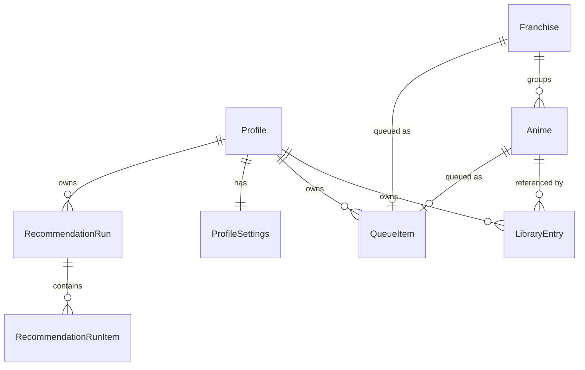

# AniQueue — Roadmap

**Status:** authoritative planning document. Supersedes nothing; amended by PR.

AniQueue is a self-hosted anime watchlist and **backlog decision layer**. It is not a
MyAnimeList/AniList replacement — it assumes your library already exists somewhere and
answers the question those tools answer badly: *what do I actually watch next?*

Put precisely: **AniQueue owns the order of your watch list; the service you already use
owns its membership** (D11). The order is maintained jointly by you and an AI, and it
persists.

Problems in scope:

- Plan-to-Watch lists grow large and unordered.
- There is no deliberate, hand-curated "watch this next" queue.
- Franchise seasons, OVAs, films and specials clutter the backlog as separate decisions.
- Prioritisation should follow *your* historical scores, not global popularity.
- It must run on your own hardware with no cloud dependency.

### Source documents

| Document | Role |
|---|---|
| [`BUILD-PROMPT.md`](BUILD-PROMPT.md) | Original brief, preserved verbatim. Historical reference. |
| `ROADMAP.md` (this file) | **Authoritative.** Brief + agreed deviations + phase plan. |

Where this file and the build prompt disagree, this file wins, and §2 records why.

---

## 0. Verified environment

Checked on the development machine, not assumed:

| Component | Version |
|---|---|
| .NET SDK | 10.0.301 (runtime host 10.0.9) |
| Visual Studio | Community 2026 — 18.7.11925.98 |
| Docker Engine / Compose | 29.5.3 / v5.1.4 |
| git / gh | 2.54.0.windows.1 / 2.92.0 |
| EF Core SQLite (latest) | 10.0.11 |

Two findings that contradict reasonable assumptions:

- `dotnet new xunit` on .NET 10 emits **xUnit v2.9.3**, not v3. We use v2 as templated.
- No .NET workloads installed, and none are needed — plain `net10.0` + `Microsoft.NET.Sdk.Web`.

**The repository is public.** No secret, token, API key, or personal export may ever be
committed. Sample/seed data must be obviously fictional.

---

## 1. Technology

Fixed by the brief and agreed:

- .NET 10, C#, ASP.NET Core **Blazor Web App** with Interactive Server rendering
- EF Core 10 + SQLite
- Built-in DI, configuration, logging, options pattern
- xUnit, Docker, Docker Compose

Explicitly excluded: React, Angular, Vue, Node.js, any separate frontend build system,
MediatR/CQRS abstractions, generic repositories, service locator.

One permitted JS dependency: **SortableJS**, via minimal interop, for drag ordering only.
See D5 and §9 for why this is the riskiest line in the document.

`<Nullable>enable</Nullable>` and `<ImplicitUsings>enable</ImplicitUsings>` everywhere.

---

## 2. Architectural decisions and deviations

Numbered so they can be cited in code comments, PRs and future amendments.

### D1 — The queue gets its own table; `LibraryEntry.QueuePosition` is dropped

*Brief §4 vs §5 contradict each other.* §4 puts `QueuePosition` on `LibraryEntry`; §5
requires that an anime **or an entire franchise** can occupy a queue slot. There is no
`LibraryEntry` row for a franchise, so a nullable int on that table structurally cannot
express "Slayers is at position 7".

**Decision:** a dedicated `QueueItem` table holding an exclusive-or reference:

```sql
CHECK ((AnimeId IS NULL) <> (FranchiseId IS NULL))
```

`LibraryEntry.QueuePosition` does not exist. "Is this queued, and where?" is a join.
Reordering rewrites one narrow table instead of touching library rows.

### D2 — No unique index on `(ProfileId, Position)`

SQLite enforces uniqueness **per statement**, not at commit. Any reorder that shifts a
block of positions collides transiently and aborts the transaction. The escapes (shift into
a negative range, then rewrite) are two passes of pure ceremony.

**Decision:** a plain non-unique index. Contiguity and uniqueness are invariants owned by
`QueueService`, applied inside a single transaction. This is a real trade — the database no
longer defends the invariant, so §8's reorder tests are load-bearing, not decorative.

### D3 — `IDbContextFactory`, never scoped `AddDbContext`

Under Interactive Server a scoped service lives as long as the SignalR circuit — the user's
whole session, potentially hours. A scoped `DbContext` there means an unbounded change
tracker, stale reads, and `InvalidOperationException` the first time two components render
concurrently.

**Decision:** `AddDbContextFactory<AniQueueDbContext>`; every service method creates and
disposes a short-lived context. This is the most common Blazor Server + EF defect and is
free to avoid at the start.

### D4 — Recommendation history needs per-run items

*Brief §20 is internally inconsistent.* It says store run metadata and avoid duplicating
request data, then requires comparing the current recommendation set against a previous
one. Metadata alone cannot support that comparison.

**Decision:** `RecommendationRun` (metadata) + `RecommendationRunItem` (per-candidate rank,
predicted score, confidence, reason). Request payloads are **not** persisted — the
candidate set is reconstructable from run items. The `Recommendation*` columns on
`LibraryEntry` are a denormalised cache of the currently-applied run so backlog sorting
stays a single-table query.

### D5 — Button reordering ships before drag-and-drop

The brief requires both (§5) and mandates a non-drag path (§39). The buttons are trivial
and entirely server-side; drag is the risky half.

**Decision:** implement button reordering and its tests first. Drag layers onto an
already-correct reorder service. If the interop proves messy, the feature degrades to
something that already works rather than blocking the phase.

### D6 — Central package management and shared build props

Not in the brief, framework-native, no new dependency: `Directory.Build.props` for shared
compiler settings, `Directory.Packages.props` for versions pinned once across five
projects. Prevents version drift.

### D7 — `ProfileSettings` is a typed entity, not a key/value bag

Settings (§25 of the brief) are a fixed, known set. Typed columns are migratable, bindable
straight from the Settings page, and cannot rot into stringly-typed soup.

### D8 — `AniQueue.slnx`, not `AniQueue.sln`

*Reverses an earlier call in this document.* The brief names `AniQueue.sln`, and the first
attempt used the classic format on the reasoning that `.slnx`'s main benefit — no GUIDs, so
no merge conflicts — does not apply when all five projects are added at once and no more
are planned.

That weighed one factor and missed a second. `dotnet new sln` emits a **hardcoded, already
stale version stamp** (`# Visual Studio Version 17` — VS 2022) that has nothing to do with
the installed toolchain, and the format carries ~100 lines of GUID bookkeeping for what is
really a five-line list of projects. Since VS 2026 is the primary development environment
and supports `.slnx` natively, the modern format is the better fit.

**Decision:** `AniQueue.slnx`, generated via `dotnet sln migrate`. 101 lines → 12, no GUIDs,
and no version header that can go stale. Verified: `dotnet sln list`, `dotnet build`,
`dotnet test` and `dotnet build -c Release` all work unchanged. The `x86`/`x64` platform
entries the migration carried over were removed — this solution only ever builds Any CPU.

Minimum tooling this implies: VS 2026 (or VS 2022 17.14+) and the .NET 10 SDK. Both are
already the baseline in §0, so nothing is lost.

### D10 — Franchise grouping waits for authoritative relation data

A MyAnimeList export carries no relationship data at all. Its 23 fields per entry are
catalogue basics and the user's own tracking; there is no sequel, prequel, parent or
franchise field. Franchises therefore cannot be derived from an import, only curated.

That is a problem at realistic scale. Measured against a genuine 752-title export, a
title-similarity heuristic proposed **138 candidate franchises covering 447 titles (59%)**.
Curating that by hand is data entry, not curation — but the same run also produced a
confident group named "Re" containing seven entries, which is `Re:Zero` split on its colon.

The brief permits detection "as an optional suggestion" (§4), and that option was considered
and **declined**: a suggestion engine that is confidently wrong leaves the user unpicking
mis-grouped franchises, which is worse than having none yet. Franchise grouping instead
waits for MAL/AniList relation data, which is authoritative rather than inferred.

**Consequence, accepted knowingly:** until that integration lands, users with large libraries
have manual franchise management only, and will realistically group a handful of franchises
rather than all of them. Phase 5 ships manual tools; the post-MVP API work in §10 is what
makes franchises practical at scale.

Do not re-propose title-similarity detection without new evidence that it can be made
accurate — the 59% coverage figure is not the interesting number, the false positives are.

**Amended by D13.** Promoting AniList read access into the MVP supplies exactly the
authoritative relation data this decision was waiting for, so the wait is now until Phase 5
rather than until after the MVP. Phase 6 may propose groupings from real relations — still
confirmed by the user, never applied silently.

### D11 — The AI orders a closed set. It does not choose what is in it.

**What AniQueue is for:** a watch list whose *order* is maintained jointly by the user and
an AI, and which persists. The list's *membership* is maintained elsewhere — principally on
MyAnimeList or AniList — and arrives here by import or, later, sync.

That division is the point. AniQueue owns the order; the external service owns the
membership.

So the model is given the user's scored history and the titles already on their list, and
asked to rank *those*. It is never asked what to add. Entries it ranks lowest become
removal candidates the user may act on at their discretion; removal is therefore a
consequence of ranking rather than a separate instruction, and needs nothing in the schema.

This is a constraint on the model, chosen deliberately over a broader one:

- **It removes hallucination by construction, not by validation.** Every ranked item carries
  a candidate id AniQueue issued, so a fabricated title has nowhere to appear. Asking for
  additions would mean accepting titles the application has never seen, which would then
  need resolving against a real catalogue before they could be trusted — work that depends
  on the API integration, not the model.
- **It keeps the result schema exactly as the brief specifies.** An earlier suggestion to add
  an extensibility hook for future "suggested additions" is withdrawn: a field for a feature
  that is not being built is speculative infrastructure, and `schemaVersion` already provides
  the way to change shape later.
- **It needs no new persistence.** `RecommendationRunItem` referencing an existing anime or
  franchise holds, because every ranked item exists locally. Acting on a removal candidate
  uses what is already modelled — `Dropped` status or `IsHidden` — so nothing has to be
  written back to an external service.

Deferred until the core is done, and deliberately not designed yet: an LLM-written summary
of the user's taste for the dashboard. Pleasant, not load-bearing.

### D12 — AniQueue observes watched status. It never authors it.

D11 said membership is owned elsewhere. This follows it to its conclusion, and
**removes a phase**.

The brief's watching workflow (§22) — mark as watching, add an episode, complete and
score — assumed AniQueue was the primary tracker. It is not. A realistic setup already
has one: media server scrobbles to AniList, scores are entered there, and other services
mirror it. Every one of those actions in AniQueue would create a second source of truth
that drifts from the first within a day.

So watched status, episode progress and scores are **read-only here**. They arrive by
import or sync, they display, and nothing in the application writes them.

That extends to the action that looked most defensible. An explicit "start watching"
button is unnecessary, because starting a show is already observable: the entry moves from
Planning to Watching at the source. **The queue advances as a consequence of sync, not of a
click** — when a queued title stops being Planning, its slot is released and the next item
becomes next in line.

This has a useful property: the rule belongs to the import and sync path, not to a button,
so it works with file import today and needs no API to be correct.

The trade, recorded honestly: the brief's acceptance criteria 13 and 14 ask for progress
tracking and score entry, and this decision declines both. D11 and the brief disagree here;
D11 is the later and more considered position, and the application it describes is the one
being built.

**What remains of the old watching phase:** nothing that warrants a phase. Its one surviving
rule is queue advancement, which belongs with the queue in Phase 4.

### D13 — AniList read access moves into the MVP

Previously post-MVP. Two things move it.

**It is the only manual step in an otherwise automatic chain.** With D11 and D12, membership
and status both arrive from outside — so file export and upload is the single point where the
user does work a machine should. Automating the *ordering* while leaving the *input* manual
optimises the wrong half.

**D12 depends on it to be useful.** Queue advancement works on any import, but advancing on a
schedule rather than when the user remembers to export is what makes the queue trustworthy
without attention.

Scope is deliberately narrow: **read only.** List and status retrieval, and relation data.
No write-back, no OAuth-gated private lists, no scheduled re-ranking. Write-back stays
post-MVP, where it belongs — it is the direction that can damage data the user maintains
elsewhere.

Worth confirming at implementation time rather than assuming: AniList's GraphQL API serves
public list data without authentication, which if true removes OAuth from the MVP entirely.
Design for it, verify before relying on it.

**A consequence for D10:** franchise grouping was deferred for want of authoritative relation
data. Promoting AniList read access supplies it, so franchises can use real relations inside
the MVP rather than waiting. The phase order below puts AniList before franchises for exactly
this reason.

### D14 — No manual priority. The queue is the user's ordering.

`LibraryEntry.ManualPriority` is removed: the column, the filter, the sort, the facet and
the bulk action.

**A shared bucket is not an order.** Setting twenty titles to priority 5 says nothing about
which of them comes first, so a bulk priority control could not produce the thing it
appeared to produce. Ordering needs a rank, and two already exist — both real ranks:

| Ordering | Held by |
|---|---|
| The user's | `QueueItem.Position` |
| The AI's | `LibraryEntry.RecommendationScore` |

Those two are exactly what the Manual / AI / Hybrid views need. A third axis overlapping the
first without replacing it only blurred the distinction.

The brief lists manual priority as a hybrid ranking input (§18) — but the same sentence also
lists *"whether title is already in Up Next"*. Queue position was always an intended signal,
and it is the better one: being third in a hand-ordered queue is a far stronger statement of
intent than wearing a shared label.

Removed rather than left unused. Keeping a column against a possibility is the speculative
infrastructure argued against in D11, and if Phase 9 wants a user signal stronger than queue
membership, choosing one deliberately beats inheriting one nobody picked.

Two details worth keeping in mind when removing anything similar:

- **The retired sort's enum value is not reused.** Sort preferences are persisted in settings
  later, and silently changing what a stored number means is how a saved preference becomes a
  wrong one.
- **A tiebreak test quietly stopped testing anything.** It had sorted by priority across
  entries sharing a value; with priority gone it sorted unique titles and would have passed
  without exercising the tiebreak at all. It was re-pointed at a sort that genuinely collides.

---

## 3. Solution structure

Follows the brief's §36. It is a sensible shape; no argument.

```
AniQueue.slnx
Directory.Build.props / Directory.Packages.props
.editorconfig / .gitattributes / .gitignore / .dockerignore
Dockerfile / docker-compose.yml
README.md
docs/ROADMAP.md, docs/BUILD-PROMPT.md

src/
  AniQueue.Core/            entities, enums, DTOs, interfaces, pure logic. No EF, no Blazor.
  AniQueue.Infrastructure/  EF Core, SQLite, migrations, service implementations
  AniQueue.Web/             Blazor components, DI composition, configuration, hosting

tests/
  AniQueue.Core.Tests/            pure, fast, no database
  AniQueue.Infrastructure.Tests/  SQLite in-memory, real EF
```

**The split that makes the test plan work.** Pure computation lives in Core and is tested
with no database: MAL XML parsing, runtime maths, hybrid ranking, AI-result validation.
Anything touching data lives in Infrastructure. Core has no EF reference not for
architectural purity but so most of the suite runs in milliseconds with no fixtures.

Interfaces are declared in Core, implementations in Infrastructure. Blazor components call
services only — no `DbContext` in `.razor`, no LINQ in markup, no business logic in
components. No HTTP API between the Blazor server and itself.

---

## 4. Domain model



### Anime

`Id, Title, AlternativeTitle?, MediaType, EpisodeCount?, EpisodeDurationMinutes?,
ReleaseYear?, CoverImageUrl?, Description?, Source, SourceAnimeId?, FranchiseId?,
FranchiseOrder?, OptionalWithinFranchise, CreatedAt, UpdatedAt`

- `MediaType`: `Unknown, Tv, Movie, Ova, Ona, Special, Music`
- `Source`: `Manual, MyAnimeList, AniList`
- `OptionalWithinFranchise` (brief §21) belongs here, not on `Franchise` — it describes an
  individual entry's role within its group.
- **Filtered** unique index on `(Source, SourceAnimeId)` `WHERE SourceAnimeId IS NOT NULL`.
  Manual entries have no source id and must not collide with one another.
- Domain entities are never coupled to MAL/AniList DTOs.

### LibraryEntry

`Id, ProfileId, AnimeId, Status, UserScore?, EpisodesWatched, DateStarted?, DateCompleted?,
DateAdded, LastUpdated, PersonalNotes?, ManualPriority, IsHidden, RecommendationScore?,
RecommendationConfidence?, RecommendationReason?, RecommendationUpdatedAt?`

- `Status`: `Planning, Watching, Completed, OnHold, Dropped`
- Unique `(ProfileId, AnimeId)`; indexes on `(ProfileId, Status)`, `(ProfileId, IsHidden)`
- No `QueuePosition` — see D1.

### Franchise

`Id, Name, Description?, ManualSortOrder`. Anime→Franchise is 0..1 for MVP. Internal
ordering is `Anime.FranchiseOrder`. User can create, rename, add/remove titles, reorder and
dissolve. **No automatic franchise detection in v1.**

### QueueItem

`Id, ProfileId, Position, AnimeId?, FranchiseId?, AddedAt`. See D1/D2. Filtered unique
indexes on `(ProfileId, AnimeId)` and `(ProfileId, FranchiseId)` so nothing is queued twice.

### RecommendationRun / RecommendationRunItem

Run: `Id, ProfileId, CreatedAt, ProviderName, ModelIdentifier?, CompletedCount,
CandidateCount, ResultCount, WasApplied`
Item: `Id, RunId, AnimeId?, FranchiseId?, Rank, PredictedScore, Confidence, Reason?`

### Profile / ProfileSettings

Single default local profile; no registration, no OAuth, no auth in MVP. All library data
carries `ProfileId` so multi-user (Phase 5 post-MVP) stays possible. Settings per D7.

---

## 5. Service boundaries

| Service | Project | Responsibility |
|---|---|---|
| `ILibraryService` | Infrastructure | CRUD, status transitions, progress, scoring, filter/page |
| `IQueueService` | Infrastructure | add/remove/reorder, normalise positions, transactional |
| `IFranchiseService` | Infrastructure | membership, ordering, dissolve, next-unwatched |
| `IImportService` | Infrastructure | orchestrates the import pipeline |
| `IRecommendationService` | Infrastructure | build request, validate/apply result, run history |
| `IAnimeListParser` | **Core** (incl. impls) | `MyAnimeListXmlParser`, `AniQueueJsonParser` — pure, no database |
| `IAiRecommendationProvider` | Core | `ManualJsonRecommendationProvider` only in MVP |
| `IRankingCalculator` | **Core** | hybrid ranking formula — pure, testable |
| `IRuntimeCalculator` | **Core** | episode×duration maths, franchise sums, formatting |
| `ICoverImageResolver` | Core | URL passthrough now; local caching later |

Import splits at the point where a database is first needed:

```
IAnimeListParser  (Core, pure)      file bytes  → ParseResult (entries + problems)
IImportService    (Infrastructure)  ParseResult → ImportPreview → commit
```

**D9 — parsing lives in Core, and the parser does not build the preview.** The brief's
`IAnimeListProvider.ImportAsync` returns an `ImportPreview` directly. But deciding whether
an entry is new, an update or a conflict requires reading the existing library, so such a
provider would need database access — which would drag every format parser into
Infrastructure and out of reach of fast, fixture-free tests. Splitting at this seam keeps
all format-specific logic pure, and leaves matching in exactly one place however many
formats exist. Adding AniList later means writing one parser, not a second pipeline.

`ImportPreview` is a pure in-memory object. **Nothing touches the database until the user
explicitly confirms.** Imports are idempotent where reasonable.

---

## 6. Cross-cutting requirements

**Security.** Anti-forgery; server-side validation; upload size limits; reject oversized
imports; secure XML (`DtdProcessing.Prohibit`, `XmlResolver = null`); HTML-encode user
content; no user-supplied file paths; no command execution; **never execute or evaluate AI
content** — it is untrusted data; no stack traces in production; secrets only via
environment/configuration. Forwarded headers honoured **only when explicitly configured**.
Never assume requests originate from localhost.

**Logging.** Structured `ILogger`. Events: startup, migration, import started, preview
generated, import committed, recommendation exported, recommendation imported, queue
changed. Never log whole uploaded files, AI payloads, or secrets.

**Performance.** Must handle several thousand anime. Server-side filtering, pagination or
virtualisation, `AsNoTracking` for reads, async EF, real indexes. Never load the whole
library for an ordinary page. AI export may intentionally load the full relevant set.

**Accessibility.** Semantic HTML; real `<button>` elements; keyboard-operable controls;
meaningful labels; sensible focus; a non-drag alternative for every drag action; adequate
contrast in both themes.

**Privacy in AI export.** Export only what ranking needs. Never email addresses, passwords,
API keys, IP addresses, server information, or personal notes unless explicitly opted in.
The UI states plainly what is being sent.

**Data integrity on import.** Match on `Source + SourceAnimeId` first; title matching only
cautiously and never silently merging ambiguous matches. An import must not overwrite
manual queue position, personal notes, franchise grouping, hidden flag, or recommendation
history unless explicitly requested.

---

## 7. Phase plan

Every phase ends **buildable, tested and green**. `dotnet build` + `dotnet test` at each
boundary. Phases are front-loaded so a genuinely useful application exists from Phase 4
onward even if later phases slip.

| # | Phase | Exit criteria |
|---|---|---|
| 0 | Foundation | Solution + 5 projects build; F5 serves the app; repo hygiene in place |
| 1 | Domain + persistence | Migration applies to a fresh DB; indexes exist; dev seeder works |
| 2 | **Vertical slice** | MAL XML → preview → confirm → SQLite → backlog list, end to end |
| 3 | Backlog page | Search, filter, sort, page, bulk actions |
| 4 | Up Next | Reorder correct and persistent; queue advances when status changes |
| 5 | AniList read sync | List and status retrieved by API; queue advances unattended |
| 6 | Franchises | Management plus grouping from real relation data |
| 7 | Dashboard + decision mode | Summary counts, Suggested Next, "What should I watch?" |
| 8 | JSON interchange | Full library export → wipe → restore round-trip |
| 9 | AI recommendation | Export request, import ranking, apply — manual order provably intact |
| 10 | Settings + polish | Settings, theme, confirmations, a11y and responsive pass |
| 11 | Docker + README | Compose up, health check, container recreated without data loss |

### Phase 0 — Foundation
Repo hygiene (`.gitignore`, `.gitattributes`, `.editorconfig`), solution and five projects,
`Directory.Build.props`, `Directory.Packages.props`, project references wired, placeholder
test in each test project. `.gitattributes` matters: Windows development, Linux container.

### Phase 1 — Domain and persistence
Entities and enums in Core. `AniQueueDbContext` with one `IEntityTypeConfiguration` per
entity. Indexes per §4. Initial migration. `IDbContextFactory` registration (D3). WAL and
`busy_timeout` applied at startup. Migrate-on-boot with explicit, readable failure logging
and graceful startup failure if the database is unreachable. Development-only seeder —
**never** auto-seeds production — covering completed titles with varied scores, planning,
watching, a franchise, a queue and a recommendation result.

### Phase 2 — Vertical slice (the brief's §45 deliverable)
MAL XML import end to end. Secure XML settings, `0000-00-00` → null, status mapping,
size limits, dedup on `Source + SourceAnimeId`, preview summarising new/updated/skipped/
conflicts/invalid and totals per status, then explicit commit. Minimal backlog list to
prove the data landed.

### Phase 3 — Backlog page
Server-side search, filtering, sorting, paging/virtualisation. Filters: status, franchise/
standalone, media type, decade, runtime, score, source. Quick filters (Under 2h,
Under 6h, Movie, OVA, TV, decades, High AI confidence, Not yet ranked) — **each rendered
only when the backing metadata exists**. Bulk selection, bulk queue-add and bulk hide.
Anime cards degrade cleanly instead of printing rows of "N/A".

No priority filter, sort or bulk action: manual priority does not exist (D14).

Defaults to **Planning**, with the status filter able to widen it. The brief defines the
backlog as what the user intends to watch, and Watching has its own page (§26); listing
every status by default buries the couple of hundred titles that are actually a decision
behind several hundred that are not.

Also adds a **source link per row** — "View on MyAnimeList", and AniList once that source
exists. This costs nothing: `Source` and `SourceAnimeId` are already stored by the importer,
so the URL is pure formatting with no lookup, no configuration and no new dependency. It is
worth having early because a backlog of several hundred titles constantly raises "what *is*
this one?", and answering it should not mean leaving the page to search manually.

It is also the first implementation of the link provider described in §10, so Plex and
Overseerr later become configuration rather than new machinery.

Bulk actions run through `BusyScope` and off the circuit thread from the start, for the
reason recorded against the import: SQLite's provider is synchronous, so a bulk write
awaited inline freezes the entire circuit rather than just the page.

### Phase 4 — Up Next
`QueueService`: add, remove, move to top/up/down/bottom, transactional reorder with
position normalisation. Franchises queueable from the start (D1). Buttons first, then
SortableJS interop (D5, §9).

Also **queue advancement** (D12): when an import or sync reports that a queued title is no
longer Planning, its slot is released and positions are normalised, so the next item becomes
next in line without anyone pressing anything. This lives here rather than in the import
because it is a queue invariant, and it works with file import immediately — the API in
Phase 5 only changes how often it runs.

### Phase 5 — AniList read sync
Retrieve the user's list, statuses and scores over the AniList GraphQL API, and the relation
data franchises need. Read only (D13): no write-back, no scheduled re-ranking. Runs on demand
and on an interval, with a per-source watermark so repeated polling stays inside rate limits.

Reconciliation reuses the import pipeline rather than duplicating it — matching on
`Source + SourceAnimeId`, preserving every locally curated field, and advancing the queue via
the Phase 4 rule. The difference is the trigger, not the logic.

Unattended sync cannot show a preview and wait, so it applies the safe subset — status,
progress, scores — and leaves anything ambiguous for review. The field-preservation rules
proven in Phase 2 are what make that safe.

### Phase 6 — Franchises
Create, rename, add/remove titles, reorder, dissolve. Collapsed card showing entries
watched, remaining runtime, first entry, AI score, queue position; expanding shows viewing
order. `OptionalWithinFranchise` respected in completion and runtime maths.

Grouping may now be proposed from the relation data Phase 5 supplies, which is what D10 was
waiting for. Proposals are still confirmed by the user; nothing is grouped silently.

### Phase 7 — Dashboard and decision mode
Currently Watching with progress bars, Up Next top 5–10 with a prominent Start Watching,
backlog summary counts and estimated runtime, Suggested Next. "What should I watch?":
Anything / Something short / A movie / One evening / Old-school / From my top 20 / Surprise
me. Surprise me uses **weighted randomness**, not the top-ranked title. No conversational UI.

### Phase 8 — JSON interchange
Versioned AniQueue interchange format, import and export, validation, backwards-compatible
design, full-library backup and restore. No secrets in exports.

### Phase 9 — AI recommendation workflow
Request export (download + copy) with an explanatory UI. Generated ready-to-copy prompt.
Import screen accepting upload or paste. Validation: unknown candidate ids, duplicates,
missing candidates, rank collisions, numeric ranges, unexpected candidates. Preview showing
title, rank, predicted score, confidence, reason. Apply writes to `LibraryEntry` and a
`RecommendationRun` (D4). Manual / AI / Hybrid are **three views**, and applying AI never
mutates `QueueItem.Position`. Hybrid ranking is a simple, transparent, explainable formula
— the UI shows why an item ranks where it does. No black box.

### Phase 10 — Settings and polish
General (display name, default queue size, date format, theme System/Light/Dark), Backlog
(show optional franchise entries, default sort/filters), Recommendations (default mode,
export privacy, weighting), Data (export/import backup, clear recommendation results).
Destructive actions require explicit confirmation. Accessibility and responsive passes.

### Phase 11 — Docker and README
Multi-stage Dockerfile (SDK build → `aspnet` runtime, no SDK in the final layer), non-root
user, `/data` persistence, configurable port defaulting to 8080, `/health` endpoint,
compose health check, environment-variable configuration. README per brief §35, explicitly
explaining that v1 AI recommendation works **without giving AniQueue an API key**.

Final gate: Release build, full test run, image build, `docker compose up -d`, health check
verified, **container recreated and the database confirmed intact**.

---

## 8. Test plan

Allocated to whichever project can run each test fastest.

**Core.Tests — no database, milliseconds.** MAL XML parsing; malformed XML; `0000-00-00`;
XXE rejection; status mapping; JSON schema validation; AI result validation (unknown
candidate, duplicate, missing candidate, rank collision, out-of-range predicted score,
out-of-range confidence); runtime calculations including unknown-duration cases; franchise
runtime with optional entries; hybrid ranking; weighted-random selection bounds.

**Infrastructure.Tests — real EF, real SQLite.** Use `Data Source=:memory:` with a
**deliberately held-open connection** (the database dies when the last connection closes).
The EF `InMemory` provider is not used at all — it does not enforce the constraints under
test. Covers: migrations apply cleanly; dedup on `Source + SourceAnimeId`; import
idempotency; import preserves local fields; **queue reorder edge cases and the contiguity
invariant** (load-bearing per D2); franchise ordering; completion transitions; applying AI
recommendations leaves `QueueItem` untouched.

No test may depend on a live external API.

---

## 9. Risks

**SortableJS vs Blazor's DOM ownership — the real one.** Blazor's renderer diffs against
its own virtual tree; SortableJS physically moves nodes behind its back, so the next render
can duplicate or resurrect rows. The working pattern is `@key` on every item plus reverting
the DOM move inside `onEnd`, then calling into .NET with `(oldIndex, newIndex)` and letting
the re-render produce the authoritative order. Budget a spike in Phase 4. Mitigated by D5.

**Non-root container against a bind-mounted `/data`.** A non-root UID cannot create the
database file in a host directory owned by root. Named volumes are fine — Docker seeds
ownership from the image — bind mounts are not. Plan: pin a known UID/GID in the image,
default compose to a **named volume**, and document `chown` for bind-mount users (the
common Unraid case).

**Privacy-hardened browsers break Blazor Server's DOM contract.** Narrowed by bisect: the
circuit dies with `Cannot read properties of null (reading 'insertBefore')` followed by
`No element is currently associated with component 1` in **Brave**, while Firefox and Edge
are clean. Edge is also Chromium, so this is Brave's Shields layer, not the engine.

**It is intermittent.** Toggling Shields off and back on for the site stopped it recurring,
which points at cached per-site Shields state or a stale cosmetic-filter list rather than a
deterministic rule. Do not expect to reproduce it on demand — an attempt that comes up clean
does not mean it is gone.

Blazor Server patches the live DOM through direct node references. Shields' cosmetic
filtering hides and sometimes removes nodes, and its fingerprinting protection patches
native DOM APIs — either can invalidate a reference the renderer still holds, after which
the next render batch fails and the circuit tears down.

This matters beyond development. A self-hosted anime backlog manager skews heavily toward
the home-server audience, which skews heavily toward Brave; those users would see only
"An unhandled error has occurred" with no explanation.

Not yet mitigated. Options, in increasing order of cost:

- Document it, and tell users to drop Shields for their AniQueue host.
- Rename any CSS classes that generic cosmetic-filter lists target.
- Disable prerendering on the root components, removing the phase where the client adopts
  server-rendered markup. Only a partial fix — a node removed later still breaks a
  subsequent patch — and it costs a blank first paint.

Reassess once it is known *which* element Shields is acting on.

**SQLite single-writer.** Adequate for one user, but a concurrent import and queue write
can hit `SQLITE_BUSY`. WAL plus a `busy_timeout` at startup; keep write transactions short.

**Scope.** This is a large MVP — 25 acceptance criteria across 11 phases. Treating them as
one milestone is the main schedule risk; the phase ordering exists to avoid it.

---

## 10. Out of scope

**Not in MVP** (brief §41): MAL/AniList OAuth, live two-way sync, built-in OpenAI calls,
Ollama integration, user registration, social features, comments, public profiles, mobile
native apps, automatic metadata scraping, automatic franchise detection, streaming
integrations. `IAnimeListProvider` and `IAiRecommendationProvider` are the extension
points; nothing speculative gets built behind them. **No fake AniList integration.**

**Post-MVP** (brief §42, amended by D13): metadata enrichment, cover art, genres and studios ·
optional AI providers, OpenAI-compatible endpoints, Ollama/LM Studio, scheduled re-ranking ·
MAL API sync · **write-back to AniList or MAL** · multi-user, authentication, household
profiles.

AniList *read* access is no longer here — D13 moved it into the MVP as Phase 5, because with
D11 and D12 it is the only remaining manual step in the loop. **Write-back stays post-MVP**
and should be approached carefully: it is the one direction that can damage a list the user
maintains elsewhere, and every safeguard in the import pipeline exists to protect data
flowing the other way.

### Stretch goals — self-hosted neighbours

A self-hosted AniQueue very likely sits beside Plex, and often beside Overseerr. Both are
worth linking to, and neither should become an integration: **AniQueue decides what to
watch and hands off the how.** That keeps D11 intact — no data ownership moves.

These are stretch goals for after the MVP is complete, not commitments.

**The cost split matters more than the feature list.** Two very different things get
described with the same words:

| | Needs | Cost |
|---|---|---|
| *Search* link — `/search?query={title}` | A configured base URL | Trivial |
| *Precise* link, or an "on Plex" indicator | A Plex library sync, or an anime-ID → TMDB/TVDB mapping | Substantial |

Search links are worth doing on their own. An availability indicator is the expensive half,
and it is the half with the real product value — *"which of my planned shows can I start
tonight?"* — so it should be judged against the AniList API work rather than bundled with
the cheap links.

Specific things a future implementer will otherwise have to rediscover:

- **Overseerr is TMDB-keyed.** It knows nothing of AniList or MAL identifiers, so a precise
  request link needs an anime-ID → TMDB mapping (the community anime-lists datasets exist
  for this, at the cost of vendoring and refreshing them). A search link avoids the problem
  entirely.
- **Plex anime metadata is inconsistent.** Depending on the agent, items may carry AniList
  or MAL identifiers, only TVDB, or nothing but a title. Where identifiers are absent this
  becomes title matching, which is the same ambiguity that produces import conflicts and
  deserves the same rule: never apply a match the application cannot confidently identify.
- **Plex availability was considered as an LLM input and rejected.** Passing a library for
  the model to recommend from is affordable — a couple of thousand titles is perhaps 10k
  tokens — but it makes AniQueue a membership editor, which D11 rules out, and it discloses
  what media the user holds to an external service. As a *filter* it needs no model at all.
- **Base URLs come from user configuration and end up in an `href`.** Validate the scheme is
  `http` or `https` at the point the link is built. A `javascript:` base URL is stored XSS,
  and this is trivial to guard up front and awkward to retrofit.

The natural shape is one small provider — given an anime, return an optional URL and label —
with per-instance base URLs and an independent toggle each. MyAnimeList, AniList, Plex and
Overseerr all fit it, so the Phase 3 links below are the first implementation of the same
extension point rather than a one-off.

---

## 11. MVP acceptance criteria → phase

The brief's 25 criteria, mapped so completion is measurable.

| Criteria | Phase |
|---|---|
| 1–2 `docker compose up -d`, open in browser | 11 |
| 3–7 Upload MAL XML, preview, confirm, see statuses and scores | 2 |
| 8–9 Create/edit franchises, collapse sequels into them | 6 |
| 10–12 Add to Up Next, drag to exact order, persist across restart | 4 + 11 |
| 13–14 Track progress, complete with a score | **declined — see D12** |
| 15 Filter backlog usefully | 3 |
| 16–22 AI request export, prompt, import, preview, apply, manual order intact | 9 |
| 23–24 Export full library as JSON, restore from it | 8 |
| 25 Recreate container without losing the database | 11 |

**Criteria 13–14 are deliberately not met.** They ask AniQueue to record watch progress and
accept a score, which D12 declines: those belong to the service that already tracks them, and
a second copy here would drift within a day. Progress and scores are still *shown* — the
importer writes them — so criteria 6 and 7, seeing statuses and historical scores, are met.

This is the one place the brief and the built application deliberately part company, so it is
stated here rather than quietly reported as done.

---

## 12. Working agreements

- Integration branch is `development`. `main` is release-only.
- One feature branch per phase: `feature/phase-N-slug` → PR into `development`.
- Rebase onto `development` and resolve conflicts locally before opening a PR.
- No new third-party dependency without explicit approval. SortableJS is the only one
  pre-approved, and only for Phase 4.
- **LF line endings everywhere**, in the repository and in the working tree on every
  platform, enforced by `.gitattributes` (`* text=auto eol=lf`) with `.editorconfig`
  matching it. `.gitattributes` is the enforcement point rather than `core.autocrlf`
  because it is committed and so applies to every clone; `core.autocrlf` is per-machine
  and never travels. Batch files (`*.bat`, `*.cmd`) are the sole CRLF exception —
  `cmd.exe` can mis-parse LF-only batch files. Verify with
  `git ls-files | while read -r f; do tr -dc '\r' < "$f" | wc -c; done`.
- Amendments to this roadmap go through a PR that updates this file, so the decision record
  and the code move together.
- Comments explain **why**, not syntax. Decisions cite their `D`-number.

---

## 13. Local development workflow

- **The inner loop is `F5` on `AniQueue.Web`, not Docker.** Container debugging in
  Blazor Server adds a rebuild cycle per change for no diagnostic benefit. Docker is a
  Phase 11 deliverable and a pre-release gate, not the daily loop.
- **Do not accept Visual Studio's generated Dockerfile.** Container Tools writes a
  debug-oriented file tuned for its fast-mode volume mount. Phase 11 writes a production
  multi-stage one (SDK build → `aspnet` runtime, non-root, no SDK in the final layer).
- `AniQueue.Web` is the single startup project; no multi-project startup is needed.
- **EF tooling is a pinned local tool**, not a global install: `.config/dotnet-tools.json`
  fixes `dotnet-ef` at the same version as the EF packages. Run `dotnet tool restore` once
  after cloning. Using the CLI rather than the Package Manager Console means the same
  commands work in CI and in a container build.

  ```bash
  dotnet ef migrations add <Name> -p src/AniQueue.Infrastructure -s src/AniQueue.Web -o Persistence/Migrations
  ```

  `Microsoft.EntityFrameworkCore.Design` is referenced by **both** Infrastructure and Web —
  the tooling builds the model through the startup project's DI — with `PrivateAssets=all`
  so it never reaches the published output.

- **The development database lands under the Web project, not the repository root.**
  `Database:Path` is `./data/aniqueue.db` in `appsettings.Development.json`, and a relative
  path resolves against the app's *content root*, so the file appears at
  `src/AniQueue.Web/data/aniqueue.db`. Both that directory and `*.db*` by extension are
  git-ignored, deliberately belt-and-braces: an imported library is personal data and must
  never reach the repository.
- Delete that `data` directory to start from an empty database; migrations and the default
  profile are recreated on the next run, and the development seeder refills it.
